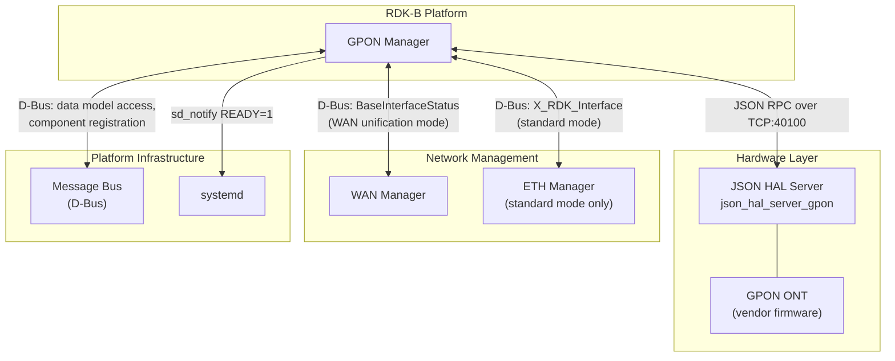
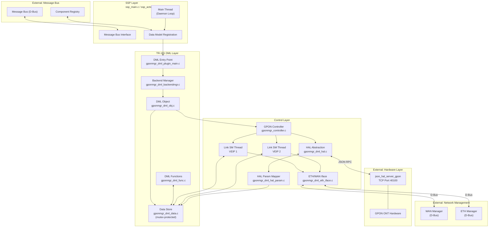
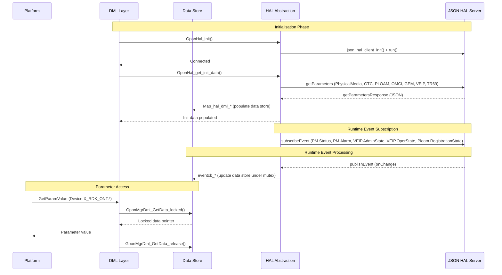
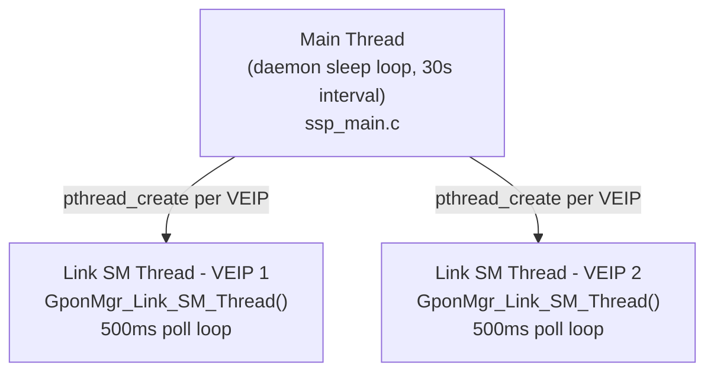
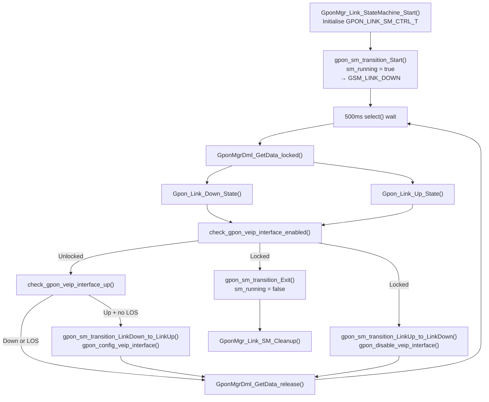
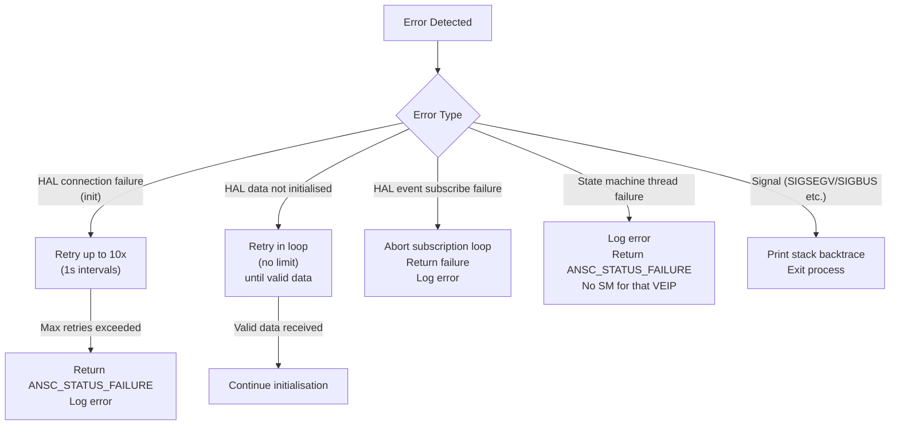
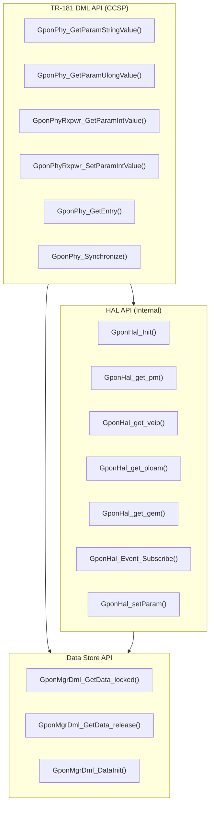
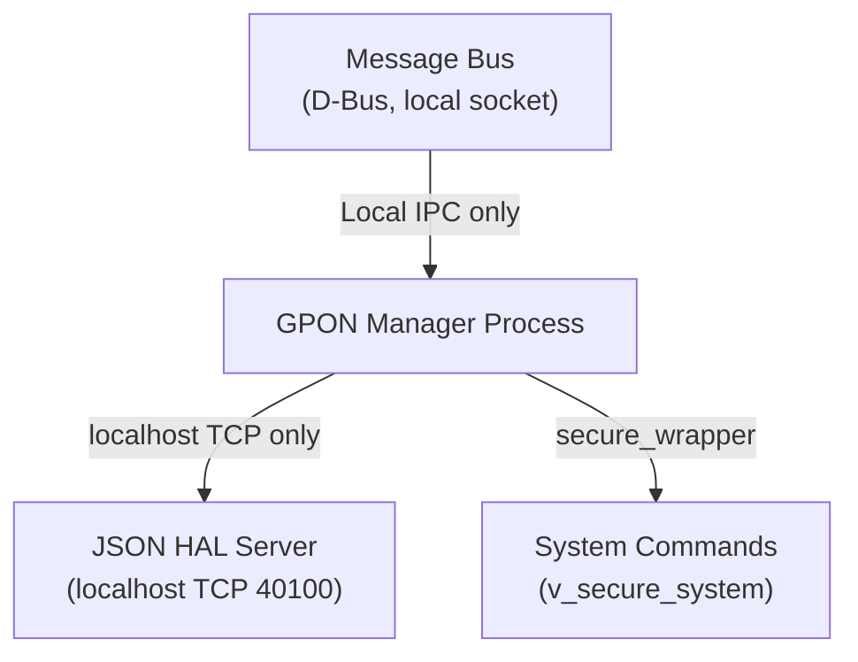

# GPON Manager Architecture

## Component Overview

GPON Manager is the RDK-B data model provider for GPON ONT devices. It is structured as a layered system: a process management layer (SSP), a hardware abstraction layer (HAL), a data model layer (DML), and a runtime control layer comprising the GPON Controller and per-VEIP link state machines.

---

## System Context

This diagram shows GPON Manager as a black box and its relationships with external systems.

### External Dependencies

| System                                   | Interface                  | Notes                                                            |
| ---------------------------------------- | -------------------------- | ---------------------------------------------------------------- |
| JSON HAL Server (`json_hal_server_gpon`) | TCP port 40100 (localhost) | Vendor-supplied; port is configurable                            |
| WAN Manager                              | D-Bus                      | Used in WAN unification mode (`WAN_MANAGER_UNIFICATION_ENABLED`) |
| ETH Manager                              | D-Bus                      | Used in standard mode only                                       |
| Message Bus                              | D-Bus (local socket)       | Required for data model access by other components               |
| systemd                                  | `sd_notify`                | Optional; requires `ENABLE_SD_NOTIFY` build flag                 |

---

## High-Level Architecture

---

## Component Responsibilities

### SSP Layer (`source/GponManager/`)

- Process entry point and daemon lifecycle management.
- Message bus registration and data model publishing.
- Health and memory usage reporting.

### DML Layer (`source/TR-181/middle_layer_src/`)

- Mutex-protected in-memory GPON data store.
- All `Device.X_RDK_ONT.*` parameter get/set implementations.
- Data model object lifecycle.

### Control Layer (`source/GponManager/`)

- HAL event subscription and initial configuration dispatch.
- Per-VEIP link state machine management.
- WAN/ETH interface provisioning.

### HAL Abstraction (`source/TR-181/middle_layer_src/gponmgr_dml_hal.c`)

- `json_hal_client` initialisation and connection management.
- Typed query functions for each ONT subsystem.
- Event callback registration and dispatch.
- HAL parameter mapping from JSON to data store structures.

---

## Data Flow Architecture

---

## Threading Model

### Thread Responsibilities

#### Main Thread

Runs the daemon sleep loop (`while(1) { sleep(30); }` in daemon mode). All initialisation — HAL startup, DML registration, controller setup — completes synchronously during startup before the loop is entered. Signal handlers are installed on the main thread.

#### Link State Machine Threads

One thread is created per VEIP interface by `GponMgr_Link_StateMachine_Start()`. Each thread is detached (`pthread_detach`). The thread runs a `select()`-based timer loop with a 500 ms timeout. On each wake, it acquires the global data store mutex, evaluates the current state, performs any required transitions, and releases the mutex. The thread exits when `sm_running` is set to `FALSE` (on transition to `GSM_EXIT`).

---

## Message Flow Patterns

### Link State Machine Lifecycle

---

## Error Recovery Flow

---

## Interface Architecture

---

## Security Architecture

- All CCSP communication is over the local D-Bus socket; no external network exposure.
- HAL server communication is over localhost TCP only.
- System command execution uses the `v_secure_system()` wrapper (`secure_wrapper` library) to prevent command injection.

---

## Build Variants

Two significant build-time variants change runtime behaviour:

| Macro                             | Effect                                                                                                                                                                      |
| --------------------------------- | --------------------------------------------------------------------------------------------------------------------------------------------------------------------------- |
| `WAN_MANAGER_UNIFICATION_ENABLED` | Uses WAN Manager (`Device.X_RDK_WanManager.Interface.*`) instead of ETH Manager for link status; adds `PhysicalMedia.Enable`, `Alias`, `LowerLayers`, `Upstream` parameters |
| `ENABLE_SD_NOTIFY`                | Sends `sd_notify(READY=1)` to systemd after successful initialisation                                                                                                       |
| `INCLUDE_BREAKPAD`                | Delegates crash signal handling to Breakpad exception handler                                                                                                               |
| `_COSA_SIM_`                      | Enables PC simulation mode (empty subsystem prefix)                                                                                                                         |

For steps to add new data model parameters or integrate on a new platform, see [configuration-guide.md](../configuration-guide.md).
