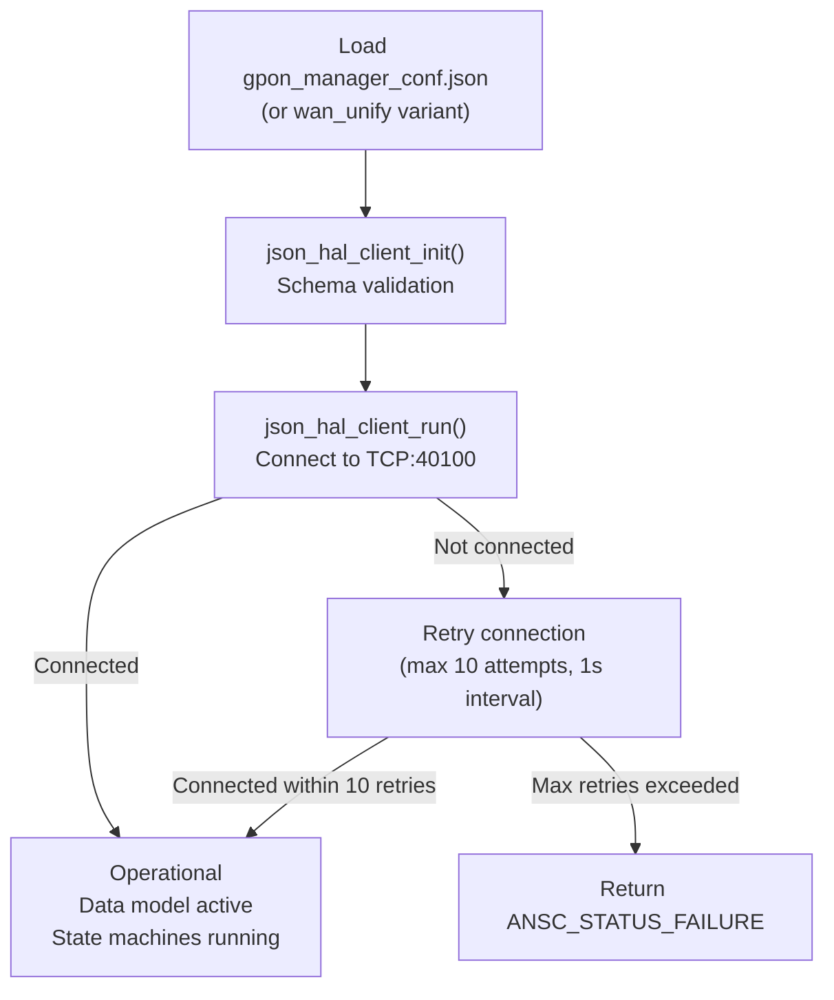

# GPON Manager Configuration Guide

## Overview

GPON Manager is configured through JSON runtime configuration files, a TR-181 data model XML file, and build-time preprocessor macros. Runtime configuration controls the HAL server connection; the XML file defines the data model object tree; build macros select the operational mode.

---

## Platform Integration Guide

This section is a task-oriented onboarding guide for integrating GPON Manager onto a new platform. The reference tables that follow provide full parameter details.

### Step 1 — Choose Your Deployment Mode

GPON Manager supports two deployment modes, selected at compile time.

| Mode            | Macro                             | WAN Interface Management                            |
| --------------- | --------------------------------- | --------------------------------------------------- |
| Standard        | _(not defined)_                   | ETH Manager (`Device.Ethernet.X_RDK_Interface.*`)   |
| WAN Unification | `WAN_MANAGER_UNIFICATION_ENABLED` | WAN Manager (`Device.X_RDK_WanManager.Interface.*`) |

Choose based on which WAN management stack your platform uses. If you are targeting a modern RDK-B stack with WAN Manager Unification, define `WAN_MANAGER_UNIFICATION_ENABLED` in your build configuration.

---

### Step 2 — Configure Build Flags

Set these preprocessor macros in your platform's build configuration (`configure.ac` or Yocto recipe):

| Macro                             | When to Set                                      |
| --------------------------------- | ------------------------------------------------ |
| `WAN_MANAGER_UNIFICATION_ENABLED` | Platform uses the unified WAN Manager stack      |
| `ENABLE_SD_NOTIFY`                | Process is managed by systemd with `Type=notify` |
| `INCLUDE_BREAKPAD`                | Platform has Breakpad crash reporting            |

---

### Step 3 — Deploy Runtime Configuration Files

Copy the correct configuration file to the target filesystem. Both files must be present regardless of build mode.

| Mode            | Source File                               | Target Path                                      |
| --------------- | ----------------------------------------- | ------------------------------------------------ |
| Standard        | `config/gpon_manager_conf.json`           | `/etc/rdk/conf/gpon_manager_conf.json`           |
| WAN Unification | `config/gpon_manager_wan_unify_conf.json` | `/etc/rdk/conf/gpon_manager_wan_unify_conf.json` |

Edit the config file for your platform:

```json
{
  "hal_schema_path": "/etc/rdk/schemas/gpon_hal_schema.json",
  "server_port": 40100
}
```

- **`server_port`** — must match the port your JSON HAL server listens on.
- **`hal_schema_path`** — must point to the schema file that matches your HAL server version.

---

### Step 4 — Deploy HAL Schema Files

Copy the schema files. These are consumed by the HAL client library to validate JSON RPC messages.

| Mode            | Source File                                 | Target Path                                       |
| --------------- | ------------------------------------------- | ------------------------------------------------- |
| Standard        | `hal_schema/gpon_hal_schema.json`           | `/etc/rdk/schemas/gpon_hal_schema.json`           |
| WAN Unification | `hal_schema/gpon_wan_unify_hal_schema.json` | `/etc/rdk/schemas/gpon_wan_unify_hal_schema.json` |

> The schema version (`"0.0.1"` in the schema file) must match what your vendor HAL server advertises.

---

### Step 5 — Deploy the Data Model XML

Copy `config/RdkGponManager.xml` to the platform's data model directory. This file defines the `Device.X_RDK_ONT.*` object tree and is loaded at runtime by the data model registration layer.

---

### Step 6 — Verify Integration

```bash
# Confirm the process started and wrote its PID file
cat /var/tmp/gponmanager.pid

# Query data model parameters (if dmcli is available)
dmcli eRT getv Device.X_RDK_ONT.PhysicalMedia.1.Status
dmcli eRT getv Device.X_RDK_ONT.Ploam.RegistrationState
dmcli eRT getv Device.X_RDK_ONT.Veip.1.OperationalState
```

The sentinel file `/tmp/GponMgrDml_Initialized` is created after successful data model initialisation. Other components can poll this file for startup ordering.

---

### Step 7 — Adding New Data Model Parameters

To expose new ONT hardware parameters through `Device.X_RDK_ONT.*`:

1. **`gponmgr_dml_hal_param.c`** — Implement a `Map_hal_dml_*` function that maps the JSON HAL response fields to the data store structure.
2. **`gponmgr_dml_hal.c`** — Add a `GponHal_get_*` query function that calls the HAL and invokes your mapper.
3. **`gponmgr_dml_func.c`** — Add `GetParam*Value` / `SetParam*Value` accessor and mutator functions for the DML layer.
4. **`config/RdkGponManager.xml`** — Declare the new parameter in the data model XML with its type and access permissions.
5. **`gponmgr_dml_data.h` / `gponmgr_dml_data.c`** — Add the field to the relevant data store struct and initialise it in `GponMgrDml_DataInit()`.

---

## Configuration Architecture

```text
/etc/rdk/conf/
├── gpon_manager_conf.json           (standard mode)
└── gpon_manager_wan_unify_conf.json (WAN unification mode)

/etc/rdk/schemas/
├── gpon_hal_schema.json             (standard mode HAL schema)
└── gpon_wan_unify_hal_schema.json   (WAN unification mode HAL schema)

Source tree:
config/
├── gpon_manager_conf.json
├── gpon_manager_wan_unify_conf.json
└── RdkGponManager.xml

hal_schema/
├── gpon_hal_schema.json
└── gpon_wan_unify_hal_schema.json
```

---

## Configuration Reference

### JSON Configuration Files

#### Standard Mode: `gpon_manager_conf.json`

```json
{
  "hal_schema_path": "/etc/rdk/schemas/gpon_hal_schema.json",
  "server_port": 40100
}
```

#### WAN Unification Mode: `gpon_manager_wan_unify_conf.json`

```json
{
  "hal_schema_path": "/etc/rdk/schemas/gpon_wan_unify_hal_schema.json",
  "server_port": 40100
}
```

---

## Configuration Parameters

### JSON Configuration File Parameter Reference

| Parameter         | Type    | Default                                 | Description                                                                                        |
| ----------------- | ------- | --------------------------------------- | -------------------------------------------------------------------------------------------------- |
| `hal_schema_path` | string  | `/etc/rdk/schemas/gpon_hal_schema.json` | Absolute path to the JSON HAL schema file. Used by the HAL client to validate JSON RPC messages.   |
| `server_port`     | integer | `40100`                                 | TCP port on which the JSON HAL server listens. GPON Manager connects to `localhost:<server_port>`. |

### Build-Time Configuration

| Macro                             | Type         | Default      | Description                                                                                                                                                                               |
| --------------------------------- | ------------ | ------------ | ----------------------------------------------------------------------------------------------------------------------------------------------------------------------------------------- |
| `WAN_MANAGER_UNIFICATION_ENABLED` | preprocessor | Not defined  | When defined, enables WAN Manager unification mode. Changes the active config file, HAL schema, WAN interface management approach, and adds additional DML parameters to `PhysicalMedia`. |
| `ENABLE_SD_NOTIFY`                | preprocessor | Not defined  | When defined, sends `sd_notify(READY=1)` to systemd after successful initialisation.                                                                                                      |
| `INCLUDE_BREAKPAD`                | preprocessor | Not defined  | When defined, uses Breakpad for crash reporting. Replaces standard signal handlers for `SIGSEGV`, `SIGBUS`, etc.                                                                          |
| `_COSA_SIM_`                      | preprocessor | Not defined  | When defined, uses an empty subsystem prefix. Intended for PC simulation environments.                                                                                                    |
| `GIT_VERSION`                     | preprocessor | Build system | Compiled-in version string logged at startup.                                                                                                                                             |

### Component Identity Constants

These are defined in `source/GponManager/ssp_internal.h` and are not runtime-configurable.

| Constant                         | Value                               | Description                         |
| -------------------------------- | ----------------------------------- | ----------------------------------- |
| `COMPONENT_ID_GPON_MANAGER`      | `com.cisco.spvtg.ccsp.gponmanager`  | CCSP component identifier           |
| `COMPONENT_NAME_GPON_MANAGER`    | `com.cisco.spvtg.ccsp.gponmanager`  | CCSP component name                 |
| `COMPONENT_VERSION_GPON_MANAGER` | `1`                                 | CCSP component version              |
| `COMPONENT_PATH_GPON_MANAGER`    | `/com/cisco/spvtg/ccsp/gponmanager` | D-Bus object path                   |
| `MESSAGE_BUS_CONFIG_FILE`        | `msg_daemon.cfg`                    | CCSP message bus configuration file |

### HAL Connection Constants

Defined in `source/TR-181/middle_layer_src/gponmgr_dml_hal.c`.

| Constant                         | Value       | Description                                                           |
| -------------------------------- | ----------- | --------------------------------------------------------------------- |
| `HAL_CONNECTION_RETRY_MAX_COUNT` | `10`        | Maximum number of HAL server connection retries during initialisation |
| `DML_GTC_FETCH_INTERVAL`         | `10`        | GTC statistics refresh interval (seconds)                             |
| `GPON_LINK_SM_LOOP_TIMEOUT`      | `500000` µs | Link state machine polling interval (500 ms)                          |

### Data Store Limits

Defined in `source/TR-181/middle_layer_src/gponmgr_dml_data.h`.

| Constant             | Value | Description                               |
| -------------------- | ----- | ----------------------------------------- |
| `GPON_DATA_MAX_PM`   | `2`   | Maximum number of PhysicalMedia instances |
| `GPON_DATA_MAX_GEM`  | `32`  | Maximum number of GEM port instances      |
| `GPON_DATA_MAX_VEIP` | `2`   | Maximum number of VEIP instances          |

---

## TR-181 Data Model Configuration

The data model is defined in `config/RdkGponManager.xml` and is loaded at startup by the data model registration layer.

### Data Model Namespace

```text
Device.X_RDK_ONT.
├── PhysicalMedia.{i}.         (dynamicTable, max 128 per XML; bounded by GPON_DATA_MAX_PM=2)
│   ├── Cage
│   ├── ModuleVendor
│   ├── ModuleName
│   ├── ModuleVersion
│   ├── ModuleFirmwareVersion
│   ├── PonMode
│   ├── Connector
│   ├── NominalBitRateDownstream
│   ├── NominalBitRateUpstream
│   ├── Status
│   ├── RedundancyState
│   ├── RxPower.
│   │   ├── SignalLevel
│   │   ├── SignalLevelLowerThreshold  (writable)
│   │   └── SignalLevelUpperThreshold  (writable)
│   ├── TxPower.
│   │   ├── SignalLevel
│   │   ├── SignalLevelLowerThreshold  (writable)
│   │   └── SignalLevelUpperThreshold  (writable)
│   ├── Voltage.VoltageLevel
│   ├── Bias.CurrentBias
│   ├── Temperature.CurrentTemp
│   ├── PerformanceThreshold.
│   │   ├── SignalFail
│   │   └── SignalDegrade
│   └── Alarm.
│       ├── RDI, PEE, LOS, LOF, DACT, DIS, MIS, MEM, SUF, SF, SD, LCDG, TF, ROGUE
├── Gtc.
│   ├── CorrectedFecBytes, CorrectedFecCodeWords, UnCorrectedFecCodeWords
│   ├── TotalFecCodeWords, HecErrorCount, PSBdHecErrors, FrameHecErrors, FramesLost
├── Ploam.
│   ├── OnuId, VendorId, SerialNumber, RegistrationState
│   ├── ActivationCounter, TxMessageCount, RxMessageCount, MicErrors
│   └── RegistrationTimers. (TO1, TO2)
├── Omci.
│   ├── RxBaseLineMessageCountValid, RxExtendedMessageCountValid, MicErrors
├── Gem.{i}.
│   ├── PortId, TrafficType, TransmittedFrames, ReceivedFrames
│   └── EthernetFlow. (Ingress.*, Egress.*)
├── Veip.{i}.
│   ├── MeId, AdministrativeState, OperationalState
│   ├── InterDomainName, InterfaceName
│   └── EthernetFlow. (Ingress.*, Egress.*)
└── TR69.
    ├── url, AssociatedTag
```

**WAN Unification Mode Additional Parameters** (when `WAN_MANAGER_UNIFICATION_ENABLED` is defined):

Added to `PhysicalMedia.{i}.`:

- `Enable` (boolean, writable)
- `Alias` (string, writable)
- `LowerLayers` (string, writable)
- `Upstream` (boolean)
- `LastChange` (unsignedInt)

---

## WAN Manager Integration Parameters

Defined in `source/TR-181/middle_layer_src/gponmgr_dml_eth_iface.h`.

### Standard Mode

| Parameter          | Path                                                     | Description                  |
| ------------------ | -------------------------------------------------------- | ---------------------------- |
| WAN NOE            | `Device.X_RDK_WanManager.CPEInterfaceNumberOfEntries`    | Number of WAN CPE interfaces |
| WAN IF Name        | `Device.X_RDK_WanManager.CPEInterface.%d.Name`           | Interface name               |
| WAN Link Status    | `Device.X_RDK_WanManager.CPEInterface.%d.Wan.LinkStatus` | Link status (`Up`/`Down`)    |
| WAN Base Interface | `Device.X_RDK_WanManager.CPEInterface.%d.Phy.Path`       | Lower layer path             |

### WAN Unification Mode

| Parameter          | Path                                                       | Description                         |
| ------------------ | ---------------------------------------------------------- | ----------------------------------- |
| WAN NOE            | `Device.X_RDK_WanManager.InterfaceNumberOfEntries`         | Number of WAN interfaces            |
| WAN IF Name        | `Device.X_RDK_WanManager.Interface.%d.Name`                | Interface name                      |
| WAN Link Status    | `Device.X_RDK_WanManager.Interface.%d.BaseInterfaceStatus` | Base interface status (`Up`/`Down`) |
| WAN Base Interface | `Device.X_RDK_WanManager.Interface.%d.BaseInterface`       | Base interface path                 |

---

## ETH Manager Integration Parameters

Used in standard mode only (when `WAN_MANAGER_UNIFICATION_ENABLED` is not defined).

| Parameter          | Path                                             | Description                       |
| ------------------ | ------------------------------------------------ | --------------------------------- |
| ETH IF Count       | `Device.Ethernet.X_RDK_InterfaceNumberOfEntries` | Number of RDK Ethernet interfaces |
| ETH IF Table       | `Device.Ethernet.X_RDK_Interface.%d.`            | Per-interface object              |
| ETH IF Name        | `Device.Ethernet.X_RDK_Interface.%d.Name`        | Interface name                    |
| ETH IF LowerLayers | `Device.Ethernet.X_RDK_Interface.%d.LowerLayers` | Lower layer VEIP node path        |
| ETH IF Enable      | `Device.Ethernet.X_RDK_Interface.%d.Enable`      | Enable/disable the interface      |

---

## HAL Event Subscription Parameters

Subscribed at runtime by `GponMgr_subscribe_hal_events()` in `source/GponManager/gponmgr_controller.c`.

| Event Name Pattern                              | Callback                          | Trigger                         |
| ----------------------------------------------- | --------------------------------- | ------------------------------- |
| `Device.X_RDK_ONT.PhysicalMedia.%ld.Status`     | `eventcb_PhysicalMediaStatus`     | PM status change                |
| `Device.X_RDK_ONT.PhysicalMedia.%ld.Alarm`      | `eventcb_PhysicalMediaAlarmsAll`  | PM alarm change                 |
| `Device.X_RDK_ONT.Veip.%ld.AdministrativeState` | `eventcb_VeipAdministrativeState` | VEIP admin state change         |
| `Device.X_RDK_ONT.Veip.%ld.OperationalState`    | `eventcb_VeipOperationalState`    | VEIP operational state change   |
| `Device.X_RDK_ONT.Ploam.RegistrationState`      | `eventcb_PloamRegistrationState`  | PLOAM registration state change |

All events are subscribed with notification type `onChange`.

---

## Operational Flow



---

## Troubleshooting

### Common Problems

| Issue                                          | Cause                                            | Resolution                                                                                  |
| ---------------------------------------------- | ------------------------------------------------ | ------------------------------------------------------------------------------------------- |
| `Failed to initialise json hal client library` | Config file not found at expected path           | Verify `/etc/rdk/conf/gpon_manager_conf.json` exists and is valid JSON                      |
| `Failed to connect to the hal server`          | `json_hal_server_gpon` not running or wrong port | Check that the HAL server is started and `server_port` matches in config                    |
| Component health stays at Yellow after startup | `RegisterCcspDataModel2` failed                  | Confirm `RdkGponManager.xml` is deployed and CR is reachable                                |
| No event updates received                      | HAL subscriptions failed                         | Review trace logs for `Failed to subscribe to` messages from `GponMgr_subscribe_hal_events` |
| VEIP link state machine not starting           | VEIP data not populated from HAL                 | Confirm HAL returns valid VEIP data; check HAL schema compatibility                         |

### Validation Commands

```bash
# Example only.
# Replace with actual commands for the target platform.

# Check if gponmanager is running
cat /var/tmp/gponmanager.pid
ps aux | grep gponmanager

# Verify configuration file
cat /etc/rdk/conf/gpon_manager_conf.json

# Check CCSP data model access (if dmcli is available)
dmcli eRT getv Device.X_RDK_ONT.PhysicalMedia.1.Status
dmcli eRT getv Device.X_RDK_ONT.Ploam.RegistrationState
```

---

## Best Practices

### Configuration Management

- Do not modify `hal_schema_path` unless deploying a custom schema; the schema file must match the version expected by the JSON HAL server.
- `server_port` must match the port configured in the HAL server's own configuration.
- Both config file variants (`gpon_manager_conf.json` and `gpon_manager_wan_unify_conf.json`) must be deployed to the target filesystem regardless of build mode, to avoid startup failures in field-switched configurations.

### Deployment

- The PID file `/var/tmp/gponmanager.pid` is written at startup. Use this file to verify process health from monitoring scripts.
- When using `ENABLE_SD_NOTIFY`, the systemd unit file must include `Type=notify` to benefit from the readiness notification.
- The sentinel file `/tmp/GponMgrDml_Initialized` is created after successful DML initialisation. Other components can poll this file to coordinate startup order.

### Maintenance

- Schema files in `hal_schema/` must be kept in sync with the vendor HAL server implementation.
- When upgrading, ensure the schema version constant (`"0.0.1"` in `gpon_hal_schema.json`) matches what the HAL server advertises.
