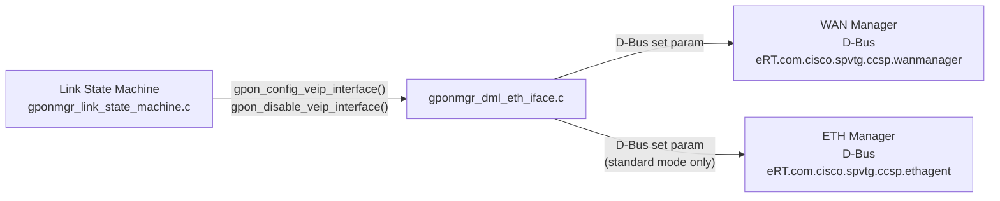
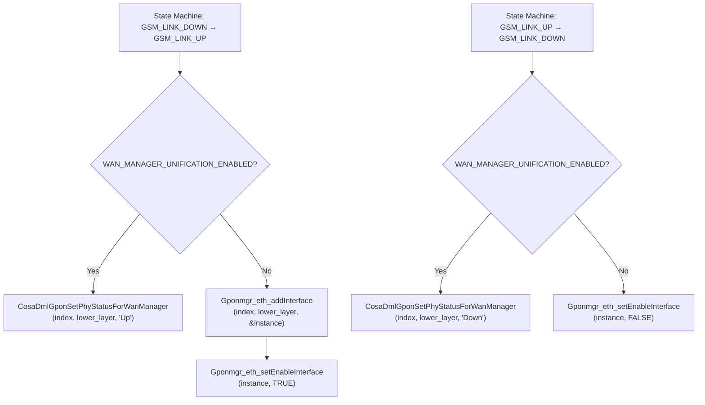

# ETH/WAN Interface Manager

## Overview

The ETH/WAN Interface Manager (`gponmgr_dml_eth_iface.c`) manages the upstream network interface that carries GPON ONT traffic toward the WAN. It is invoked by the Link State Machine on VEIP link-up and link-down transitions.

The module operates in two distinct modes selected at compile time by the `WAN_MANAGER_UNIFICATION_ENABLED` preprocessor macro:

- **Standard mode**: Communicates with ETH Manager (`eRT.com.cisco.spvtg.ccsp.ethagent`) to create and enable a `Device.Ethernet.X_RDK_Interface.*` entry, and with WAN Manager to set the CPE interface link status.
- **WAN Unification mode**: Communicates only with WAN Manager (`eRT.com.cisco.spvtg.ccsp.wanmanager`) to set the `BaseInterfaceStatus` of the corresponding `Device.X_RDK_WanManager.Interface.*` entry.

---

## Architecture

---

## Key Components

### Files

| Type | Path |
|------|------|
| Source | `source/TR-181/middle_layer_src/gponmgr_dml_eth_iface.c` |
| Header | `source/TR-181/middle_layer_src/gponmgr_dml_eth_iface.h` |

---

## Core Functions

### Standard Mode

#### `Gponmgr_eth_addInterface()`

#### Purpose

Creates a new `Device.Ethernet.X_RDK_Interface.*` entry in ETH Manager and configures it with the VEIP lower-layer path.

#### Inputs

| Parameter | Description |
|-----------|-------------|
| `iVeipIndex` | Zero-based VEIP index |
| `LowerLayers` | Lower-layer path string (e.g. `Device.X_RDK_ONT.Veip.1`) |
| `iVeipInstance` | Output: ETH Manager instance number assigned |

#### Processing

1. Queries WAN Manager for the number of CPE interfaces and finds the matching interface by name.
2. Sets `Device.Ethernet.X_RDK_Interface.%d.Name` and `Device.Ethernet.X_RDK_Interface.%d.LowerLayers` on ETH Manager via D-Bus.
3. Returns the assigned ETH Manager instance number in `iVeipInstance`.

---

#### `Gponmgr_eth_setEnableInterface()`

#### Purpose

Enables or disables a `Device.Ethernet.X_RDK_Interface.*` entry in ETH Manager.

#### Inputs

| Parameter | Description |
|-----------|-------------|
| `iVeipInstance` | ETH Manager instance number |
| `bflag` | `TRUE` to enable, `FALSE` to disable |

#### Processing

Sets `Device.Ethernet.X_RDK_Interface.%d.Enable` via D-Bus to the ETH Manager component.

---

### WAN Unification Mode

#### `CosaDmlGponSetPhyStatusForWanManager()`

#### Purpose

Sets the `BaseInterfaceStatus` parameter of the WAN Manager interface entry corresponding to the VEIP lower-layer path.

#### Inputs

| Parameter | Description |
|-----------|-------------|
| `iVeipIndex` | Zero-based VEIP index |
| `LowerLayers` | Lower-layer path string (e.g. `Device.X_RDK_ONT.Veip.1`) |
| `PhyStatus` | `"Up"` or `"Down"` |

#### Processing

1. Calls `CosaDmlGetLowerLayersInstanceInWanManager()` to find the WAN Manager interface instance whose `BaseInterface` matches `LowerLayers`.
2. Sets `Device.X_RDK_WanManager.Interface.%d.BaseInterfaceStatus` via D-Bus.

---

#### `CosaDmlGetLowerLayersInstanceInWanManager()`

#### Purpose

Searches WAN Manager interface entries to find the instance number whose `BaseInterface` matches the given lower-layer path.

---

### Shared

#### `Gponmgr_eth_setParams()`

#### Purpose

Generic D-Bus parameter set helper. Sends a `setParameterValues` request to the specified CCSP component.

#### Inputs

| Parameter | Description |
|-----------|-------------|
| `pComponent` | CCSP component name |
| `pBus` | D-Bus path of the component |
| `pParamName` | Full TR-181 parameter path |
| `pParamVal` | Value string |
| `type` | CCSP parameter data type |
| `bCommitFlag` | Commit flag (0 or 1) |

---

## D-Bus Endpoints

### Standard Mode

| Component | D-Bus Name | D-Bus Path |
|-----------|-----------|-----------|
| WAN Manager | `eRT.com.cisco.spvtg.ccsp.wanmanager` | `/com/cisco/spvtg/ccsp/wanmanager` |
| ETH Manager | `eRT.com.cisco.spvtg.ccsp.ethagent` | `/com/cisco/spvtg/ccsp/ethagent` |

### WAN Unification Mode

| Component | D-Bus Name | D-Bus Path |
|-----------|-----------|-----------|
| WAN Manager | `eRT.com.cisco.spvtg.ccsp.wanmanager` | `/com/cisco/spvtg/ccsp/wanmanager` |

---

## Parameter Paths

### Standard Mode

| Parameter | Path |
|-----------|------|
| CPE interface count | `Device.X_RDK_WanManager.CPEInterfaceNumberOfEntries` |
| CPE interface name | `Device.X_RDK_WanManager.CPEInterface.%d.Name` |
| CPE link status | `Device.X_RDK_WanManager.CPEInterface.%d.Wan.LinkStatus` |
| CPE physical path | `Device.X_RDK_WanManager.CPEInterface.%d.Phy.Path` |
| ETH interface count | `Device.Ethernet.X_RDK_InterfaceNumberOfEntries` |
| ETH interface table | `Device.Ethernet.X_RDK_Interface.%d.` |
| ETH interface name | `Device.Ethernet.X_RDK_Interface.%d.Name` |
| ETH lower layers | `Device.Ethernet.X_RDK_Interface.%d.LowerLayers` |
| ETH enable | `Device.Ethernet.X_RDK_Interface.%d.Enable` |

### WAN Unification Mode

| Parameter | Path |
|-----------|------|
| WAN interface count | `Device.X_RDK_WanManager.InterfaceNumberOfEntries` |
| WAN interface name | `Device.X_RDK_WanManager.Interface.%d.Name` |
| WAN base interface status | `Device.X_RDK_WanManager.Interface.%d.BaseInterfaceStatus` |
| WAN base interface | `Device.X_RDK_WanManager.Interface.%d.BaseInterface` |

---

## Processing Flow

---

## Integration Points

### Dependencies

| Dependency | Purpose |
|------------|---------|
| `ccsp_message_bus.h` | D-Bus handle (`bus_handle`) for parameter set calls |
| WAN Manager | Interface status and instance lookup |
| ETH Manager | Ethernet interface provisioning (standard mode) |

### Consumers

| Consumer | Usage |
|----------|-------|
| `gponmgr_link_state_machine.c` | `gpon_config_veip_interface()` / `gpon_disable_veip_interface()` |

---

## Error Handling

| Error | Cause | Recovery |
|-------|-------|---------|
| WAN Manager D-Bus query failure | WAN Manager not running or D-Bus error | Returns `ANSC_STATUS_FAILURE`; state machine logs error and retains current state |
| ETH Manager D-Bus set failure | ETH Manager not running | Returns `ANSC_STATUS_FAILURE`; state machine logs error |
| Interface not found in WAN Manager | VEIP lower-layer path not matched | Returns `ANSC_STATUS_FAILURE`; logged |
