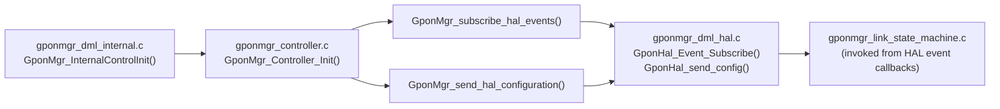
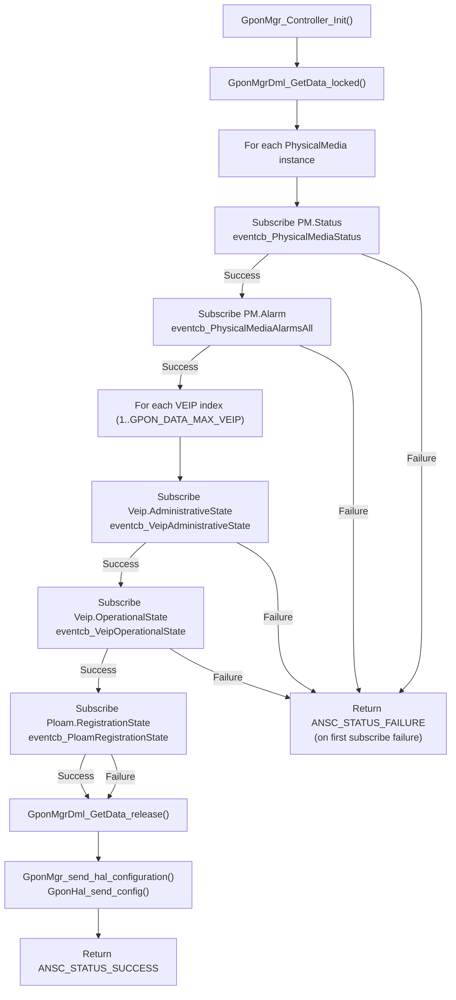

# GPON Controller

## Overview

The GPON Controller (`gponmgr_controller.c`) is the runtime orchestration entry point for GPON Manager's active behaviour. It is called once during initialisation (via `GponMgr_InternalControlInit()`) and performs two responsibilities: subscribing to HAL hardware events for all relevant ONT objects, and dispatching the initial HAL configuration.

The controller acts as the bridge between the DML initialisation sequence and the hardware layer. It does not run a loop; it drives the one-time setup actions that put the system into a live, event-driven operating mode.

---

## Architecture



---

## Key Components

### Files

| Type | Path |
|------|------|
| Source | `source/GponManager/gponmgr_controller.c` |
| Header | `source/GponManager/gponmgr_controller.h` |

---

## Core Functions

### `GponMgr_Controller_Init()`

#### Purpose

Top-level initialisation function for the GPON Controller. Calls `GponMgr_subscribe_hal_events()` and `GponMgr_send_hal_configuration()` in sequence.

#### Inputs

None.

#### Outputs

Returns `ANSC_STATUS_SUCCESS` if both sub-functions succeed; returns the failure status of the first failing sub-function.

#### Processing

```c
// Example only.
// Replace with actual implementation.

returnStatus = GponMgr_subscribe_hal_events();
if (returnStatus != ANSC_STATUS_SUCCESS) { return returnStatus; }

returnStatus = GponMgr_send_hal_configuration();
return returnStatus;
```

---

### `GponMgr_subscribe_hal_events()`

#### Purpose

Subscribes to HAL event notifications for all active PhysicalMedia and VEIP instances, and for the PLOAM registration state.

#### Processing

1. Acquires the global data store lock (`GponMgrDml_GetData_locked()`).
2. Iterates over all `PhysicalMedia` entries in the data store:
   - Subscribes `eventcb_PhysicalMediaStatus` to `Device.X_RDK_ONT.PhysicalMedia.%ld.Status`.
   - Subscribes `eventcb_PhysicalMediaAlarmsAll` to `Device.X_RDK_ONT.PhysicalMedia.%ld.Alarm`.
3. Iterates VEIP indices from 1 to `GPON_DATA_MAX_VEIP` (inclusive):
   - Subscribes `eventcb_VeipAdministrativeState` to `Device.X_RDK_ONT.Veip.%ld.AdministrativeState`.
   - Subscribes `eventcb_VeipOperationalState` to `Device.X_RDK_ONT.Veip.%ld.OperationalState`.
4. Subscribes `eventcb_PloamRegistrationState` to `Device.X_RDK_ONT.Ploam.RegistrationState`.
5. Releases the data store lock.
6. Returns `ANSC_STATUS_SUCCESS` if all subscriptions succeed; aborts and returns failure on the first subscription error.

All subscriptions use notification type `JSON_SUBSCRIBE_ON_CHANGE` (`"onChange"`).

---

### `GponMgr_send_hal_configuration()`

#### Purpose

Sends the initial configuration to the HAL server using `GponHal_send_config()`.

#### Processing

Delegates directly to `GponHal_send_config()` and returns its result.

---

## Processing Flow



---

## Integration Points

### Dependencies

| Dependency | Purpose |
|------------|---------|
| `gponmgr_dml_data.c` | `GponMgrDml_GetData_locked()` / `GponMgrDml_GetData_release()` for thread-safe data store access |
| `gponmgr_dml_hal.c` | `GponHal_Event_Subscribe()` and `GponHal_send_config()` |

### Consumers

| Consumer | Usage |
|----------|-------|
| `gponmgr_dml_internal.c` | Calls `GponMgr_Controller_Init()` from `GponMgr_InternalControlInit()` |

---

## Error Handling

| Error | Cause | Recovery |
|-------|-------|---------|
| `GponHal_Event_Subscribe()` returns failure | HAL client not connected, or invalid event name | Subscription loop aborts; error logged via `CcspTraceError`; `ANSC_STATUS_FAILURE` returned to caller |
| `GponMgr_send_hal_configuration()` failure | HAL server returned error or not connected | Error logged; failure propagated to `GponMgr_Controller_Init()` caller |

The calling function (`GponMgr_InternalControlInit`) logs the error but does not abort the overall DML initialisation on controller failure, allowing the component to start in a degraded state.
