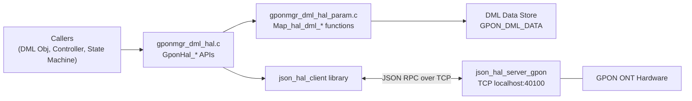
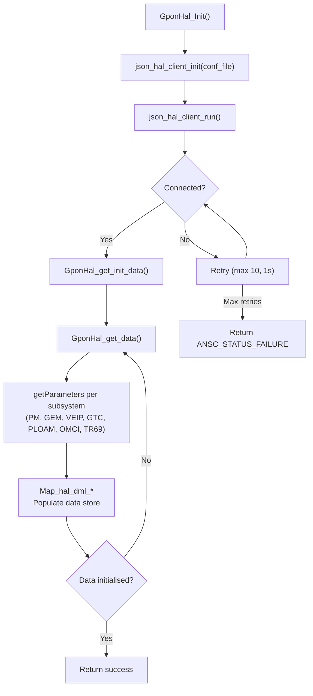

# HAL Abstraction

## Overview

The HAL Abstraction layer (`gponmgr_dml_hal.c` and `gponmgr_dml_hal_param.c`) provides a typed, GPON-specific interface between GPON Manager and the underlying vendor hardware, accessed via the `json_hal_client` library.

All hardware interactions — initial data retrieval, parameter writes, and event subscriptions — pass through this layer. It abstracts the JSON-over-TCP RPC protocol defined by `gpon_hal_schema.json`, and maps JSON responses to the TR-181 C data structures defined in `gpon_apis.h`.

---

## Architecture

---

## Key Components

### Files

| Type | Path |
|------|------|
| Source | `source/TR-181/middle_layer_src/gponmgr_dml_hal.c` |
| Source | `source/TR-181/middle_layer_src/gponmgr_dml_hal_param.c` |
| Header | `source/TR-181/middle_layer_src/gponmgr_dml_hal.h` |
| Header | `source/TR-181/middle_layer_src/gponmgr_dml_hal_param.h` |
| Header | `source/TR-181/include/gpon_apis.h` |
| Schema | `hal_schema/gpon_hal_schema.json` |
| Schema | `hal_schema/gpon_wan_unify_hal_schema.json` |

---

## Core Functions

### `GponHal_Init()`

#### Purpose

Initialises the JSON HAL client and establishes a connection to the HAL server.

#### Processing

1. In `WAN_MANAGER_UNIFICATION_ENABLED` mode, starts the HAL server process `json_hal_server_gpon` via `v_secure_system()`.
2. Calls `json_hal_client_init(GPON_MANAGER_CONF_FILE)` to load configuration.
3. Calls `json_hal_client_run()` to start the client.
4. Polls `json_hal_is_client_connected()` up to `HAL_CONNECTION_RETRY_MAX_COUNT` (10) times with 1-second intervals.
5. Returns `ANSC_STATUS_FAILURE` if not connected after all retries.

---

### `GponHal_get_init_data()`

#### Purpose

Fetches initial ONT data from the HAL and populates the data store. Retries indefinitely until valid GPON data is returned.

#### Processing

1. Calls `GponHal_get_data()` in a loop.
2. After each successful call, calls `GponHal_check_data_initiliased()`.
3. Considers data initialised when at least one PhysicalMedia entry has a non-empty `ModuleVendor` and `PonMode == GPON`.

---

### `GponHal_get_data()`

#### Purpose

Queries the HAL server for the full ONT data set. Issues `getParameters` requests for each subsystem and maps responses to the data store.

Subsystem query prefixes:

| Constant | Value |
|----------|-------|
| `GPON_QUERY_PM` | `Device.X_RDK_ONT.PhysicalMedia.` |
| `GPON_QUERY_GEM` | `Device.X_RDK_ONT.Gem.` |
| `GPON_QUERY_VEIP` | `Device.X_RDK_ONT.Veip.` |
| `GPON_QUERY_GTC` | `Device.X_RDK_ONT.Gtc.` |
| `GPON_QUERY_PLOAM` | `Device.X_RDK_ONT.Ploam.` |
| `GPON_QUERY_OMCI` | `Device.X_RDK_ONT.Omci.` |
| `GPON_QUERY_TR69` | `Device.X_RDK_ONT.TR69.` |

---

### `GponHal_get_pm()` / `GponHal_get_veip()` / `GponHal_get_gtc()` / etc.

#### Purpose

Subsystem-specific query functions. Each issues a `getParameters` JSON RPC call for the respective subsystem prefix, iterates the response array, and calls the appropriate `Map_hal_dml_*` function.

| Function | HAL Query Prefix | Maps To |
|----------|-----------------|---------|
| `GponHal_get_pm()` | `Device.X_RDK_ONT.PhysicalMedia.` | `DML_PHY_MEDIA_LIST_T` |
| `GponHal_get_veip()` | `Device.X_RDK_ONT.Veip.` | `DML_VEIP_LIST_T` |
| `GponHal_get_gtc()` | `Device.X_RDK_ONT.Gtc.` | `DML_GTC` |
| `GponHal_get_ploam()` | `Device.X_RDK_ONT.Ploam.` | `DML_PLOAM` |
| `GponHal_get_omci()` | `Device.X_RDK_ONT.Omci.` | `DML_OMCI` |
| `GponHal_get_gem()` | `Device.X_RDK_ONT.Gem.` | `DML_GEM_LIST_T` |
| `GponHal_get_tr69()` | `Device.X_RDK_ONT.TR69.` | `DML_TR69` |

---

### `GponHal_setParam()`

#### Purpose

Sends a `setParameters` JSON RPC call to the HAL server for a single named parameter.

#### Inputs

| Parameter | Type | Description |
|-----------|------|-------------|
| `pName` | `char*` | Full TR-181 parameter path |
| `pType` | `eParamType` | JSON parameter type |
| `pValue` | `char*` | String representation of the value |

---

### `GponHal_Event_Subscribe()`

#### Purpose

Subscribes to a named HAL event with a specified notification type and callback function.

#### Inputs

| Parameter | Type | Description |
|-----------|------|-------------|
| `callback` | `event_callback` | Function to call when event fires |
| `event_name` | `const char*` | Full event path (e.g. `Device.X_RDK_ONT.Veip.1.OperationalState`) |
| `event_notification_type` | `const char*` | `"onChange"` |

---

### `GponHal_send_config()`

#### Purpose

Sends the initial configuration parameters to the HAL. Called by `GponMgr_send_hal_configuration()` after HAL data retrieval.

---

## Event Callbacks

All callbacks are registered by `GponMgr_subscribe_hal_events()` and are called by the `json_hal_client` library when the HAL server publishes a matching event.

Each callback parses the JSON event message, acquires the data store mutex, and updates the relevant data structure fields.

| Callback | Subscribed Event | Updates |
|----------|-----------------|---------|
| `eventcb_PhysicalMediaStatus` | `Device.X_RDK_ONT.PhysicalMedia.%ld.Status` | `DML_PHY_MEDIA.Status` |
| `eventcb_PhysicalMediaAlarmsAll` | `Device.X_RDK_ONT.PhysicalMedia.%ld.Alarm` | `DML_PHY_MEDIA.Alarm.*` |
| `eventcb_VeipAdministrativeState` | `Device.X_RDK_ONT.Veip.%ld.AdministrativeState` | `DML_VEIP.AdministrativeState` |
| `eventcb_VeipOperationalState` | `Device.X_RDK_ONT.Veip.%ld.OperationalState` | `DML_VEIP.OperationalState`; triggers `GponMgr_Link_StateMachine_Start()` if `sm_created == FALSE` |
| `eventcb_PloamRegistrationState` | `Device.X_RDK_ONT.Ploam.RegistrationState` | `DML_PLOAM.RegistrationState` |

---

## HAL Parameter Mapping

`gponmgr_dml_hal_param.c` provides `Map_hal_dml_*` functions that receive a parameter name string and value string from a HAL response and update the appropriate field in the data store.

| Function | Maps Into |
|----------|----------|
| `Map_hal_dml_pm()` | `DML_PHY_MEDIA_LIST_T` |
| `Map_hal_dml_gtc()` | `DML_GTC` |
| `Map_hal_dml_ploam()` | `DML_PLOAM` |
| `Map_hal_dml_omci()` | `DML_OMCI` |
| `Map_hal_dml_gem()` | `DML_GEM_LIST_T` |
| `Map_hal_dml_veip()` | `DML_VEIP_LIST_T` |
| `Map_hal_dml_tr69()` | `DML_TR69` |

Index extraction from parameter names is handled by:

| Function | Purpose |
|----------|---------|
| `gpon_hal_get_pm_index()` | Extracts PhysicalMedia instance index from parameter name string |
| `gpon_hal_get_gem_index()` | Extracts GEM instance index from parameter name string |
| `gpon_hal_get_veip_index()` | Extracts VEIP instance index from parameter name string |

---

## JSON HAL Protocol

The HAL client communicates with the HAL server using JSON messages validated against `gpon_hal_schema.json`. The schema version is `0.0.1` and the module name is `gponhal`.

### Supported Actions

| Action | Direction | Description |
|--------|----------|-------------|
| `getParameters` | Client → Server | Query parameter values by prefix or name |
| `getParametersResponse` | Server → Client | Response with name, type, value for each parameter |
| `setParameters` | Client → Server | Set one or more parameter values |
| `subscribeEvent` | Client → Server | Subscribe to named event notifications |
| `publishEvent` | Server → Client | Deliver event notification to subscribed callback |
| `getSchema` | Client → Server | Request schema file path |
| `getSchemaResponse` | Server → Client | Schema file path response |
| `result` | Server → Client | Status response for set operations |

### HAL Parameter Paths

| Path Pattern | Description |
|-------------|-------------|
| `Device.X_RDK_ONT.PhysicalMedia.%ld.*` | Physical media properties, power levels, alarms |
| `Device.X_RDK_ONT.Veip.%ld.*` | VEIP administrative/operational state, Ethernet flow |
| `Device.X_RDK_ONT.Gem.%ld.*` | GEM port traffic and Ethernet flow settings |
| `Device.X_RDK_ONT.Gtc.*` | GTC FEC and HEC counters |
| `Device.X_RDK_ONT.Ploam.*` | PLOAM registration, timers, message counters |
| `Device.X_RDK_ONT.Omci.*` | OMCI message counters |
| `Device.X_RDK_ONT.TR69.*` | TR-069 URL and association tag |

---

## Processing Flow

---

## Integration Points

### Dependencies

| Dependency | Purpose |
|------------|---------|
| `json_hal_client` library | JSON RPC transport |
| `json-c` | JSON parsing |
| `syscfg` | System configuration access |
| `secure_wrapper` (`v_secure_system`) | Secure process launch for HAL server |
| `gponmgr_dml_data.c` | Data store write access via mutex |
| `gponmgr_link_state_machine.c` | `GponMgr_Link_StateMachine_Start()` called from `eventcb_VeipOperationalState` |

### Consumers

| Consumer | Usage |
|----------|-------|
| `gponmgr_dml_obj.c` | `GponHal_Init()` and `GponHal_get_init_data()` during initialisation |
| `gponmgr_controller.c` | `GponHal_Event_Subscribe()` and `GponHal_send_config()` |
| `gponmgr_dml_func.c` | `GponHal_setParam()` for writable parameter updates |
| `gponmgr_link_state_machine.c` | `GponHal_get_veip()` on link-up transition |

---

## Error Handling

| Error | Cause | Recovery |
|-------|-------|---------|
| `json_hal_client_init()` failure | Config file not found or invalid | Returns `ANSC_STATUS_FAILURE`; logged |
| `json_hal_client_run()` failure | Client thread start failure | Returns `ANSC_STATUS_FAILURE`; logged |
| HAL connection timeout | Server not running | Returns `ANSC_STATUS_FAILURE` after 10 retries |
| `getParameters` request failure | Server error or invalid schema | Returns `ANSC_STATUS_FAILURE`; retry on next `get_init_data` loop iteration |
| `setParameters` failure | Server rejected set | Returns `ANSC_STATUS_FAILURE`; logged by caller |
| Null parameter in mapping functions | Invalid HAL response | `CHECK` macro returns `ANSC_STATUS_FAILURE`; logged |
