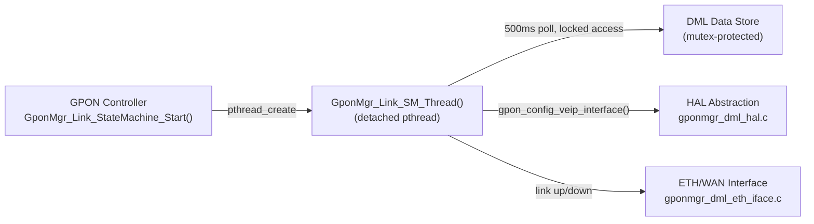
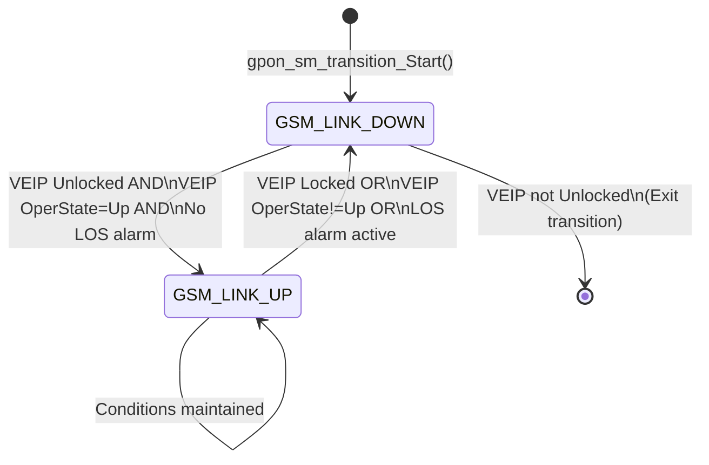
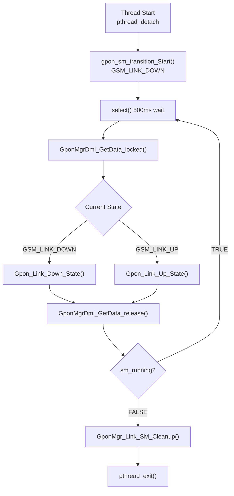

# Link State Machine

## Overview

The GPON Link State Machine (`gponmgr_link_state_machine.c`) manages the operational lifecycle of a single VEIP (Virtual Ethernet Interface Point) interface on the GPON ONT. One state machine instance is created per VEIP and runs in a dedicated, detached POSIX thread.

The state machine monitors VEIP administrative state, VEIP operational state, and PhysicalMedia LOS (Loss of Signal) alarm conditions. Based on these inputs, it drives transitions between `GSM_LINK_DOWN` and `GSM_LINK_UP`, and configures or disables the upstream WAN/ETH interface accordingly.

---

## Architecture



---

## Key Components

### Files

| Type | Path |
|------|------|
| Source | `source/GponManager/gponmgr_link_state_machine.c` |
| Header | `source/GponManager/gponmgr_link_state_machine.h` |

---

## Core Functions

### `GponMgr_Link_StateMachine_Start()`

#### Purpose

Creates and starts the state machine thread for a specific VEIP instance.

#### Inputs

| Parameter | Type | Description |
|-----------|------|-------------|
| `pGponVeip` | `DML_VEIP*` | Pointer to the VEIP data model object; provides `uInstanceNumber` |

#### Processing

1. Validates `pGponVeip` is non-NULL.
2. Allocates and initialises `GPON_LINK_SM_CTRL_T` via `GponMgr_Link_SM_Init()`.
3. Stores `veip_hal_index = pGponVeip->uInstanceNumber`.
4. Calls `pthread_create()` with `GponMgr_Link_SM_Thread` as the thread function.

---

### `GponMgr_Link_SM_Thread()`

#### Purpose

The state machine thread function. Runs a `select()`-based timer loop, acquiring the data store on each iteration to evaluate and advance the state machine.

#### Processing

1. Calls `pthread_detach(pthread_self())`.
2. Calls `gpon_sm_transition_Start()` → initial state: `GSM_LINK_DOWN`.
3. Enters loop while `sm_running == TRUE`:
   - Waits up to 500 ms using `select(0, NULL, NULL, NULL, &tv)`.
   - Acquires data store: `GponMgrDml_GetData_locked()`.
   - Dispatches current state:
     - `GSM_LINK_DOWN` → `Gpon_Link_Down_State()`
     - `GSM_LINK_UP` → `Gpon_Link_Up_State()`
   - Releases data store: `GponMgrDml_GetData_release()`.
4. Calls `GponMgr_Link_SM_Cleanup()`.
5. Calls `pthread_exit(NULL)`.

---

### `Gpon_Link_Down_State()`

#### Purpose

Evaluates conditions for transitioning from `GSM_LINK_DOWN` to `GSM_LINK_UP`.

#### Processing

1. Calls `check_gpon_veip_interface_enabled()`:
   - If VEIP `AdministrativeState != Unlock` → calls `gpon_sm_transition_Exit()` (stops state machine).
2. Calls `check_gpon_veip_interface_up()`:
   - If VEIP `OperationalState == veip_Up` AND no LOS alarm on active PhysicalMedia → calls `gpon_sm_transition_LinkDown_to_LinkUp()`.
3. Otherwise remains in `GSM_LINK_DOWN`.

---

### `Gpon_Link_Up_State()`

#### Purpose

Monitors link-up conditions and transitions to `GSM_LINK_DOWN` if they are no longer met.

#### Processing

1. Calls `check_gpon_veip_interface_enabled()`:
   - If VEIP is not Unlocked → transitions to `GSM_LINK_DOWN`.
2. Calls `check_gpon_veip_interface_up()`:
   - If VEIP is not operationally up, or LOS is active → transitions to `GSM_LINK_DOWN`.
3. Calls `GSM_Operational_State_Handler()` (currently a no-op returning success).
4. Remains in `GSM_LINK_UP`.

---

### `gpon_sm_transition_LinkDown_to_LinkUp()`

#### Purpose

Performs the link-up transition. Fetches fresh VEIP data from HAL and configures the upstream interface.

#### Processing

1. Calls `GponHal_get_veip()` to refresh VEIP data in the data store.
2. Constructs the VEIP lower-layer path string: `Device.X_RDK_ONT.Veip.%d`.
3. In `WAN_MANAGER_UNIFICATION_ENABLED` mode: calls `CosaDmlGponSetPhyStatusForWanManager(veip_index, lower_layer, "Up")`.
4. In standard mode: calls `Gponmgr_eth_addInterface()` to create an ETH Manager entry, then `Gponmgr_eth_setEnableInterface(instance, TRUE)`.

---

### `gpon_sm_transition_LinkUp_to_LinkDown()`

#### Purpose

Performs the link-down transition. Disables the upstream interface.

#### Processing

1. In `WAN_MANAGER_UNIFICATION_ENABLED` mode: calls `CosaDmlGponSetPhyStatusForWanManager(veip_index, lower_layer, "Down")`.
2. In standard mode: calls `Gponmgr_eth_setEnableInterface(veip_eth_instance, FALSE)`.

---

### `check_gpon_physical_media_alarm_los()`

#### Purpose

Returns `true` if any PhysicalMedia instance in `Active` RedundancyState has `Alarm.LOS == ACTIVE`.

---

### `GponMgr_Link_SM_Cleanup()`

#### Purpose

Called on state machine thread exit. Clears the `sm_created` flag on the VEIP control structure, releases the data store lock, and frees the `GPON_LINK_SM_CTRL_T` allocation.

---

## Data Structures

```c
// Example only.
// Replace with actual data structures.

typedef struct _GPON_LINK_SM_CTRL_
{
    int                         veip_hal_index;       // 1-based VEIP HAL index
    int                         veip_eth_instance;    // ETH Manager instance (standard mode)
    char                        veip_lower_layer[256]; // e.g. "Device.X_RDK_ONT.Veip.1"
    bool                        sm_running;           // Loop control flag
    GPON_LINK_STATE_MACHINE_T   sm_state;             // Current state
    GPON_DML_DATA*              pGponData;            // Locked data store pointer (held during state evaluation)
}
GPON_LINK_SM_CTRL_T;
```

---

## State Management



---

## Processing Flow



---

## Integration Points

### Dependencies

| Dependency | Purpose |
|------------|---------|
| `gponmgr_dml_data.c` | Thread-safe data store access (`GponMgrDml_GetData_locked` / `release`) |
| `gponmgr_dml_hal.c` | `GponHal_get_veip()` to refresh VEIP data on link-up |
| `gponmgr_dml_eth_iface.c` | `Gponmgr_eth_addInterface()`, `Gponmgr_eth_setEnableInterface()`, `CosaDmlGponSetPhyStatusForWanManager()` |

### Consumers

| Consumer | Usage |
|----------|-------|
| `gponmgr_controller.c` | `GponMgr_Link_StateMachine_Start()` called per VEIP during controller initialisation |

---

## Configuration

| Parameter | Value | Description |
|-----------|-------|-------------|
| `GPON_LINK_SM_LOOP_TIMEOUT` | `500000` µs | State machine polling interval |
| `GPON_DATA_MAX_VEIP` | `2` | Maximum concurrent state machine instances |

---

## Error Handling

| Error | Cause | Recovery |
|-------|-------|---------|
| `pthread_create` failure | Thread resource exhaustion | Error logged; no state machine runs for that VEIP |
| `GponMgr_Link_SM_Init()` returns NULL | Memory allocation failure | Error logged; function returns `ANSC_STATUS_FAILURE` |
| `gpon_config_veip_interface()` failure | HAL query or ETH/WAN Manager D-Bus failure | Transition returns `GSM_LINK_DOWN`; logged |
| `gpon_disable_veip_interface()` failure | ETH/WAN Manager D-Bus failure | Transition returns `GSM_LINK_UP` (link remains up); logged |
| `select()` returns negative | Signal interrupt | Loop continues (no state change) |

## Performance Characteristics

### CPU

The state machine thread performs one `select()` call per 500 ms interval, followed by a mutex lock/unlock and two to three data store structure reads. CPU overhead is negligible under normal conditions.

### Memory

One `GPON_LINK_SM_CTRL_T` (approximately 280 bytes) is allocated per VEIP. Maximum two instances (`GPON_DATA_MAX_VEIP = 2`).
