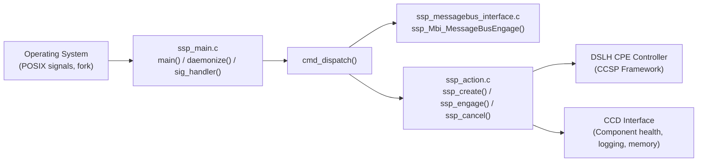
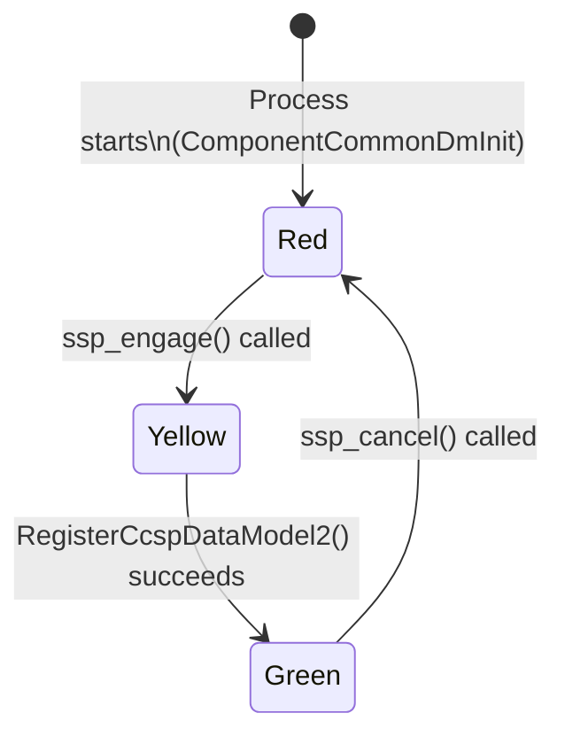

# SSP (Service Process)

## Overview

The SSP layer forms the entry point and process management shell of GPON Manager. It implements the CCSP Service/System Process (SSP) pattern, providing daemon lifecycle management, CCSP message bus engagement, component identity and health reporting via the CCD interface, and data model registration using the DSLH CPE Controller.

The SSP layer does not contain application-specific logic; it establishes the CCSP hosting environment within which the TR-181 data model and GPON control logic operate.

---

## Architecture



---

## Key Components

### Files

| Type | Path |
|------|------|
| Source | `source/GponManager/ssp_main.c` |
| Source | `source/GponManager/ssp_action.c` |
| Source | `source/GponManager/ssp_messagebus_interface.c` |
| Header | `source/GponManager/ssp_internal.h` |
| Header | `source/GponManager/ssp_global.h` |
| Header | `source/GponManager/ssp_messagebus_interface.h` |

---

## Core Functions

### `main()`

#### Purpose

Process entry point. Parses command-line arguments, initialises the RDK logger, optionally daemonises, writes the PID file, installs signal handlers, engages CCSP, and enters the main daemon loop.

#### Inputs

| Argument | Description |
|----------|-------------|
| `-subsys <prefix>` | Sets the CCSP subsystem prefix (e.g. `eRT.`) |
| `-c` | Runs in foreground (interactive) mode instead of daemon mode |

#### Outputs

- PID written to `/var/tmp/gponmanager.pid`.
- Sentinel file `/tmp/GponMgrDml_Initialized` created after DML init (via `system()` call).
- In daemon mode: enters `while(1) { sleep(30); }` loop.

#### Processing

1. Parses `-subsys` and `-c` flags.
2. Sets `pComponentName = COMPONENT_NAME_GPON_MANAGER`.
3. Calls `rdk_logger_init(DEBUG_INI_NAME)`.
4. Calls `daemonize()` if not in interactive mode.
5. Writes PID to `/var/tmp/gponmanager.pid`.
6. Installs signal handlers.
7. Calls `cmd_dispatch('e')` to start the component.
8. Calls `Cdm_Init()` for device management integration.
9. Sends `sd_notify(READY=1)` if `ENABLE_SD_NOTIFY` is defined.
10. Executes `touch /tmp/GponMgrDml_Initialized`.
11. Enters daemon sleep loop or interactive input loop.

---

### `daemonize()`

#### Purpose

Forks the process to background, calls `setsid()` to create a new session, and redirects standard file descriptors to `/dev/null` in release builds.

---

### `cmd_dispatch()`

#### Purpose

Dispatches runtime commands. Called with `'e'` at startup, and optionally with `'m'`, `'t'`, `'c'` in interactive mode.

| Command | Action |
|---------|--------|
| `'e'` | Engage: call `ssp_Mbi_MessageBusEngage()`, `ssp_create()`, `ssp_engage()` |
| `'m'` | Print component memory table |
| `'t'` | Print ANSC memory trace table |
| `'c'` | Cancel: call `ssp_cancel()` |

---

### `ssp_create()`

#### Purpose

Allocates and initialises the component data structures. Creates the CCD interface (`CCSP_CCD_INTERFACE`) and the library callback interface (`DSLH_LCB_INTERFACE`), and creates the DSLH CPE Controller object.

#### Processing

1. Allocates `COMPONENT_COMMON_GPON_MANAGER` and initialises it via `ComponentCommonDmInit`.
2. Sets `Name = COMPONENT_NAME_GPON_MANAGER`, `Version = 1`.
3. Creates `CCSP_CCD_INTERFACE` and binds all `ssp_CcdIf*` function pointers.
4. Creates `DSLH_LCB_INTERFACE` and sets `InitLibrary = GponMgrDml_Init`.
5. Calls `DslhCreateCpeController()`.

---

### `ssp_engage()`

#### Purpose

Engages the DSLH CPE Controller and registers the GPON Manager data model with the CCSP Component Registry.

#### Processing

1. Sets component health to Yellow.
2. Adds `DSLH_LCB_INTERFACE`, `CCC_MBI_INTERFACE`, and `CCSP_CCD_INTERFACE` to the CPE Controller.
3. Sets the D-Bus handle on the CPE Controller.
4. Calls `pDslhCpeController->Engage()`, which in turn calls `GponMgrDml_Init()` (via the LCB interface).
5. Calls `pDslhCpeController->RegisterCcspDataModel2()` with the CR name, `DMPackCreateDataModelXML`, component name, version, path, and subsystem prefix.
6. On success, sets component health to Green.

---

### `ssp_cancel()`

#### Purpose

Deregisters the component from the CCSP Component Registry, cancels the CPE Controller, and frees all allocated resources.

---

### CCD Interface Functions

Implement the `CCSP_CCD_INTERFACE` required by the CCSP framework for component health and logging management.

| Function | Purpose |
|----------|---------|
| `ssp_CcdIfGetComponentName()` | Returns `COMPONENT_NAME_GPON_MANAGER` |
| `ssp_CcdIfGetComponentVersion()` | Returns component version (`1`) |
| `ssp_CcdIfGetComponentHealth()` | Returns current health: Red / Yellow / Green |
| `ssp_CcdIfGetComponentState()` | Returns current state: Initializing / Running / Blocked |
| `ssp_CcdIfGetLoggingEnabled()` / `ssp_CcdIfSetLoggingEnabled()` | Controls RDK trace logging |
| `ssp_CcdIfGetLoggingLevel()` / `ssp_CcdIfSetLoggingLevel()` | Controls RDK trace level |
| `ssp_CcdIfGetMemConsumed()` | Returns live memory consumption via `AnscGetComponentMemorySize()` |
| `ssp_CcdIfGetMemMaxUsage()` | Returns peak memory usage from `g_ulAllocatedSizePeak` |

---

## Data Structures

```c
// Example only.
// Replace with actual data structures.

typedef struct _COMPONENT_COMMON_GPON_MANAGER
{
    char*   Name;         // Component name string
    ULONG   Version;      // Component version
    char*   Author;       // Author string
    ULONG   Health;       // Red(1) / Yellow(2) / Green(3)
    ULONG   State;        // Initializing(1) / Running(2) / Blocked(3)
    BOOL    LogEnable;    // Logging enabled flag
    ULONG   LogLevel;     // CCSP trace level
    ULONG   MemMaxUsage;  // Peak memory usage
    ULONG   MemMinUsage;  // Minimum memory usage
    ULONG   MemConsumed;  // Current memory consumption
}
COMPONENT_COMMON_GPON_MANAGER;
```

---

## State Management



Health states:

| Value | Constant | Meaning |
|-------|----------|---------|
| 1 | `COMMON_COMPONENT_HEALTH_Red` | Not initialised |
| 2 | `COMMON_COMPONENT_HEALTH_Yellow` | Engaging, not yet registered |
| 3 | `COMMON_COMPONENT_HEALTH_Green` | Fully operational |

---

## Signal Handling

| Signal | Handler Action |
|--------|---------------|
| `SIGTERM` | Exit process |
| `SIGINT` | Exit process |
| `SIGUSR1` | Log and re-register handler |
| `SIGUSR2` | Log |
| `SIGCHLD` | Log and re-register handler |
| `SIGPIPE` | Log and re-register handler |
| `SIGALRM` | Log warning and re-register handler |
| `SIGSEGV` / `SIGBUS` / `SIGILL` / `SIGFPE` / `SIGQUIT` / `SIGHUP` | Print stack backtrace, exit |
| `SIGKILL` | Print stack backtrace, exit |

When `INCLUDE_BREAKPAD` is defined, crash signals are delegated to `breakpad_ExceptionHandler()`.

---

## Integration Points

### Dependencies

| Dependency | Purpose |
|------------|---------|
| CCSP Common Library | Message bus, CPE Controller, CCD interface |
| ANSC Platform | Memory management, string utilities, trace macros |
| RDK Logger | `rdk_logger_init()` for `CcspTrace*` macros |
| `Cdm_Init()` / `Cdm_Term()` | Device management integration |
| `GponMgrDml_Init()` | DML plugin initialisation (called indirectly via LCB interface) |

### Consumers

| Consumer | Usage |
|----------|-------|
| CCSP Component Registry | Receives component registration from `ssp_engage()` |
| CCSP Message Bus | Routes data model get/set requests to DML functions |
| systemd | Receives `READY=1` notification when `ENABLE_SD_NOTIFY` is defined |

---

## Error Handling

| Error | Cause | Recovery |
|-------|-------|---------|
| `ANSC_STATUS_RESOURCES` from `ssp_create()` | Memory allocation failure | Logged; startup aborts |
| PID file creation failure | `/var/tmp/` not writable | Warning logged; process returns 1 |
| `Cdm_Init()` failure | Device management init failed | Error printed to stderr; process exits |
| `RegisterCcspDataModel2()` failure | CR not reachable or DM XML error | Health stays Yellow; logged |
