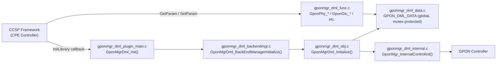
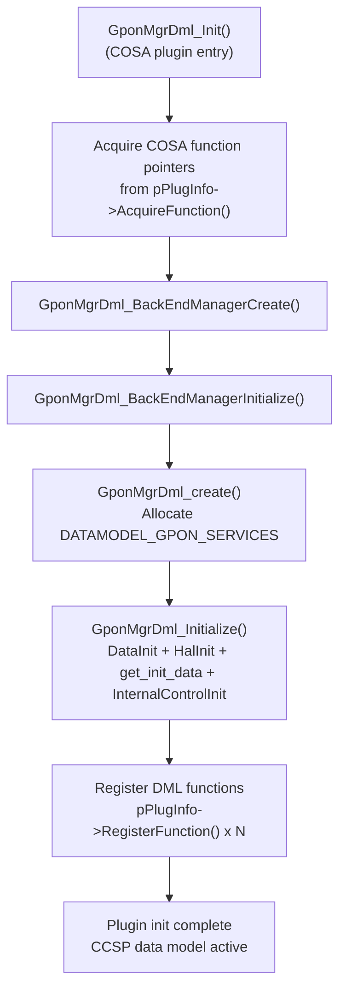

# TR-181 Data Model Layer

## Overview

The TR-181 Data Model (DML) Layer implements the COSA plugin interface for GPON Manager. It serves as the CCSP-facing layer that exposes the `Device.X_RDK_ONT.*` data model subtree, manages an in-memory data store, and handles all parameter get/set requests from the CCSP framework.

The DML layer is structured as a COSA plugin. It registers all accessor and mutator function pointers with the CCSP framework at startup, and owns the global `GPON_DML_DATA` structure that is shared (under mutex protection) with the HAL and control layers.

---

## Architecture



---

## Key Components

### Files

| Type | Path |
|------|------|
| Source | `source/TR-181/middle_layer_src/gponmgr_dml_plugin_main.c` |
| Source | `source/TR-181/middle_layer_src/gponmgr_dml_backendmgr.c` |
| Source | `source/TR-181/middle_layer_src/gponmgr_dml_obj.c` |
| Source | `source/TR-181/middle_layer_src/gponmgr_dml_func.c` |
| Source | `source/TR-181/middle_layer_src/gponmgr_dml_data.c` |
| Source | `source/TR-181/middle_layer_src/gponmgr_dml_internal.c` |
| Header | `source/TR-181/middle_layer_src/gponmgr_dml_plugin_main.h` |
| Header | `source/TR-181/middle_layer_src/gponmgr_dml_backendmgr.h` |
| Header | `source/TR-181/middle_layer_src/gponmgr_dml_obj.h` |
| Header | `source/TR-181/middle_layer_src/gponmgr_dml_func.h` |
| Header | `source/TR-181/middle_layer_src/gponmgr_dml_data.h` |
| Header | `source/TR-181/middle_layer_src/gponmgr_dml_internal.h` |
| Header | `source/TR-181/include/gpon_apis.h` |

---

## Core Functions

### `GponMgrDml_Init()`

#### Purpose

COSA plugin entry point. Called by the DSLH CPE Controller via the `DSLH_LCB_INTERFACE.InitLibrary` callback during `ssp_engage()`. Acquires all necessary COSA function pointers from the plugin info, creates the backend manager, and registers all DML accessor/mutator functions.

#### Inputs

| Parameter | Description |
|-----------|-------------|
| `uMaxVersionSupported` | Plugin version check; must be ≥ `THIS_PLUGIN_VERSION` (1) |
| `hCosaPlugInfo` | `PCOSA_PLUGIN_INFO` — provides `AcquireFunction` and `RegisterFunction` |

#### Processing

1. Acquires COSA function pointers: `COSAGetParamValueByPathName`, `COSASetParamValueByPathName`, `COSAGetParamValueString`, `COSAGetParamValueUlong`, `COSAGetParamValueInt`, `COSAGetParamValueBool`, `COSASetParamValue*`, `COSAGetInstanceNumbers`, `COSAValidateHierarchyInterface`, `COSAGetRegistryRootFolder`, `COSAGetInstanceNumberByIndex`, `COSAGetInterfaceByName`, `COSAGetMessageBusHandle`, `COSAGetSubsystemPrefix`, `COSARegisterCallBackAfterInitDml`, `COSARepopulateTable`.
2. Creates the backend manager via `GponMgrDml_BackEndManagerCreate()` and initialises it via `GponMgrDml_BackEndManagerInitialize()`.
3. Registers all DML functions with the CCSP framework via `pPlugInfo->RegisterFunction()`.

Registered function groups include all `GponPhy_*`, `GponGtc_*`, `GponPloam_*`, `GponGem_*`, `GponOmci_*`, `GponVeip_*`, `GponTR69_*`, and their sub-object counterparts.

---

### `GponMgrDml_BackEndManagerInitialize()`

#### Purpose

Initialises the backend manager object. Creates the GPON service data model object.

#### Processing

1. Calls `GponMgrDml_create()` which allocates `DATAMODEL_GPON_SERVICES`.
2. `GponMgrDml_Initialize()` is called on the object, which:
   - Calls `GponMgrDml_DataInit()` to allocate and initialise the `GPON_DML_DATA` structure.
   - Calls `GponHal_Init()` to connect to the JSON HAL server.
   - Calls `GponHal_get_init_data()` to populate the data store.
   - Calls `GponMgr_InternalControlInit()` to start the controller and state machines.

---

### `GponMgrDml_GetData_locked()` / `GponMgrDml_GetData_release()`

#### Purpose

Thread-safe access primitives for the global `GPON_DML_DATA` store. `GetData_locked()` acquires `mDataMutex` and returns a pointer to the global data. `GetData_release()` releases the mutex.

All code that reads or writes the data store — DML functions, HAL callbacks, and state machine threads — must use these two functions as a pair.

---

### DML Accessor Functions (`gponmgr_dml_func.c`)

These functions implement the CCSP data model callbacks registered by `GponMgrDml_Init()`. Each function acquires the data store lock, reads the requested value, and releases the lock.

Selected function signatures:

| Function | Parameters | Return |
|----------|-----------|--------|
| `GponPhy_GetParamStringValue()` | `hInsContext`, `ParamName`, `pValue`, `pUlSize` | `ULONG` (0=OK, -1=buffer too small) |
| `GponPhy_GetParamUlongValue()` | `hInsContext`, `ParamName`, `puLong` | `BOOL` |
| `GponPhyRxpwr_GetParamIntValue()` | `hInsContext`, `ParamName`, `pInt` | `BOOL` |
| `GponPhyRxpwr_SetParamIntValue()` | `hInsContext`, `ParamName`, `iValue` | `BOOL` (triggers `GponHal_setParam`) |
| `GponPhy_GetEntryCount()` | `hInsContext` | `ULONG` (PhysicalMedia count) |
| `GponPhy_GetEntry()` | `hInsContext`, `nIndex`, `pInsNumber` | `ANSC_HANDLE` |
| `GponVeip_GetParamUlongValue()` | `hInsContext`, `ParamName`, `puLong` | `BOOL` |
| `GponGtc_GetParamUlongValue()` | `hInsContext`, `ParamName`, `puLong` | `BOOL` |
| `GponPloam_GetParamStringValue()` | `hInsContext`, `ParamName`, `pValue`, `pUlSize` | `ULONG` |
| `GponGem_GetEntryCount()` | `hInsContext` | `ULONG` (GEM count) |

Writable parameters (those with `Set*` counterparts) call `GponHal_setParam()` to propagate the change to the HAL.

---

## Data Structures

```c
// Example only.
// Replace with actual data structures.

typedef struct _GPON_DML_DATA_
{
    DML_X_RDK_GPON_DEVICE   device;        // Device-level info (RootDataModelVersion, InterfaceStackNumberOfEntries)
    DML_X_RDK_GPON          gpon;          // ONT data (PhysicalMedia list, GTC, PLOAM, OMCI, GEM list, VEIP list, TR69)
    pthread_mutex_t         mDataMutex;    // Protects all fields above
}
GPON_DML_DATA;

typedef struct _DML_X_RDK_GPON
{
    DML_PHY_MEDIA_LIST_T    PhysicalMedia; // Up to GPON_DATA_MAX_PM=2 entries
    DML_GTC                 Gtc;
    DML_PLOAM               Ploam;
    DML_OMCI                Omci;
    DML_GEM_LIST_T          Gem;           // Up to GPON_DATA_MAX_GEM=32 entries
    DML_VEIP_LIST_T         Veip;          // Up to GPON_DATA_MAX_VEIP=2 entries
    DML_TR69                Tr69;
}
DML_X_RDK_GPON;

typedef struct _DML_VEIP_CTRL_
{
    DML_VEIP    dml;        // VEIP data model fields
    bool        sm_created; // TRUE if a state machine thread exists for this VEIP
    bool        updated;    // TRUE if data has been refreshed from HAL
}
DML_VEIP_CTRL_T;
```

---

## Processing Flow



---

## Integration Points

### Dependencies

| Dependency | Purpose |
|------------|---------|
| CCSP Framework | `AcquireFunction` / `RegisterFunction` / `PCOSA_PLUGIN_INFO` |
| `gponmgr_dml_hal.c` | `GponHal_Init()`, `GponHal_get_init_data()`, `GponHal_setParam()` |
| `gponmgr_dml_internal.c` | `GponMgr_InternalControlInit()` (triggers controller + state machines) |

### Consumers

| Consumer | Usage |
|----------|-------|
| CCSP CPE Controller | Calls `GponMgrDml_Init()` via the `DSLH_LCB_INTERFACE` at startup |
| CCSP Message Bus | Invokes registered `GponPhy_*`, `GponVeip_*`, etc. functions for data model access |
| HAL callbacks (`eventcb_*`) | Write updated values to the data store under mutex |
| Link state machine | Reads VEIP/PM state from the data store under mutex |

---

## Error Handling

| Error | Cause | Recovery |
|-------|-------|---------|
| `GponMgrDml_Init()` returns `-1` | Plugin version mismatch | CCSP framework skips this plugin |
| `AcquireFunction` returns NULL for any required function | COSA framework version incompatibility | Function jumps to `EXIT` label; plugin init fails |
| `GponMgrDml_BackEndManagerCreate()` returns NULL | Memory allocation failure | Logged; init fails |
| `GponMgrDml_DataInit()` failure | Memory allocation failure | Propagated upward |
