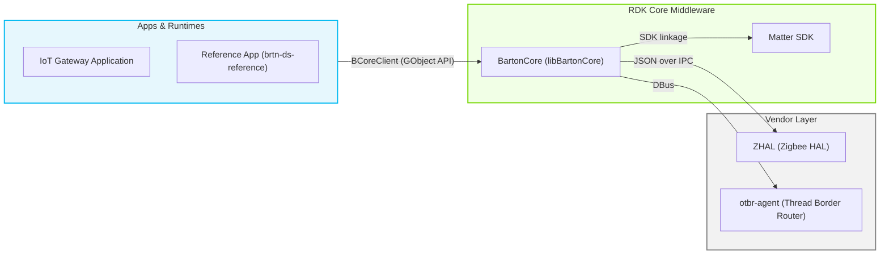
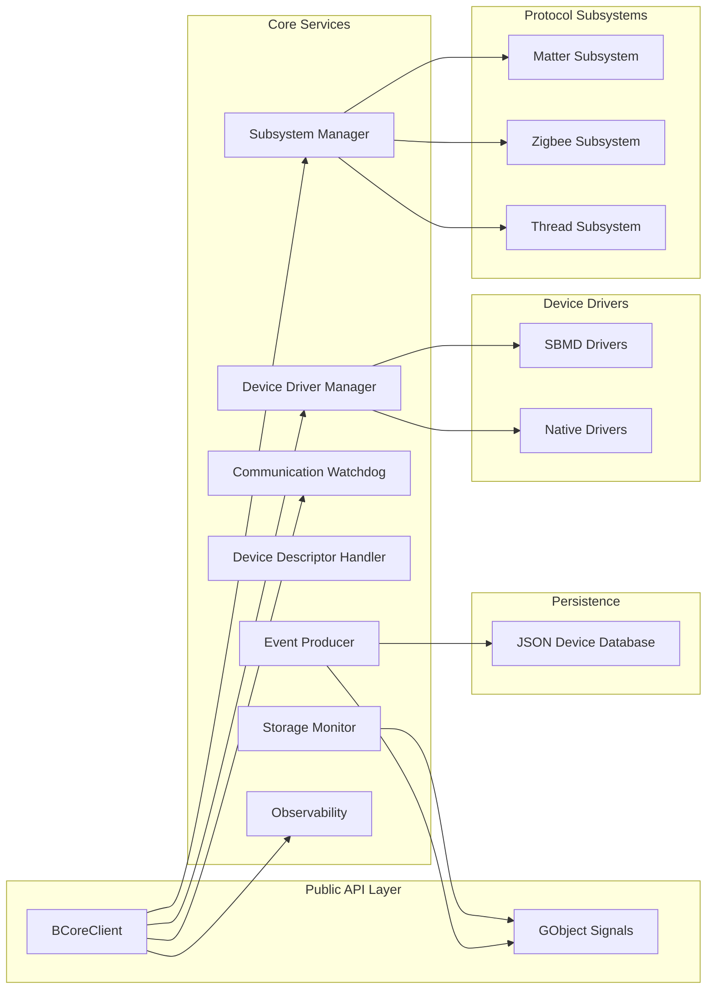
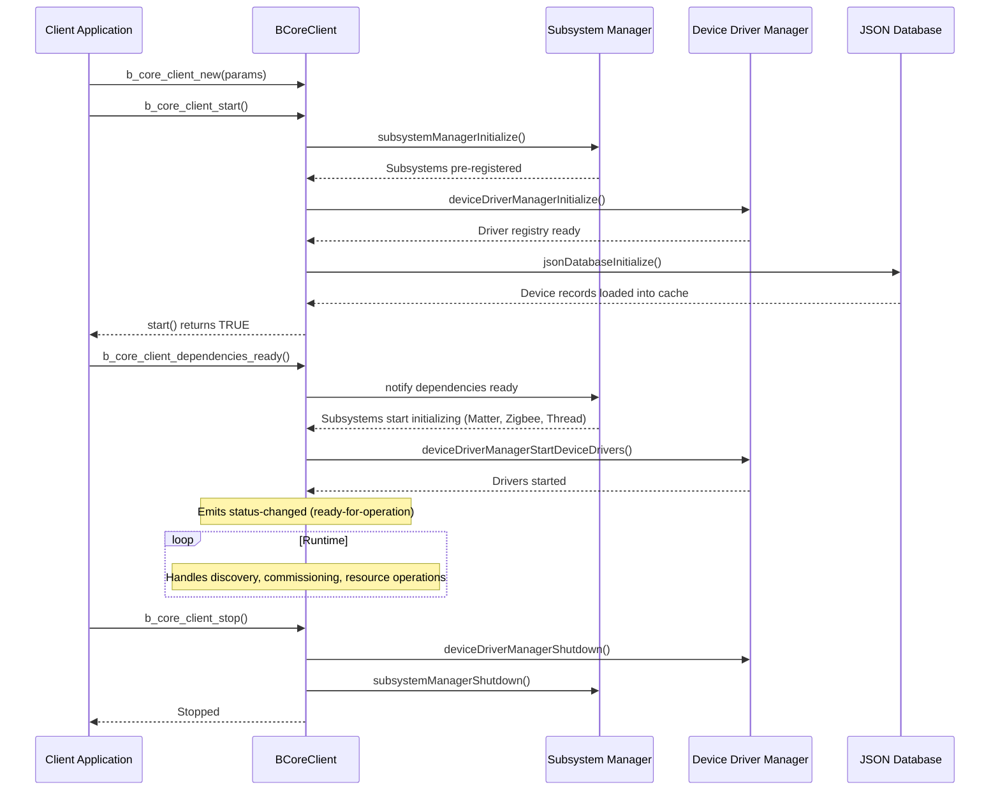
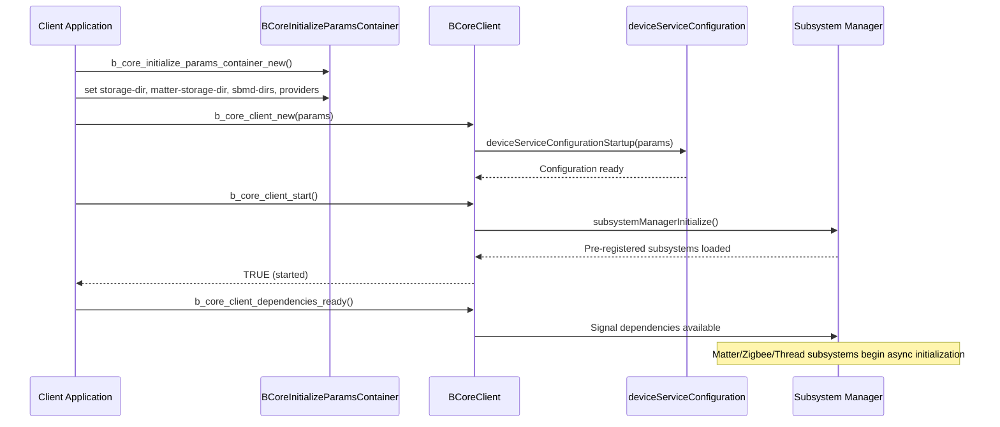
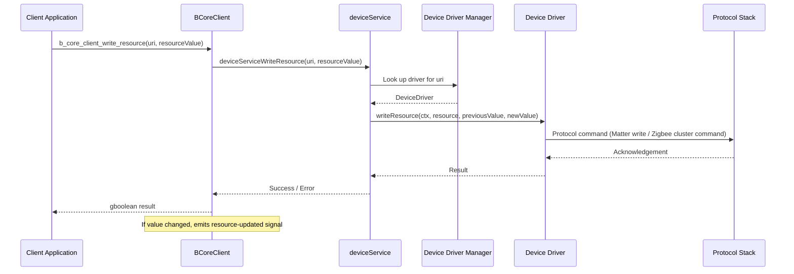
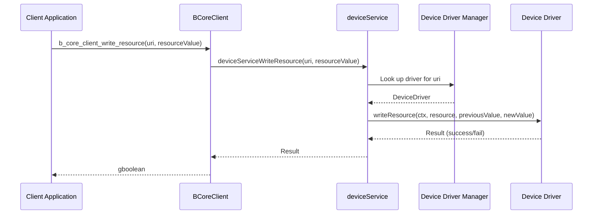
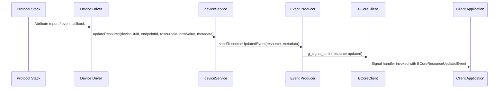

# BartonCore

BartonCore is an IoT device management library that provides a unified API and resource data model for discovering, commissioning, configuring, controlling, and monitoring smart-home devices across multiple wireless protocols and transports. It is designed to be embedded inside a host application — such as an IoT gateway service — which then routes device interactions to a local user interface or a cloud service. The library abstracts the underlying protocol complexity so that client code can interact with any device class without knowledge of whether a device uses Matter, Zigbee, Thread, or another technology. When support for a new device type is added, clients typically benefit without requiring any changes.

BartonCore exposes a GObject-based C API as its primary interface, providing automatic language-binding support through the GObject introspection (GIR) layer for languages including Python, Java, and JavaScript. The library is modular: protocol support for Matter, Zigbee, and Thread can be independently enabled or disabled at build time, allowing integrators to include only the capabilities relevant to their target platform.

At the service level, BartonCore delivers discovery, secure commissioning (including operational credentials), configuration, firmware management, real-time control, and asynchronous event notification for connected devices. At the module level, it coordinates dedicated protocol subsystems, pluggable device drivers, a persistent JSON device database, a communication health watchdog, and an observability metrics layer.



**Key Features & Responsibilities:**

- **Unified Device Resource Model**: Exposes every device and its capabilities through a URI-based resource model. Resources can be read, written, or executed; the underlying protocol is entirely hidden from callers.
- **Multi-Protocol Support**: Integrates Matter, Zigbee, and Thread through dedicated subsystems. Each subsystem manages its protocol lifecycle, network health, and device communication independently.
- **Device Discovery and Commissioning**: Orchestrates the full pairing workflow — network scanning, device claiming by a matching driver, configuration, and registration — and surfaces each stage through GObject signals.
- **Pluggable Device Drivers**: Supports native C/C++ device drivers and Specification-Based Matter Drivers (SBMD), which are declarative JavaScript files loaded at runtime, enabling new Matter device types without a firmware rebuild.
- **Communication Health Watchdog**: Monitors per-device communication timeouts and notifies drivers when a device enters or recovers from a communication failure state.
- **Firmware Management**: Integrates OTA firmware update capabilities through Device Descriptor Lists (Zigbee) and Matter's OTA Requestor/Provider infrastructure.
- **Device Allow and Deny Lists**: Downloads and enforces allow and deny lists for device pairing, with retry logic and configurable update intervals.
- **Persistent Storage**: Maintains a per-device JSON database on disk, with an in-memory cache and dirty-tracking for efficient writes.
- **Observability and Telemetry**: Collects runtime metrics through a pluggable observability backend and exposes them as a JSON dump via `b_core_client_get_telemetry()`.
- **Proactive Fault Detection**: Tracks device network health statistics (Link Quality Indicator (LQI), Received Signal Strength Indicator (RSSI), Personal Area Network Identifier (PAN ID) attacks for Zigbee) and surfaces detected anomalies as events.

---

## Design

BartonCore is structured as a shared library (`libBartonCore`) built on GLib and GObject, using a dependency-injection model for all external integrations. Callers provide implementations of `BCorePropertyProvider`, `BCoreTokenProvider`, and `BCoreNetworkCredentialsProvider` through a `BCoreInitializeParamsContainer` object at construction time. This design separates the library from any concrete persistence or credential storage, allowing integrators to plug in environment-specific implementations without modifying the library itself.

Protocol complexity is contained entirely within subsystems. Each subsystem (Matter, Zigbee, Thread) self-registers using a GCC constructor attribute, so the `SubsystemManager` discovers them automatically at startup without any static dependency on the individual subsystem modules. Device Drivers follow the same pattern and register themselves with the `DeviceDriverManager`. This extensibility model means new protocols and device types can be added without modifying the core service logic.

Northbound, `BCoreClient` exposes all operations through GObject method calls and delivers asynchronous events through GObject signals, which clients connect to using `g_signal_connect()`. This interface is self-describing through GObject introspection, enabling automatic language bindings. Southbound, the library communicates with the Zigbee stack process over JSON-formatted IPC using the ZHAL abstraction layer, with the OpenThread Border Router agent over D-Bus, and with the Matter SDK through direct library linkage.

Device state, metadata, and resource values are persisted in per-device JSON files within the configured storage directory. An in-memory cache overlays the on-disk representation with a dirty flag per device entry, deferring writes and reducing unnecessary I/O. A `GFileMonitor` on the storage directory detects external changes and notifies subscribers through the `storage-changed` signal.



#### Threading Model

- **Threading Architecture**: Multi-threaded with a GLib main event loop for protocol subsystems and POSIX threads for watchdog and background tasks.
- **Main GLib Event Loop**: The Matter subsystem runs its own `GMainLoop` for the Matter SDK's event dispatch, timer callbacks, and commissioning orchestration.
- **Communication Watchdog Thread**: A dedicated `pthread` (`commFailWatchdogThreadProc`) wakes on a configurable interval (default 60 seconds) to scan all monitored devices for communication timeout expiry.
- **Worker Threads** (if applicable):
  - _Repeating Task threads_: Used by the Device Descriptor Handler and Zigbee subsystem for periodic background operations (allow/deny list download, network health checks, OTA polling).
  - _Delayed Task threads_: Used to defer device configuration and descriptor processing after discovery.
  - _Thread Pool_: A general-purpose thread pool (`icConcurrent/threadPool`) services asynchronous device-level operations.
- **Synchronization**: `pthread_mutex_t` guards shared state in all core modules. The Subsystem Manager uses a `pthread_rwlock_t` for its subsystem registry. The communication watchdog uses a `pthread_cond_t` to allow accelerated wakeup on demand. The Matter subsystem uses a `std::mutex` for its lifecycle state.
- **Async / Event Dispatch**: The `DeviceEventProducer` marshals all GObject signal emissions. Signals are emitted synchronously from whichever thread triggers the event; clients are responsible for any required thread affinity in their signal handlers.

### Prerequisites and Dependencies

#### Platform and Integration Requirements

- **Build Dependencies**: `cjson`, `curl`, `dbus`, `glib-2.0`, `barton-matter` (Matter SDK static archive), `mbedtls`, `otbr-agent`, `libcertifier`, `linenoise`. For Zigbee, `zhal` is required. For Matter SBMD, `mquickjs` or `quickjs` JavaScript engine.
- **Protocol HAL**: Zigbee interactions are mediated through the ZHAL abstraction layer (JSON over IPC). Thread interactions use DBus to `otbr-agent`. Matter uses the linked Matter SDK.
- **Systemd Services**: When Thread support is enabled, `otbr-agent` must be running and accessible over D-Bus before the Thread subsystem initializes.
- **Configuration**: All configuration is provided at construction time through `BCoreInitializeParamsContainer`. Storage and firmware directories default to `/tmp/barton/device_service/storage` and `/tmp/barton/device_service/firmware` when the caller provides no override.
- **Startup Order**: The host application calls `b_core_client_start()` followed by `b_core_client_dependencies_ready()` when all external dependencies (network, credentials service, etc.) are confirmed available.

---

### Component State Flow

#### Initialization to Active State

The component transitions through the following states during its lifecycle: **Uninitialized** (object not yet constructed) → **Starting** (subsystems and database initializing, device drivers registering) → **AwaitingDependencies** (service started but waiting for external readiness signal) → **Active** (device drivers started, discovery and device operations available) → **Stopping** (subsystems shutting down, database flushed).



#### Runtime State Changes

State changes during normal operation are driven by subsystem lifecycle events, device communication failures, and resource updates received from devices over their respective protocols.

**State Change Triggers:**

- When a subsystem finishes initialization, the `SubsystemManager` fires the `subsystemManagerReadyForDevicesCallback`, which triggers the allow/deny list download process and eventually the pairing-readiness check.
- A device that exceeds its communication timeout (monitored by the watchdog) transitions to `commFail` state. The managing device driver is notified via `driver->communicationFailed()`. When the device resumes contact, `driver->communicationRestored()` is called and the `commFail` flag is cleared.
- Device Descriptor Handler performs exponential-backoff retries on failed allow/deny list downloads. Once both lists are valid, `deviceDescriptorsReadyForPairingCallback()` is invoked and the service transitions to ready-for-pairing.

**Context Switching Scenarios:**

- If a Zigbee network reconfiguration (e.g., channel change) is in progress, new pairing requests are rejected until the operation completes, with a `ZIGBEE_CHANNEL_CHANGE_IN_PROGRESS` error returned to the caller.
- When the storage monitor detects an external change to the device database directory, a `storage-changed` GObject signal is emitted to notify upstream subscribers.

---

### Call Flows

#### Initialization Call Flow



#### Request Processing Call Flow

Writing a resource value on a connected device is the primary control flow. The client calls `b_core_client_write_resource()`, which is routed through the device driver to the appropriate protocol command.



---

## Internal Modules

| Module / Class                   | Description                                                                                                                                                                                                                                             | Key Files                                                                                                                                             |
| -------------------------------- | ------------------------------------------------------------------------------------------------------------------------------------------------------------------------------------------------------------------------------------------------------- | ----------------------------------------------------------------------------------------------------------------------------------------------------- |
| `BCoreClient`                    | Main GObject-based public entry point. Owns the service lifecycle (`start`, `stop`, `dependencies_ready`) and exposes all GObject signals for event subscription.                                                                                       | `api/c/public/barton-core-client.h`, `core/src/deviceService.c`                                                                                       |
| `SubsystemManager`               | Manages the registration, initialization, and shutdown lifecycle of all protocol subsystems. Subsystems self-register via constructor attributes; the manager coordinates their readiness.                                                              | `core/src/subsystemManager.c`, `core/src/subsystemManager.h`                                                                                          |
| `DeviceDriverManager`            | Maintains the registry of all device drivers, routes device operations to the appropriate driver, and orchestrates driver startup and shutdown.                                                                                                         | `core/src/deviceDriverManager.c`, `core/src/deviceDriverManager.h`                                                                                    |
| `MatterSubsystem`                | Initializes the Matter SDK, manages the GMainLoop for the Matter event loop, orchestrates device commissioning, monitors device communication health, and manages OTA firmware updates via the OTA provider.                                            | `core/src/subsystems/matter/matterSubsystem.cpp`, `core/src/subsystems/matter/Matter.cpp`, `core/src/subsystems/matter/CommissioningOrchestrator.cpp` |
| `ZigbeeSubsystem`                | Initializes the Zigbee network via ZHAL, manages network backup/restore, performs health monitoring, tracks network statistics, and processes Device Descriptor Lists for OTA updates.                                                                  | `core/src/subsystems/zigbee/zigbeeSubsystem.c`                                                                                                        |
| `ThreadSubsystem`                | Communicates with `otbr-agent` over D-Bus to manage Thread network backup/restore and monitor border router status.                                                                                                                                     | `core/src/subsystems/thread/threadSubsystem.cpp`, `core/src/subsystems/thread/OpenThreadClient.cpp`                                                   |
| `DeviceCommunicationWatchdog`    | Tracks the last-contact timestamp for each monitored device and fires `communicationFailed` or `communicationRestored` callbacks when timeout thresholds are crossed. Runs a background monitor thread.                                                 | `core/src/deviceCommunicationWatchdog.c`                                                                                                              |
| `DeviceDescriptorHandler`        | Downloads and validates device allow and deny lists from configured URLs, using exponential-backoff retry. Signals the service when lists are ready for pairing decisions.                                                                              | `core/src/deviceDescriptorHandler.c`                                                                                                                  |
| `JSON Device Database`           | Persists device records, endpoint data, resources, and metadata as per-device JSON files. Maintains an in-memory cache with dirty tracking for efficient storage writes. Receives external data from device drivers during discovery and configuration. | `core/src/database/jsonDatabase.c`                                                                                                                    |
| `DeviceEventProducer`            | Translates internal device service events into GObject signal emissions on `BCoreClient`. Handles early queuing of discovery events that arrive before all subsystems are ready.                                                                        | `core/src/event/deviceEventProducer.c`                                                                                                                |
| `SBMD Framework`                 | Evaluates JavaScript `.sbmd.js` driver specification files at startup using a sandboxed JS engine (MQuickJS or QuickJS). Registers each file as a fully functional Matter device driver without requiring native code changes.                          | `core/deviceDrivers/matter/sbmd/`, `core/deviceDrivers/matter/sbmd/specs/`                                                                            |
| `Observability`                  | Collects runtime metrics via a pluggable backend (default: in-memory). Exposes all registered metrics as a JSON string through `b_core_client_get_telemetry()`.                                                                                         | `core/src/observability/observability.h`, `core/src/observability/memory/`                                                                            |
| `DeviceStorageMonitor`           | Uses `GFileMonitor` to watch the device database directory for external changes and emits the `storage-changed` signal when modifications are detected.                                                                                                 | `core/src/deviceStorageMonitor.c`                                                                                                                     |
| `BCoreInitializeParamsContainer` | Carries all configuration and injected provider interfaces to `BCoreClient`. Decouples the library from any specific credential storage or property persistence implementation.                                                                         | `api/c/public/barton-core-initialize-params-container.h`, `core/src/deviceServiceConfiguration.c`                                                     |

---

## Component Interactions

### Interaction Matrix

| Target Component / Layer                | Interaction Purpose                                                                                                     | Key APIs / Topics                                                                                  |
| --------------------------------------- | ----------------------------------------------------------------------------------------------------------------------- | -------------------------------------------------------------------------------------------------- |
| **Protocol Subsystems**                 |                                                                                                                         |                                                                                                    |
| Matter SDK                              | Operational credentials management, commissioning, device attribute subscription, OTA provider                          | `chip::Server`, `CommissioningOrchestrator`, `DeviceDataCache`                                     |
| ZHAL (Zigbee HAL)                       | Zigbee network initialization, attribute reports, OTA firmware delivery, send/receive Zigbee messages                   | `zhal_*` functions over JSON IPC                                                                   |
| otbr-agent                              | Thread network backup/restore, border router status monitoring                                                          | D-Bus interface via `OpenThreadClient`                                                             |
| **Device Drivers**                      |                                                                                                                         |                                                                                                    |
| Native Device Drivers                   | Translate Barton resource operations into protocol-specific commands (Zigbee cluster commands, Matter attribute writes) | `DeviceDriver::writeResource()`, `DeviceDriver::readResource()`, `DeviceDriver::executeResource()` |
| SBMD Drivers                            | JavaScript-declared drivers map Matter attributes to Barton resources at runtime without firmware changes               | `.sbmd.js` files, `SbmdFactory`, `SpecBasedMatterDeviceDriver`                                     |
| **External Systems**                    |                                                                                                                         |                                                                                                    |
| Device Allow/Deny List URLs             | Downloads pairing allow and deny lists via HTTP(S) to enforce device admission policy                                   | `curl` HTTP client via `urlHelper`                                                                 |
| Property Provider (injected)            | Reads and writes runtime configuration properties (e.g., Zigbee channel, Matter Vendor ID)                              | `BCorePropertyProvider::get_property()`, `set_property()`                                          |
| Token Provider (injected)               | Supplies authentication tokens for cloud or credentialing service interactions                                          | `BCoreTokenProvider`                                                                               |
| Network Credentials Provider (injected) | Provides Wi-Fi SSID/password to commissioning logic for Matter device on-boarding                                       | `BCoreNetworkCredentialsProvider`                                                                  |

### Events Published

| Event Name                       | GObject Signal Topic                                       | Trigger Condition                                             | Subscriber Components |
| -------------------------------- | ---------------------------------------------------------- | ------------------------------------------------------------- | --------------------- |
| `status-changed`                 | `B_CORE_CLIENT_SIGNAL_NAME_STATUS_CHANGED`                 | Service readiness or discovery state changes                  | Host application      |
| `discovery-started`              | `B_CORE_CLIENT_SIGNAL_NAME_DISCOVERY_STARTED`              | A new device discovery session begins                         | Host application      |
| `device-discovered`              | `B_CORE_CLIENT_SIGNAL_NAME_DEVICE_DISCOVERED`              | A device is found on the network during discovery             | Host application      |
| `device-added`                   | `B_CORE_CLIENT_SIGNAL_NAME_DEVICE_ADDED`                   | A device completes configuration and is added to the database | Host application      |
| `device-removed`                 | `B_CORE_CLIENT_SIGNAL_NAME_DEVICE_REMOVED`                 | A device is removed from management                           | Host application      |
| `resource-updated`               | `B_CORE_CLIENT_SIGNAL_NAME_RESOURCE_UPDATED`               | A device resource value changes                               | Host application      |
| `endpoint-added`                 | `B_CORE_CLIENT_SIGNAL_NAME_ENDPOINT_ADDED`                 | A new endpoint is added to a managed device                   | Host application      |
| `endpoint-removed`               | `B_CORE_CLIENT_SIGNAL_NAME_ENDPOINT_REMOVED`               | An endpoint is removed from a managed device                  | Host application      |
| `device-configuration-started`   | `B_CORE_CLIENT_SIGNAL_NAME_DEVICE_CONFIGURATION_STARTED`   | Post-discovery device configuration begins                    | Host application      |
| `device-configuration-completed` | `B_CORE_CLIENT_SIGNAL_NAME_DEVICE_CONFIGURATION_COMPLETED` | Device configuration finishes successfully                    | Host application      |
| `device-configuration-failed`    | `B_CORE_CLIENT_SIGNAL_NAME_DEVICE_CONFIGURATION_FAILED`    | Device configuration fails                                    | Host application      |
| `storage-changed`                | `B_CORE_CLIENT_SIGNAL_NAME_STORAGE_CHANGED`                | The device database directory is externally modified          | Host application      |
| `device-database-failure`        | `B_CORE_CLIENT_SIGNAL_NAME_DEVICE_DATABASE_FAILURE`        | A database operation fails                                    | Host application      |
| `metadata-updated`               | `B_CORE_CLIENT_SIGNAL_NAME_METADATA_UPDATED`               | Device metadata is updated                                    | Host application      |
| `zigbee-channel-changed`         | `B_CORE_CLIENT_SIGNAL_NAME_ZIGBEE_CHANNEL_CHANGED`         | Zigbee operating channel changes                              | Host application      |
| `zigbee-interference`            | `B_CORE_CLIENT_SIGNAL_NAME_ZIGBEE_INTERFERENCE`            | RF interference is detected on the Zigbee network             | Host application      |
| `zigbee-pan-id-attack-changed`   | `B_CORE_CLIENT_SIGNAL_NAME_ZIGBEE_PAN_ID_ATTACK_CHANGED`   | A PAN ID attack detection state changes                       | Host application      |

### IPC Flow Patterns

**Primary Request / Response Flow:**

When a client application writes or reads a device resource, the call travels synchronously through the driver dispatch layer and returns the result as a boolean or typed value. Resource-level errors are surfaced as GError codes defined in `BCoreReadResourceError`.



**Event Notification Flow:**

When a device reports a state change (via an attribute report, Zigbee message, or Matter subscription update), the device driver updates the resource value in the database and the event producer emits the corresponding GObject signal on `BCoreClient`.



---

## Implementation Details

### Key External API Integrations

| API / Interface                                            | Purpose                                                                                                          | Implementation File                                                                                          |
| ---------------------------------------------------------- | ---------------------------------------------------------------------------------------------------------------- | ------------------------------------------------------------------------------------------------------------ |
| `zhal_*` (ZHAL API)                                        | Zigbee network initialization, message send/receive, attribute report handling, and OTA firmware operations      | `core/src/subsystems/zigbee/zigbeeSubsystem.c`                                                               |
| Matter SDK (`chip::Server`, `chip::CommissioningDelegate`) | Matter stack initialization, device commissioning orchestration, attribute subscription, OTA provider management | `core/src/subsystems/matter/matterSubsystem.cpp`, `core/src/subsystems/matter/CommissioningOrchestrator.cpp` |
| Matter SDK (`chip::PersistentStorageDelegate`)             | Key-value persistence for Matter operational data (fabrics, credentials, counters)                               | `core/src/subsystems/matter/PersistentStorageDelegate.cpp`                                                   |
| D-Bus (`otbr-agent` interface)                             | Thread network configuration backup/restore, border router operational status                                    | `core/src/subsystems/thread/OpenThreadClient.cpp`                                                            |
| `curl` (HTTP client)                                       | Allow list and deny list file download with configurable timeout                                                 | `core/src/deviceDescriptorHandler.c`                                                                         |
| `GFileMonitor` (GLib file monitoring)                      | Watch the device database directory for external filesystem changes                                              | `core/src/deviceStorageMonitor.c`                                                                            |

### Key Implementation Logic

- **State / Lifecycle Management**: The `BCoreClient` object owns the service state. Startup is initiated by `b_core_client_start()` and full operational readiness is signalled by `b_core_client_dependencies_ready()`. Subsystem readiness is tracked per-subsystem in `SubsystemRegistration.ready` flags guarded by per-registration mutexes.
  - Core lifecycle: `core/src/deviceService.c`
  - Subsystem coordination: `core/src/subsystemManager.c`

- **Event Processing**: All GObject signal emissions pass through `DeviceEventProducer`. An early-event queuing mechanism holds `device-discovered`, `device-discovery-failed`, and `device-rejected` events that arrive before `BCoreClient` is ready to emit them, and replays them in order once the client is active.
  - Event dispatch: `core/src/event/deviceEventProducer.c`

- **Error Handling Strategy**: Errors from device drivers and protocol stacks are propagated as `gboolean` return values or `GError` out-parameters following GLib conventions. Error domains are defined in `BCoreReadResourceError`, `BCoreZigbeeChannelChangeError`, and `BCoreReadMetadataError`. The device descriptor handler uses exponential backoff (base 2 seconds, maximum 24 hours) for failed list downloads. The Matter subsystem uses a 15-second retry interval with a 240-second maximum backoff for initialization failures.
  - Error codes: `api/c/public/barton-core-client.h`
  - Descriptor retry: `core/src/deviceDescriptorHandler.c`

- **Logging & Diagnostics**: All modules use the `icLog` logging layer with per-module `LOG_TAG` identifiers. Key log points are present at initialization, subsystem state transitions, driver startup, communication fail/restore events, and protocol API error returns. Telemetry metrics are accessible at runtime via `b_core_client_get_telemetry()`, which returns a JSON string from the configured observability backend.
  - Logging: `<icLog/logging.h>`, tag examples: `deviceService`, `zigbeeSubsystem`, `MatterSubsystem`, `deviceCommunicationWatchdog`
  - Telemetry: `core/src/observability/`

---

## Configuration

### Key Configuration Files

| Configuration File                                                                                                 | Purpose                                                                        | Override Mechanism                                                                                   |
| ------------------------------------------------------------------------------------------------------------------ | ------------------------------------------------------------------------------ | ---------------------------------------------------------------------------------------------------- |
| Per-device JSON files (`<storage-dir>/storage/devicedb/<uuid>`)                                                    | Persistent device records, endpoint data, resource values, and metadata        | Managed internally by `jsonDatabase`; directory path set via `BCoreInitializeParamsContainer`        |
| Matter storage files (`<matter-storage-dir>/chip_config.ini`, `chip_counters.ini`, `chip_factory.ini`, `matterkv`) | Matter SDK operational data: fabric credentials, counters, and key-value store | Directory path set via `b_core_initialize_params_container_set_matter_storage_dir()`                 |
| Matter attestation trust store (`<matter-attestation-trust-store-dir>/`)                                           | Trusted root certificates for Matter device attestation                        | Directory path set via `b_core_initialize_params_container_set_matter_attestation_trust_store_dir()` |
| SBMD specification files (`<sbmd-dirs>/*.sbmd.js`)                                                                 | JavaScript-based Matter device driver declarations loaded at startup           | Semicolon-separated directory list set via `b_core_initialize_params_container_set_sbmd_dirs()`      |

### Key Configuration Parameters

**Runtime Parameters**

| Parameter                            | Type   | Default                               | Description                                                                                   |
| ------------------------------------ | ------ | ------------------------------------- | --------------------------------------------------------------------------------------------- |
| `storage-dir`                        | string | `/tmp/barton/device_service/storage`  | Root directory for device database and configuration persistence                              |
| `firmware-file-dir`                  | string | `/tmp/barton/device_service/firmware` | Directory for firmware files used during OTA update operations                                |
| `matter-storage-dir`                 | string | caller-provided                       | Directory for Matter SDK persistent storage (fabrics, counters, key-value store)              |
| `matter-attestation-trust-store-dir` | string | caller-provided                       | Directory containing trusted certificate authorities for Matter device attestation            |
| `account-id`                         | string | caller-provided                       | Account identifier supplied to credential and token providers                                 |
| `sbmd-dirs`                          | string | caller-provided                       | Semicolon-delimited list of directories scanned for `.sbmd.js` specification files at startup |

**Build-Time Configuration Flags**

| Flag                               | Type   | Default  | Description                                                                                                |
| ---------------------------------- | ------ | -------- | ---------------------------------------------------------------------------------------------------------- |
| `BCORE_ZIGBEE`                     | bool   | `ON`     | Enables Zigbee protocol subsystem and ZHAL integration                                                     |
| `BCORE_MATTER`                     | bool   | `ON`     | Enables Matter protocol subsystem and SDK linkage                                                          |
| `BCORE_THREAD`                     | bool   | `ON`     | Enables Thread protocol subsystem and D-Bus integration with `otbr-agent`                                  |
| `BCORE_BUILD_REFERENCE`            | bool   | `ON`     | Builds the `brtn-ds-reference` interactive CLI reference application                                       |
| `BCORE_MATTER_ENABLE_OTA_PROVIDER` | bool   | `OFF`    | Enables the Matter OTA Provider role and configures devices with the OTA Requestor cluster                 |
| `BCORE_MATTER_VALIDATE_SCHEMAS`    | bool   | `ON`     | Enables JSON schema validation of SBMD specification files at load time                                    |
| `BCORE_OBSERVABILITY_BACKEND`      | string | `memory` | Selects the observability metrics backend; `memory` retains metrics in-process, `none` disables collection |

### Runtime Configuration

Runtime properties (such as Zigbee channel preferences, Matter Vendor ID, and communication fail timeouts) are read and written through the injected `BCorePropertyProvider` interface. Property keys follow a namespaced convention:

```
barton.fifteenfour.eui64       # Local 802.15.4 EUI64 address
barton.matter.vendorName       # Matter Vendor Name (max 32 chars)
barton.matter.vid              # Matter Vendor ID
thread.networkConfig           # Serialized Thread network configuration blob
cpe.zigbee.healthCheck.*       # Zigbee health check tuning parameters
cpe.zigbee.defender.*          # Zigbee network defender thresholds
```

The property provider implementation is supplied by the host application at construction time; BartonCore itself does not mandate any particular storage backend.

### Configuration Persistence

Device configuration, endpoint composition, resource values, and metadata are persisted to per-device JSON files and survive service restarts. Matter operational data (fabric credentials, counters, key-value entries) is persisted to the configured `matter-storage-dir`. Thread network configuration is persisted as a property through the injected property provider under the key `threadNetworkConfig`. Runtime properties managed through `BCorePropertyProvider` are persisted according to the host application's provider implementation. Build-time configuration flags take effect at compile time and remain constant for the lifetime of the binary.
