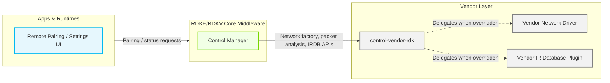
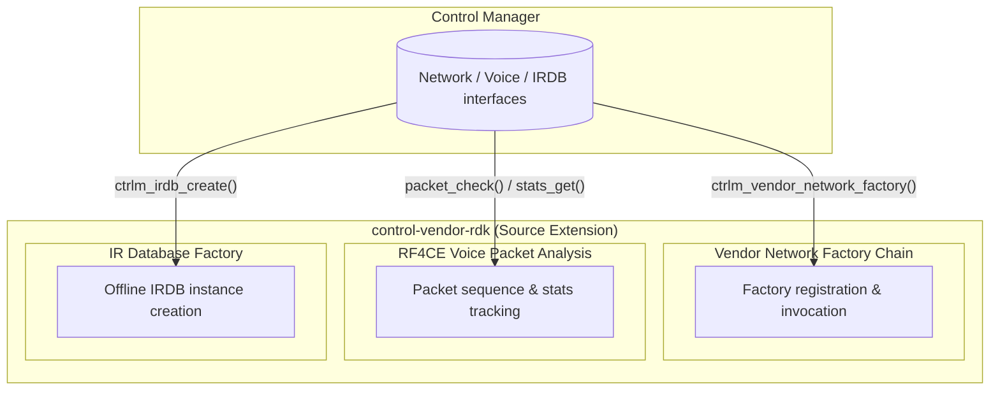
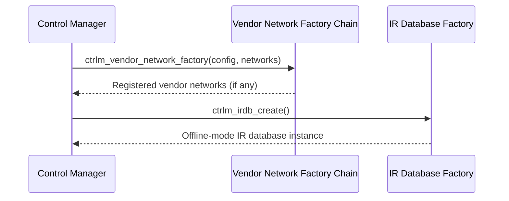
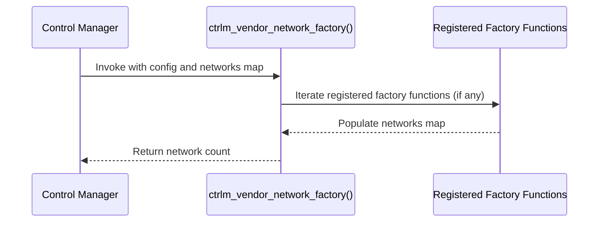
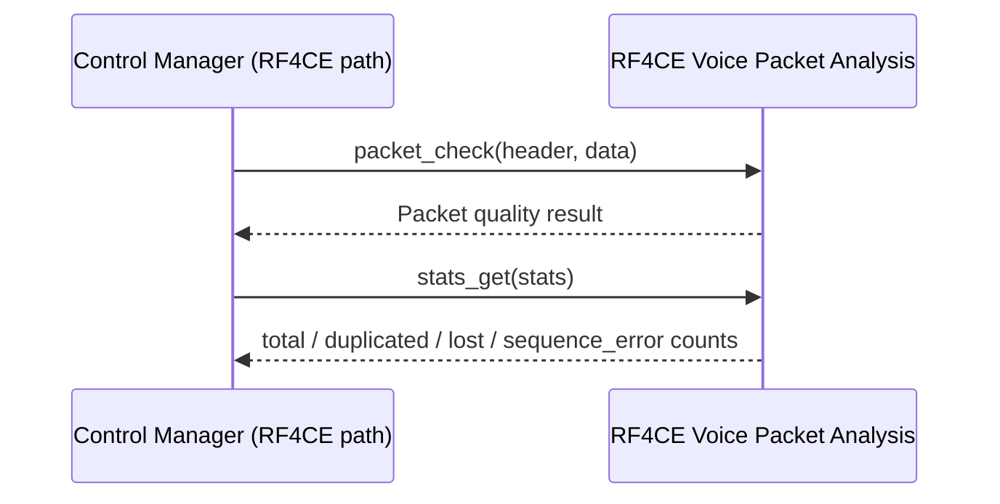
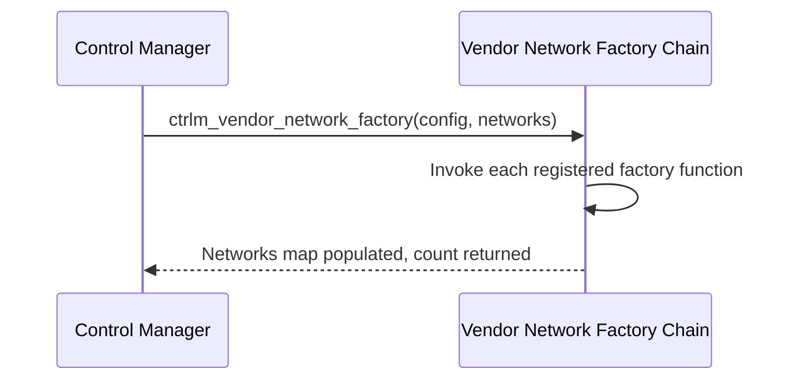
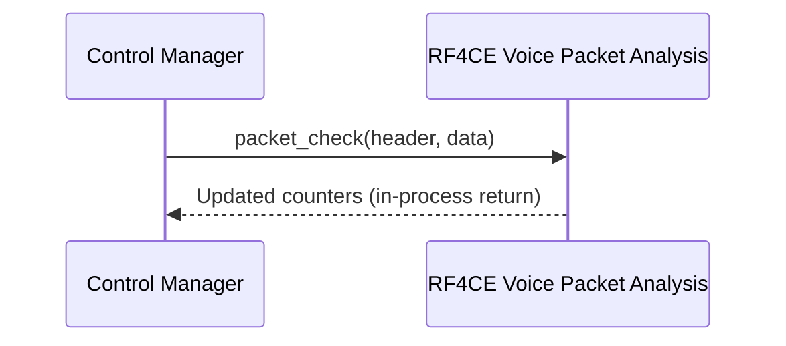

# control-vendor-rdk

control-vendor-rdk provides the vendor extension layer consumed by Control Manager, the RDKE/RDKV middleware component that manages remote control networks, voice sessions, and IR code handling. It supplies default implementations of three vendor-facing interfaces defined by Control Manager: a chained network factory used to register vendor-specific remote control network implementations, a voice packet analysis implementation for the RF4CE network, and a factory that creates the IR code database instance used for IR-based device control.

At the product/stack level, this component allows Control Manager to be built and executed with a working vendor layer already in place. It provides default classes that satisfy Control Manager's compile-time and link-time contracts for the vendor layer, giving the platform a predictable baseline behavior — an empty additional-network set, an offline-mode IR database, and a consistently reported "good" voice packet quality result — that a vendor-specific plugin can extend or override.

At the module level, the component provides three independent services consumed directly by Control Manager: a registration chain that lets vendor network factory functions add themselves before Control Manager queries them at startup, an RF4CE voice packet analysis class that tracks packet sequencing and loss statistics, and a factory function that instantiates an offline-mode IR database object.

**Key Features & Responsibilities:**

- **Vendor Network Factory Chain**: Maintains an ordered chain of vendor-supplied network factory callbacks and invokes each of them so Control Manager can populate its network map at startup, without Control Manager needing compile-time knowledge of which vendor networks are available.
- **RF4CE Voice Packet Analysis**: Implements Control Manager's voice packet analysis interface for the RF4CE network, tracking per-session packet counters (total, duplicated, lost, sequence errors) for voice audio streamed from a paired remote.
- **Offline IR Database Provisioning**: Supplies an offline-mode IR code database instance used by Control Manager for IR-based device control.

---

## Design

The component follows a factory/interface substitution pattern: Control Manager defines abstract interfaces and factory entry points for vendor-specific behavior, and this component provides one concrete implementation for each — a registration chain for networks, a concrete subclass for voice packet analysis, and a factory function for the IR database. This keeps Control Manager's core logic independent of any single vendor's network hardware, voice packet format, or IR code source, while still giving it a functional default at build time. Each implementation is self-contained in its own translation unit, with independent internal state across the network factory, the voice packet analysis class, and the IR database factory.

Interaction with Control Manager is one-directional and synchronous: Control Manager calls into the exposed factory functions and class methods directly as in-process C++ calls. Southbound behavior is limited to internal bookkeeping — the network factory chain and IR database factory return their results directly, and the voice packet analysis implementation performs counter bookkeeping on the packet data it receives, independent of any radio or device driver.

All exposed functionality is invoked through direct, in-process function and method calls from Control Manager, which links this component's translation units into its own build.

The voice packet analysis counters are held in memory for the lifetime of the analysis object and are cleared through an explicit `reset()` call. The IR database factory constructs a fresh offline-mode instance on each invocation.

#### Threading Model

- **Threading Architecture**: Single-threaded — every function and method executes synchronously on whichever thread Control Manager uses to call it.
- **Main Thread**: Network factory invocation typically occurs on Control Manager's startup thread, and voice packet analysis calls occur on whichever thread Control Manager uses to process inbound RF4CE voice audio.
- **Synchronization**: The network factory chain is a plain, unsynchronized `std::vector` populated during static initialization, with registration expected to complete before concurrent access begins.
- **Async / Event Dispatch**: Calls are synchronous and return their result directly to the caller.

### Prerequisites and Dependencies

#### Platform and Integration Requirements

- **Build Dependencies**: `glib-2.0` (used for the network factory's vector-based registration chain) and a JSON library providing the `json_t` type (used to pass configuration data through the network factory signature). The component also depends on Control Manager's own vendor interface headers (network factory, voice packet analysis, and IR database factory/stub declarations) and its logging header, consistent with being compiled as part of the Control Manager build.

---

### Component State Flow

#### Initialization to Active State

During Control Manager startup, the vendor network factory chain is queried to build the set of vendor-specific networks, and the IR database factory is invoked to obtain an IR database instance. With the registration chain in its default state, the network factory returns an empty result set, and the IR database factory yields an offline-mode instance.

#### Runtime State Changes

**State Change Triggers:**

- At the start of an RF4CE voice session, Control Manager calls `reset()` on the voice packet analysis object, clearing sequence tracking and counters for the new session.
- Each received RF4CE voice audio packet triggers a `packet_check()` call, followed by periodic `stats_get()` calls to retrieve current packet counters.

---

### Call Flows

#### Initialization Call Flow

#### Request Processing Call Flow

For each RF4CE voice audio packet, Control Manager forwards the packet header and payload to the voice packet analysis object, which evaluates the packet and updates its internal counters. Control Manager subsequently reads the accumulated statistics for reporting.

---

## Internal Modules

| Module / Class                        | Description                                                                                                                                                                                                        | Key Files                               |
| ------------------------------------- | ------------------------------------------------------------------------------------------------------------------------------------------------------------------------------------------------------------------ | --------------------------------------- |
| Vendor Network Factory Chain          | Maintains an ordered list of vendor-supplied network factory callbacks and invokes each to populate Control Manager's network map at startup.                                                                      | `ctrlm_vendor_network_factory.cpp`      |
| `ctrlm_voice_packet_analysis_rf4ce_t` | RF4CE implementation of the voice packet analysis interface. Tracks total, duplicated, and lost packet counts and sequence numbering for received voice audio, and receives packet data from the RF4CE voice path. | `ctrlm_rf4ce_voice_packet_analysis.cpp` |
| IR Database Factory                   | Instantiates an offline-mode IR code database instance consumed by Control Manager.                                                                                                                                | `irdb/ctrlm_irdb_factory.cpp`           |

---

## Component Interactions

### Interaction Matrix

| Target Component / Layer | Interaction Purpose                                                      | Key APIs / Topics                                                           |
| ------------------------ | ------------------------------------------------------------------------ | --------------------------------------------------------------------------- |
| **Plugins**              |                                                                          |                                                                             |
| Control Manager          | Registers and queries vendor-specific network implementations at startup | `ctrlm_vendor_network_factory()`, `ctrlm_vendor_network_factory_func_add()` |
| Control Manager          | Retrieves voice packet quality statistics for the RF4CE network          | `packet_check()`, `stats_get()`, `reset()`                                  |
| Control Manager          | Obtains an IR code database instance for IR-based device control         | `ctrlm_irdb_create()`                                                       |

### IPC Flow Patterns

**Primary Request / Response Flow:**

Control Manager invokes the network factory chain synchronously and receives the resulting network map directly as the call's return value.

Voice packet statistics follow the same synchronous, in-process pattern: Control Manager calls into the analysis object and receives updated counters directly in the return path.

---

## Implementation Details

### Key Implementation Logic

- **State / Lifecycle Management**: The RF4CE voice packet analysis object holds `sequence_num_last`, `total_packets`, `duplicated_packets`, `lost_packets`, and `sequence_error_count` as instance state, initialized in the constructor and cleared by `reset()` at the start of each session.
  - Core implementation: `ctrlm_rf4ce_voice_packet_analysis.cpp`
  - State transition handlers: `reset()` in `ctrlm_rf4ce_voice_packet_analysis.cpp`

- **Event Processing**: The vendor network factory chain uses a lazily allocated `std::vector` of function pointers to avoid static initialization order issues between the chain and vendor factory functions that may register themselves from other static initializers. A dedicated cleanup helper releases the chain's memory at program exit.
  - File: `ctrlm_vendor_network_factory.cpp`

- **Error Handling Strategy**: `ctrlm_vendor_network_factory()` returns `0` when the registration chain is empty, signaling an empty network set to Control Manager rather than an error condition. The RF4CE voice packet analysis implementation's `packet_check()` consistently reports a good packet result for every packet evaluated by this default implementation.
  - Packet evaluation and statistics retrieval complete synchronously within the calling thread.

- **Logging & Diagnostics**: The network factory includes the Control Manager logging header, available for diagnostic use alongside Control Manager's own logging context.
