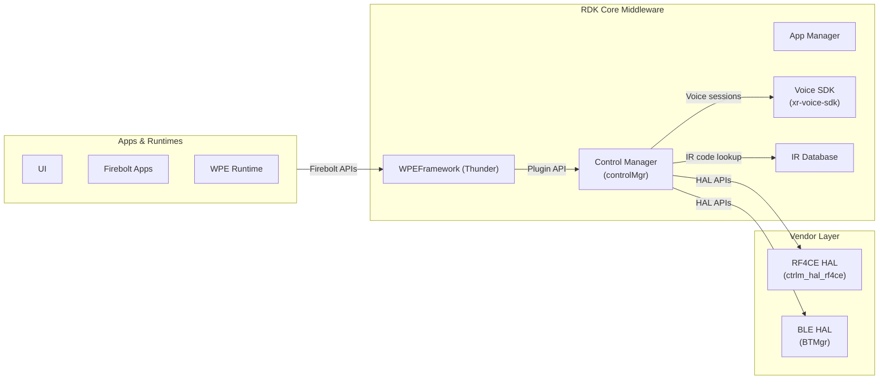
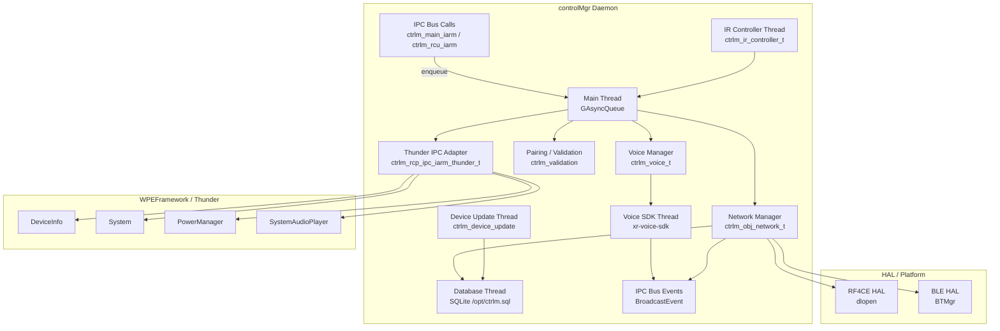
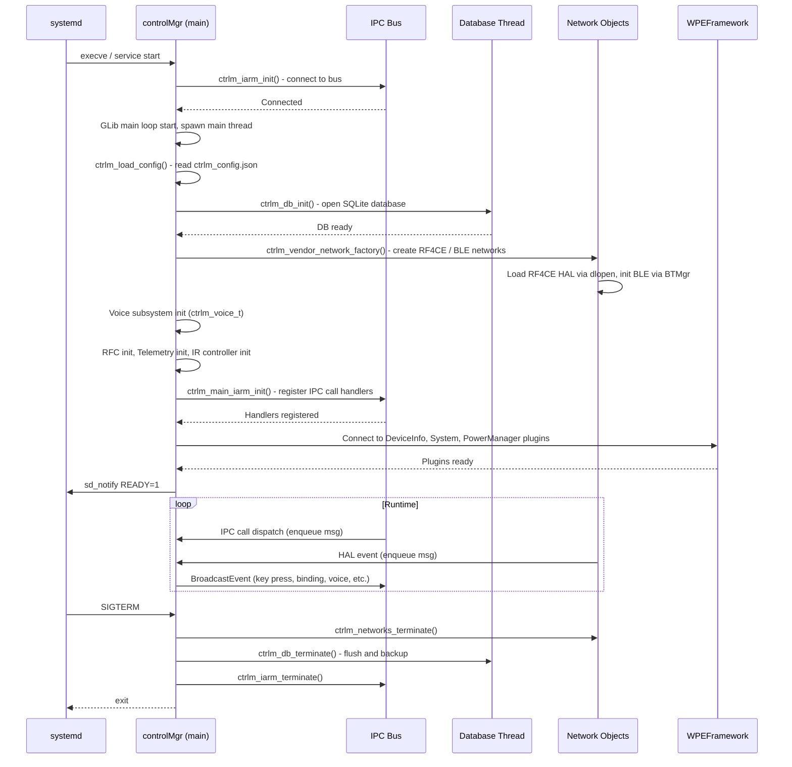
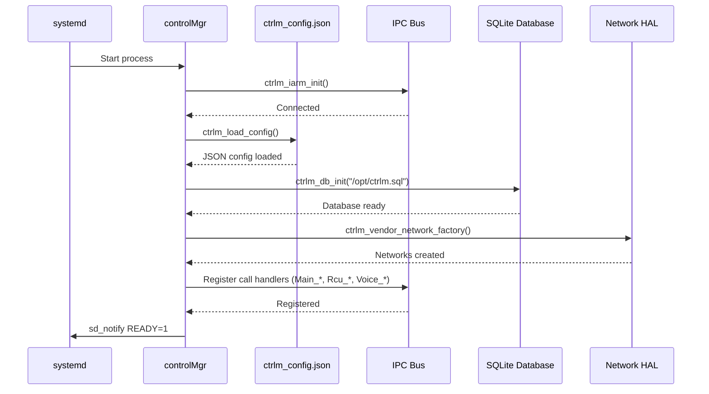
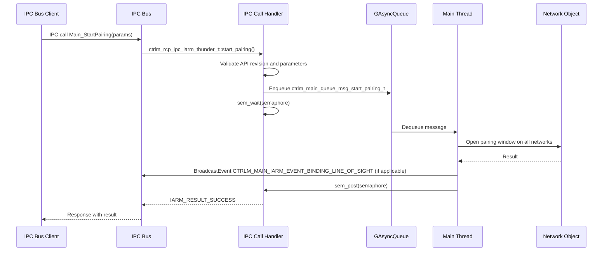
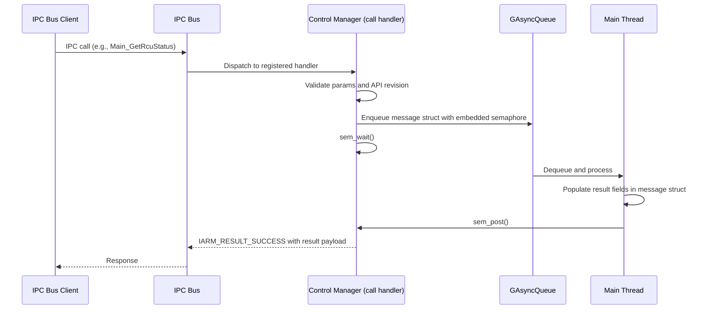
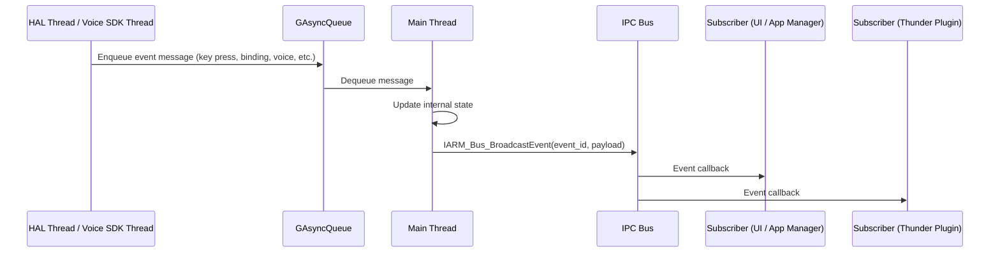

# Control Manager

Control Manager (`controlMgr`) is an RDK middleware daemon that manages all remote control devices connected to the set-top box. It operates as the central point for remote control pairing, key event distribution, voice session management, IR code handling, and controller firmware updates. The daemon exposes its services to the rest of the platform through an IPC bus under the namespace `Ctrlm`, and integrates with WPEFramework/Thunder for platform plugin access.

Control Manager abstracts multiple wireless network transports — RF4CE and BLE — behind a uniform network object model. Each transport is managed by a distinct network object that communicates with a platform-specific HAL loaded at runtime. The daemon provides the application layer and other middleware components with a single, consistent IPC surface for all remote control operations, regardless of the underlying radio technology.

At the device product level, Control Manager enables the user experience around remote controls: it drives the pairing flow between the set-top box and physical remotes, forwards key presses to the system, manages voice interaction sessions initiated from the remote, and handles over-the-air firmware delivery to paired controllers. It also maintains a persistent database of controller state and exposes telemetry metrics for platform diagnostics.



**Key Features & Responsibilities:**

- **Multi-network remote control management**: Manages simultaneous RF4CE and BLE remote control networks through a network-type-agnostic object model. Each network is assigned a numeric identifier and handled by a distinct network object backed by a platform HAL.
- **Remote pairing and validation**: Implements all supported pairing modes — line-of-sight, autobind, binding button, screen bind, and one-touch autobind — including a multi-attempt validation flow with configurable timeouts and maximum attempt limits.
- **Key event distribution**: Receives key events from paired controllers and broadcasts them system-wide over the IPC bus as `CTRLM_RCU_IARM_EVENT_KEY_PRESS` events. Also distributes ghost codes and function key events.
- **Voice session lifecycle management**: Manages voice streaming sessions initiated from RF4CE or BLE remotes, interfacing with the voice SDK for push-to-talk and far-field voice modes.
- **Controller firmware update**: Orchestrates over-the-air firmware updates for paired controllers, including background download, load scheduling, and update status reporting.
- **IR database and code management**: Maintains and queries an IR code database. Supports automatic IR code lookup using EDID, InfoFrame, and CEC data, and programs IR codes into BLE remotes.
- **Persistent state storage**: Uses an SQLite database (`/opt/ctrlm.sql`) to persist controller bindings, battery state, IR remote usage, pairing metrics, voice settings, and other controller attributes across reboots.
- **RFC-based runtime configuration**: Reads TR-181 RFC parameters for subsystem-specific feature flags at startup and responds to changes, enabling platform-level configuration of telemetry, voice, RF4CE, and BLE subsystems.
- **Power state coordination**: Monitors power state transitions through a Thunder PowerManager plugin abstraction and applies appropriate behavior changes (for example, enabling networked standby when allowed).
- **Telemetry reporting**: Collects and reports operational metrics covering global state, RF4CE, BLE, IP, and voice subsystems on a configurable interval using Telemetry 2.0.
- **Crash recovery**: Maintains a crash counter and backs up the SQLite database and HAL NVM. On recovery threshold breach, restores from backup or performs a factory reset.

---

## Design

Control Manager is structured as a single long-running daemon process (`controlMgr`) built around a GLib main loop. All internal state transitions are serialized through a single `GAsyncQueue` message queue processed on the main thread. This design eliminates data races without requiring fine-grained locking for most operations: all network objects, controller objects, voice session state, and binding state are mutated exclusively from the main thread by dequeuing and processing typed message structs.

Northbound IPC is handled by the IPC bus layer. The daemon registers a set of named call handlers on startup and broadcasts events to other bus participants as state changes occur. The bus registration and event dispatch are thin wrappers around the underlying IPC mechanism and do not directly touch the main-loop state; call handlers enqueue message structs into the GLib queue and, where a response is required, signal a semaphore that the calling thread waits on.

The southbound interface toward radio hardware is a dynamically loaded HAL plugin model. The RF4CE HAL shared library is loaded at startup via `dlopen`. When present, it enables the RF4CE network at runtime. The BLE network delegates to the BTMgr library. Both HAL paths present a uniform `ctrlm_obj_network_t` interface to the core so that network-type-specific behavior is encapsulated in the network object subclasses.

Persistence is managed by a dedicated database thread (`Ctrlm Database`). The main thread calls non-blocking queue push functions to schedule read or write operations, which the database thread executes against the SQLite file. On power state changes, the database flushes and optionally backs up its file to `/opt/ctrlm.back`.

The voice subsystem runs the voice SDK in a dedicated thread (`Voice SDK`) and communicates with the main thread through the same message queue pattern. Voice session lifecycle events (begin, stream begin/end, keyword verification, server messages, session end) are forwarded to other middleware components as JSON-payload IPC bus events.



#### Threading Model

- **Threading Architecture**: Multi-threaded with a single-threaded main event loop serving as the authoritative state owner.
- **Main Thread** (`Ctrlm Main`): Owns and mutates all global and network state. Processes all inbound messages from the `GAsyncQueue`. Dispatches IPC bus call responses and fires IPC bus broadcast events.
- **Worker Threads**:
  - _Ctrlm Database_: Executes all SQLite read and write operations asynchronously relative to the main thread. Receives work via its own `GAsyncQueue`.
  - _Ctrlm Device Update_: Manages the controller firmware download and load scheduling flow.
  - _Voice SDK_: Runs the voice SDK event loop and audio processing pipeline. Communicates back to the main thread via queue messages.
  - _IR Controller_: Monitors input device events for IR remote key input and forwards them to the main thread.
  - _RF4CE_ / _BLE_: Network-specific threads created by the HAL or network object during initialization.
- **Synchronization**: Semaphores (`sem_t`) are used for synchronous IPC call patterns where the calling bus thread must wait for the main thread to process the operation and produce a result. The `GAsyncQueue` is the primary lock-free producer–consumer mechanism between threads.
- **Async / Event Dispatch**: IPC bus events are broadcast directly from the main thread after state is updated. Voice SDK callbacks post message structs to the main thread queue and return immediately.

### Prerequisites and Dependencies

#### Platform and Integration Requirements

- **Build Dependencies**: `xr-voice-sdk`, `sqlite3`, `curl`, `glib-2.0`, `gio-2.0`, `dbus-1`, `jansson`, `nopoll`, `openssl`, `libarchive`, `rfcapi`, `secure_wrapper`, `libevdev`, `systemd`, `uuid`. Optional: `BTMgr` (BLE), `WPEFrameworkCore`/`WPEFrameworkPlugins` (Thunder), `telemetry_msgsender` (Telemetry 2.0), `breakpadwrapper` (crash dumps), `RdkCertSelector` (auth).
- **Plugin Dependencies**: With `THUNDER` enabled, the `DeviceInfo` and `System` WPEFramework plugins are required to populate device identity fields at startup. The `PowerManager` plugin provides power state coordination.
- **HAL**: The RF4CE HAL shared library is loaded at runtime via `dlopen`, enabling the RF4CE network when present. BLE support is provided by the `BTMgr` shared library. Device Settings APIs (`dsDisplay`, `dsRpc`) are used for display-related queries at initialization.
- **IPC Bus**: Registers on the `Ctrlm` IPC bus namespace. Subscribes to system manager (`sysMgr`) events for firmware image information. Depends on the IPC bus daemon being active before initialization.
- **Systemd Services**: Signals readiness to systemd with `sd_notify(0, "READY=1")` after successful initialization. Relies on the IPC bus daemon being started before `controlMgr`.
- **Configuration Files**: `/etc/ctrlm_config.json` — generated at build time by merging `ctrlm_config_default.json` with any platform-specific overlays. Read at startup via `ctrlm_load_config()`.
- **Startup Order**: Must start after the IPC bus daemon and, when Thunder is enabled, after WPEFramework is reachable.

---

### Component State Flow

#### Initialization to Active State

Control Manager starts with `ctrlm_iarm_init()` to connect to the IPC bus, then spawns the main thread which runs a GLib main loop. Within the main loop startup sequence, the daemon loads its JSON configuration, initializes the SQLite database, creates the RF4CE and BLE (and optionally IP) network objects via `ctrlm_vendor_network_factory()`, initializes the voice subsystem, the IR controller, and the RFC and telemetry managers. After all subsystems are ready, it registers IPC bus call handlers and signals systemd readiness.

The component transitions through the following states during its lifecycle: **Initializing** (IPC bus connect, GLib loop start, config load, DB open) → **NetworkInit** (HAL load, network object creation, per-network HAL init) → **Registering** (IPC bus call handler registration) → **Active** (handling IPC bus calls and events, managing controllers) → **Shutdown** (network teardown, DB flush and backup, IPC bus disconnect).



#### Runtime State Changes

**State Change Triggers:**

- A power state transition received from the PowerManager plugin causes Control Manager to update `g_ctrlm.power_state`, notify the voice subsystem, and adjust networked standby behavior if supported by the platform.
- A pairing mode activation (binding button press, line-of-sight signal, screen bind, or autobind) starts a timed pairing window. On window expiry, the pairing window closes and the appropriate IPC bus event is broadcast.
- A controller unbind operation (received via `Main_ControllerUnbind` or `Main_FactoryReset`) removes the controller's persistent database entry, destroys the network object's controller record, and broadcasts `CTRLM_MAIN_IARM_EVENT_CONTROLLER_UNBIND`.
- RFC attribute fetch completion triggers registered listeners in the RF4CE, BLE, voice, and global subsystems so they can apply updated runtime configuration values.

**Context Switching Scenarios:**

- On networked standby entry, the daemon adjusts which network operations remain active while in standby to support wake-with-voice scenarios.
- When the RFC fetch completes after startup, the daemon applies the updated configuration values over the in-use defaults.
- On crash count exceeding `crash_recovery_threshold`, the daemon initiates a restore-from-backup or factory reset sequence before normal initialization continues.

---

### Call Flows

#### Initialization Call Flow



#### Request Processing Call Flow

A caller on the IPC bus invokes a named call (for example, `Main_StartPairing`). The IPC call handler validates the API revision and input parameters, allocates a message struct on the heap, and pushes it to the main thread queue. The main thread dequeues the message, dispatches to the appropriate handler function which modifies state and broadcasts any resulting IPC events, and then signals the semaphore embedded in the message struct. The calling thread — which was sleeping on `sem_wait` — wakes up, reads the result fields populated by the main thread, and returns `IARM_RESULT_SUCCESS` to the IPC bus framework.



---

## Internal Modules

| Module / Class                 | Description                                                                                                                                                                                                         | Key Files                                                        |
| ------------------------------ | ------------------------------------------------------------------------------------------------------------------------------------------------------------------------------------------------------------------- | ---------------------------------------------------------------- |
| `ctrlm_global_t`               | Central global state struct holding all runtime state: network map, voice session pointer, power state, pairing window, and subsystem handles. Owned exclusively by the main thread.                                | `ctrlm_main.cpp`, `ctrlm.h`                                      |
| `ctrlm_obj_network_t`          | Abstract base class for all network transports. Subclassed by RF4CE and BLE network implementations. Owns the collection of bound controller objects for its transport.                                             | `ctrlm_network.cpp`, `ctrlm_network.h`                           |
| `ctrlm_obj_controller_t`       | Abstract base class for a paired remote controller. Holds identity, version, battery, IR database, and last-key state. Serializes itself to/from the SQLite database.                                               | `ctrlm_controller.cpp`, `ctrlm_controller.h`                     |
| `ctrlm_voice_t`                | Manages the voice session lifecycle. Interfaces with the voice SDK for audio routing, session begin/end, stream control, and keyword verification. Dispatches JSON-payload IPC events for each session phase.       | `ctrlm_voice_obj.cpp`, `ctrlm_voice_obj.h`                       |
| `ctrlm_ir_controller_t`        | Class managing IR input device events from the local input subsystem. Runs in a dedicated thread and forwards key events to the main thread.                                                                        | `ctrlm_ir_controller.cpp`, `ctrlm_ir_controller.h`               |
| `ctrlm_database`               | SQLite-backed persistence layer. Provides typed read/write functions for all persisted attributes. Runs on a dedicated database thread.                                                                             | `ctrlm_database.cpp`, `ctrlm_database.h`                         |
| `ctrlm_rfc_t`                  | Class that fetches RFC (Remote Feature Control) attribute values from TR-181 parameters via the `rfcapi` library. Notifies registered listeners on fetch completion or attribute change.                            | `ctrlm_rfc.cpp`, `ctrlm_rfc.h`                                   |
| `ctrlm_telemetry_t`            | Class that collects telemetry events and fires periodic reports to the Telemetry 2.0 infrastructure via `telemetry_msgsender`. Covers global, RF4CE, BLE, IP, and voice report categories.                          | `ctrlm_telemetry.cpp`, `ctrlm_telemetry.h`                       |
| `ctrlm_validation`             | Implements the controller pairing validation state machine. Manages validation timeouts, key sequence checking, and binding-type-specific flows.                                                                    | `ctrlm_validation.cpp`, `ctrlm_validation.h`                     |
| `ctrlm_recovery`               | Manages crash detection, backup creation (`/opt/ctrlm.back`, `/opt/hal_nvm.back`), and recovery type selection (restore from backup vs. factory reset).                                                             | `ctrlm_recovery.cpp`, `ctrlm_recovery.h`                         |
| `ctrlm_device_update`          | Orchestrates controller firmware update sessions. Determines whether to fetch from the update server or from the filesystem, and coordinates the download and load phases.                                          | `ctrlm_device_update.cpp`, `ctrlm_device_update.h`               |
| `ctrlm_rcp_ipc_iarm_thunder_t` | IPC adapter that registers the Thunder-facing IPC calls (`Main_StartPairing`, `Main_FindMyRemote`, etc.) and publishes RCU status and validation events as JSON-formatted IPC events consumable by Thunder plugins. | `ctrlm_rcp_ipc_iarm_thunder.cpp`, `ctrlm_rcp_ipc_iarm_thunder.h` |
| `ctrlm_thunder_plugin_t`       | Base class for all WPEFramework plugin adapters used within Control Manager. Handles plugin activation polling, state change callbacks, and JSON-RPC call dispatch toward Thunder.                                  | `ctrlm_thunder_plugin.cpp`, `ctrlm_thunder_plugin.h`             |
| `ctrlm_powermanager_t`         | Abstract class for power state queries. Concrete implementation is created at runtime by `ctrlm_powermanager_factory` based on platform capability.                                                                 | `ctrlm_powermanager.h`, `ctrlm_powermanager_factory.cpp`         |
| `ctrlm_auth_t`                 | Abstract base for the authentication service client. Provides device ID, account ID, partner ID, and SAT token retrieval. Enabled conditionally via `AUTH_ENABLED` build option.                                    | `ctrlm_auth.cpp`, `ctrlm_auth.h`                                 |

---

## Component Interactions

### Interaction Matrix

| Target Component / Layer    | Interaction Purpose                                                                                                               | Key APIs / Topics                                                                          |
| --------------------------- | --------------------------------------------------------------------------------------------------------------------------------- | ------------------------------------------------------------------------------------------ |
| **Plugins**                 |                                                                                                                                   |                                                                                            |
| `DeviceInfo`                | Retrieve device identity (device ID, device type, partner ID, experience) at startup                                              | `ctrlm_thunder_plugin_device_info_t`                                                       |
| `System`                    | Monitor firmware image information and system readiness notifications                                                             | `ctrlm_thunder_plugin_system_t`                                                            |
| `PowerManager`              | Query current power state and receive power state change events                                                                   | `ctrlm_thunder_plugin_powermanager_t`, `ctrlm_thunder_powermanager.cpp`                    |
| `SystemAudioPlayer`         | Play chime audio files (open chime, close chime, privacy chime) on voice session events                                           | `ctrlm_thunder_plugin_system_audio_player_t`                                               |
| **Device Services /HAL**    |                                                                                                                                   |                                                                                            |
| RF4CE HAL                   | Wireless RF4CE radio control: discovery, binding, key event receive, firmware delivery                                            | `ctrlm_hal_rf4ce_main_t` (loaded via `dlopen`), `ctrlm_hal_rf4ce.h`                        |
| BLE HAL                     | BLE remote control management via BTMgr library                                                                                   | `ctrlm_hal_ble.h`, `BTMgr` library                                                         |
| Device Settings (Display)   | Display-related queries used during initialization                                                                                | `dsDisplay.h`, `dsRpc.h`                                                                   |
| **IPC Bus**                 |                                                                                                                                   |                                                                                            |
| IPC Bus (`Ctrlm` namespace) | Exposes all remote control services; distributes key press, binding, voice, and firmware update events to system bus participants | `IARM_Bus_RegisterCall`, `IARM_Bus_BroadcastEvent`                                         |
| **External Systems**        |                                                                                                                                   |                                                                                            |
| RFC / TR-181                | Runtime feature flag delivery for voice, RF4CE, BLE, telemetry, and global subsystem configuration                                | `rfcapi`, TR-181 parameters under `Device.DeviceInfo.X_RDKCENTRAL-COM_RFC.Feature.ctrlm.*` |
| Auth Service                | SAT token, device ID, and account ID retrieval for voice session authorization                                                    | `ctrlm_auth_service_create()`, HTTP endpoint configured via `url_auth_service` in config   |
| Voice Server                | Receives audio streams and returns voice recognition results                                                                      | `xr-voice-sdk` (xrsr), HTTP and/or SDT transport endpoints                                 |
| Firmware Update Server      | Provides controller firmware images                                                                                               | `xconf`-compatible endpoint, checked by `ctrlm_device_update`                              |

### Events Published

| Event Name                                         | IPC Bus Topic | Trigger Condition                                                    | Subscriber Components              |
| -------------------------------------------------- | ------------- | -------------------------------------------------------------------- | ---------------------------------- |
| `CTRLM_MAIN_IARM_EVENT_BINDING_BUTTON`             | `Ctrlm` bus   | Front panel binding button state change                              | UI, control service clients        |
| `CTRLM_MAIN_IARM_EVENT_BINDING_LINE_OF_SIGHT`      | `Ctrlm` bus   | Line-of-sight pairing signal received or window expired              | UI, control service clients        |
| `CTRLM_MAIN_IARM_EVENT_AUTOBIND_LINE_OF_SIGHT`     | `Ctrlm` bus   | Autobind line-of-sight signal received or window expired             | UI, control service clients        |
| `CTRLM_MAIN_IARM_EVENT_CONTROLLER_UNBIND`          | `Ctrlm` bus   | A paired controller is removed from the binding table                | UI, control service clients        |
| `CTRLM_RCU_IARM_EVENT_KEY_PRESS`                   | `Ctrlm` bus   | Key down, repeat, or up event received from any paired controller    | Input event consumers, app manager |
| `CTRLM_RCU_IARM_EVENT_FUNCTION`                    | `Ctrlm` bus   | A setup-key function sequence executed on a controller               | Diagnostic clients                 |
| `CTRLM_RCU_IARM_EVENT_KEY_GHOST`                   | `Ctrlm` bus   | A ghost key code received from a controller                          | Input event consumers              |
| `CTRLM_RCU_IARM_EVENT_RIB_ACCESS_CONTROLLER`       | `Ctrlm` bus   | A controller reads or writes a RIB attribute entry                   | Diagnostic clients                 |
| `CTRLM_RCU_IARM_EVENT_BATTERY_MILESTONE`           | `Ctrlm` bus   | Battery level crosses a low/critical threshold                       | UI battery warning                 |
| `CTRLM_RCU_IARM_EVENT_REMOTE_REBOOT`               | `Ctrlm` bus   | A paired remote reboots                                              | Diagnostic clients                 |
| `CTRLM_RCU_IARM_EVENT_RCU_REVERSE_CMD_BEGIN/END`   | `Ctrlm` bus   | Find My Remote audible/visual alarm starts or stops                  | UI                                 |
| `CTRLM_RCU_IARM_EVENT_CONTROL`                     | `Ctrlm` bus   | Control event received from a controller                             | Input event consumers              |
| `CTRLM_RCU_IARM_EVENT_RCU_STATUS`                  | `Ctrlm` bus   | BLE remote status changes (pairing state, firmware version, battery) | Thunder RCU plugin                 |
| `CTRLM_VOICE_IARM_EVENT_JSON_SESSION_BEGIN`        | `Ctrlm` bus   | Voice session initiated                                              | Thunder Voice plugin               |
| `CTRLM_VOICE_IARM_EVENT_JSON_STREAM_BEGIN`         | `Ctrlm` bus   | Audio stream started within a voice session                          | Thunder Voice plugin               |
| `CTRLM_VOICE_IARM_EVENT_JSON_KEYWORD_VERIFICATION` | `Ctrlm` bus   | Wake word detected and verified                                      | Thunder Voice plugin               |
| `CTRLM_VOICE_IARM_EVENT_JSON_SERVER_MESSAGE`       | `Ctrlm` bus   | Message received from voice server                                   | Thunder Voice plugin               |
| `CTRLM_VOICE_IARM_EVENT_JSON_STREAM_END`           | `Ctrlm` bus   | Audio stream ended                                                   | Thunder Voice plugin               |
| `CTRLM_VOICE_IARM_EVENT_JSON_SESSION_END`          | `Ctrlm` bus   | Voice session ended                                                  | Thunder Voice plugin               |

### IPC Flow Patterns

**Primary Request / Response Flow:**

Inbound IPC calls are received by statically registered handler functions. Each handler validates the API revision field and input parameters before allocating a typed message struct, embedding a semaphore, and pushing the struct to the main thread queue. The main thread dequeues the message, executes the operation, writes the result back into the struct, and signals the semaphore. The call handler thread wakes, reads the result, and returns `IARM_RESULT_SUCCESS` to the IPC bus framework.



**Event Notification Flow:**

Hardware or network events arrive in network-specific HAL threads (or in the Voice SDK thread) and are forwarded to the main thread as message structs via the GLib queue. The main thread processes the event, updates internal state, and calls `IARM_Bus_BroadcastEvent` to distribute the event to all registered IPC bus subscribers.



---

## Implementation Details

### Major HAL APIs Integration

| HAL / DS API                                | Purpose                                                                                                                            | Implementation File                     |
| ------------------------------------------- | ---------------------------------------------------------------------------------------------------------------------------------- | --------------------------------------- |
| `ctrlm_hal_rf4ce_main_t` (function pointer) | Entry point to the RF4CE HAL, loaded via `dlopen`. Initializes the RF4CE radio and returns a handle for subsequent operations.     | `ctrlm_main.cpp`                        |
| `ctrlm_hal_rf4ce_asb_init_t`                | Initializes the Advanced Secure Binding (ASB) HAL module for RF4CE key derivation. Loaded via a separate `dlopen` call.            | `ctrlm_main.cpp`                        |
| `ctrlm_hal_rf4ce_asb_key_derive_t`          | Derives a link key using the ASB algorithm for a controller during the binding security exchange.                                  | RF4CE network object                    |
| BLE HAL (`ctrlm_hal_ble.h`)                 | Provides BLE remote management operations through BTMgr: discovery, connection, GATT attribute access, firmware update initiation. | `ctrlm_ble_network.cpp`                 |
| `dsDisplay` / `dsRpc`                       | Display information queries at initialization time.                                                                                | `ctrlm_main.cpp`, `ctrlm_main_iarm.cpp` |

### Key Implementation Logic

- **State / Lifecycle Management**: The `ctrlm_global_t` struct is the single owner of all runtime state. Pairing window state, power state, binding mode flags, and network maps are all fields within this struct and are exclusively modified from the main thread.
  - Core implementation: `ctrlm_main.cpp`
  - State transition handlers: `ctrlm_main.cpp`, `ctrlm_validation.cpp`

- **Event Processing**: HAL event callbacks from the RF4CE and BLE HALs post typed message structs to the main thread `GAsyncQueue`. The main loop dequeues them and dispatches to the appropriate handler via a message type switch. The HAL layer handles hardware-level debounce before delivering events to Control Manager.

- **Error Handling Strategy**: IPC call handlers return `CTRLM_IARM_CALL_RESULT_ERROR_API_REVISION` for mismatched API version fields, `CTRLM_IARM_CALL_RESULT_ERROR_INVALID_PARAMETER` for null or out-of-range parameters, and `CTRLM_IARM_CALL_RESULT_ERROR` for runtime failures. HAL errors are logged and, where recovery is possible (for example, loading a backup database), the recovery manager is invoked. Callers are expected to implement retry logic for transient IPC call failures.
  - Timeout handling: Each pairing mode has a configurable timeout. On expiration, the pairing window closes and an appropriate IPC event is broadcast.

- **Logging & Diagnostics**: Uses the `rdkx_logger` framework with a dedicated Control Manager module identifier. Standard info, error, and fatal log levels are used throughout. PII masking (key code values) is enabled for production builds via the `mask_pii` configuration field.
  - Key log points: startup version line, HAL load success/failure, IPC bus registration, network initialization, pairing events, voice session transitions, crash recovery decisions.

---

## Configuration

### Key Configuration Files

| Configuration File       | Purpose                                                                                                                                                                   | Override Mechanism                                                                                   |
| ------------------------ | ------------------------------------------------------------------------------------------------------------------------------------------------------------------------- | ---------------------------------------------------------------------------------------------------- |
| `/etc/ctrlm_config.json` | Primary runtime configuration. Generated at build time by merging `ctrlm_config_default.json` with platform-specific JSON overlays. Contains settings for all subsystems. | Platform-specific JSON overlay files applied at build time via `CTRLM_CONFIG_JSON_*` CMake variables |

### Key Configuration Parameters

| Parameter                                                 | Type         | Default          | Description                                                             |
| --------------------------------------------------------- | ------------ | ---------------- | ----------------------------------------------------------------------- |
| `ctrlm_global.db_path`                                    | string       | `/opt/ctrlm.sql` | Filesystem path for the SQLite controller database.                     |
| `ctrlm_global.minidump_path`                              | string       | `/opt/minidumps` | Directory where crash minidumps are written (when breakpad is enabled). |
| `ctrlm_global.thread_monitor_period`                      | int          | `60`             | Interval in seconds between watchdog polls of worker threads.           |
| `ctrlm_global.crash_recovery_threshold`                   | int          | `2`              | Number of successive crashes before recovery action is taken.           |
| `ctrlm_global.mask_pii`                                   | bool (array) | `[true, false]`  | PII masking for production and development builds respectively.         |
| `ctrlm_global.telemetry_report_interval`                  | int          | `900000`         | Telemetry report period in milliseconds (default 15 minutes).           |
| `ctrlm_global.timeout_line_of_sight`                      | int          | `10000`          | Line-of-sight pairing window duration in milliseconds.                  |
| `ctrlm_global.timeout_autobind`                           | int          | `1200`           | Autobind pairing window duration in milliseconds.                       |
| `ctrlm_global.timeout_button_binding`                     | int          | `600000`         | Button binding window duration in milliseconds.                         |
| `ctrlm_global.timeout_screen_bind`                        | int          | `600000`         | Screen bind pairing window duration in milliseconds.                    |
| `ctrlm_global.validation_config.ctrlm.max_attempts`       | int          | `5`              | Maximum number of pairing validation attempts.                          |
| `ctrlm_global.validation_config.ctrlm.timeout_initial`    | int          | `30000`          | Initial validation period timeout in milliseconds.                      |
| `ctrlm_global.validation_config.ctrlm.timeout_subsequent` | int          | `10000`          | Subsequent validation attempt timeout in milliseconds.                  |
| `network_rf4ce.autobind_config.enable`                    | bool         | `true`           | Enables automatic binding mode for RF4CE.                               |
| `network_rf4ce.discovery_config.require_line_of_sight`    | bool         | `false`          | When true, restricts RF4CE discovery to line-of-sight remotes.          |

### Runtime Configuration

RFC TR-181 parameters can override subsystem-level defaults at runtime without a restart. The `ctrlm_rfc_t` module fetches these parameters at startup and re-applies them when triggered:

```bash
# Example: read an RFC parameter via the rfcapi CLI
rfcapi get Device.DeviceInfo.X_RDKCENTRAL-COM_RFC.Feature.ctrlm.telemetry_report.global
```

Relevant TR-181 paths:

| TR-181 Parameter                                                               | Subsystem                 |
| ------------------------------------------------------------------------------ | ------------------------- |
| `Device.DeviceInfo.X_RDKCENTRAL-COM_RFC.Feature.ctrlm.telemetry_report.global` | Global telemetry enable   |
| `Device.DeviceInfo.X_RDKCENTRAL-COM_RFC.Feature.ctrlm.telemetry_report.rf4ce`  | RF4CE telemetry enable    |
| `Device.DeviceInfo.X_RDKCENTRAL-COM_RFC.Feature.ctrlm.telemetry_report.ble`    | BLE telemetry enable      |
| `Device.DeviceInfo.X_RDKCENTRAL-COM_RFC.Feature.ctrlm.telemetry_report.voice`  | Voice telemetry enable    |
| `Device.DeviceInfo.X_RDKCENTRAL-COM_RFC.Feature.Power.PwrMgr2.Enable`          | PowerManager v2 selection |

### Configuration Persistence

Controller binding state, battery milestones, IR remote usage statistics, pairing metrics, last key press information, voice settings, IR code selections, chime settings, and conversational mode are all persisted to the SQLite database at `/opt/ctrlm.sql`. A backup of the database is written to `/opt/ctrlm.back` on power state transitions and before crash recovery operations. Configuration changes received at runtime via IPC calls (for example, chime enable/disable, conversational mode, IR command repeats) are written to the database and survive reboots.
