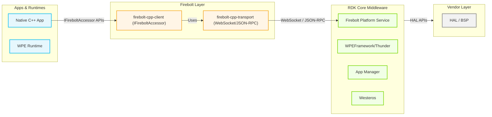
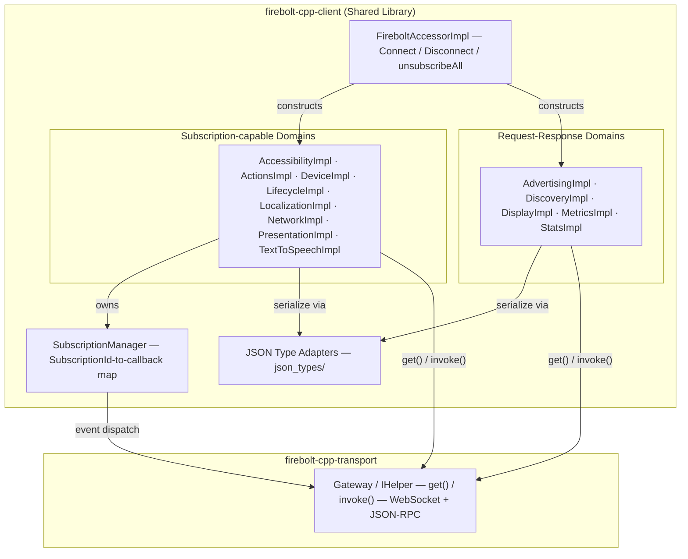
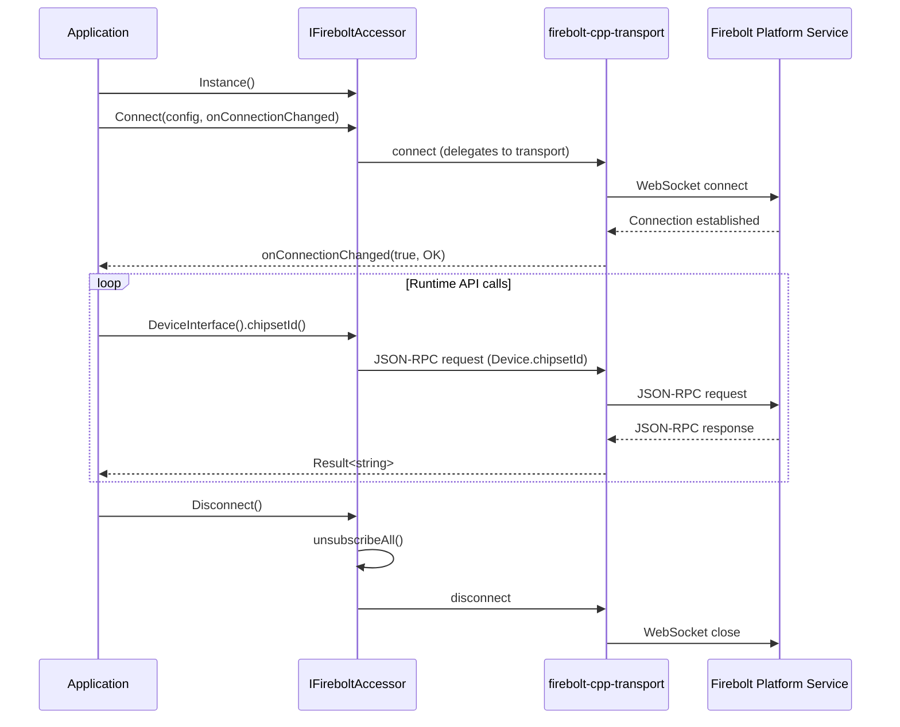
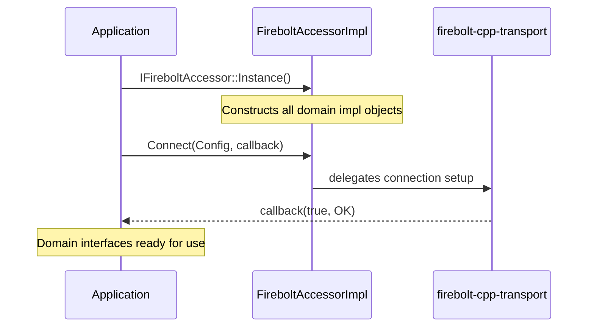
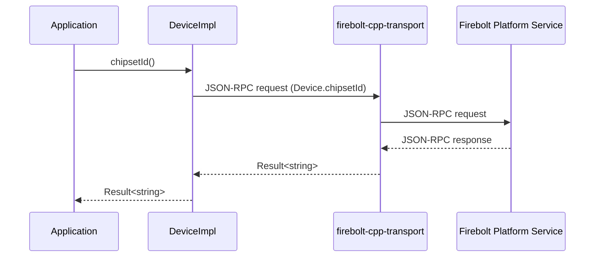
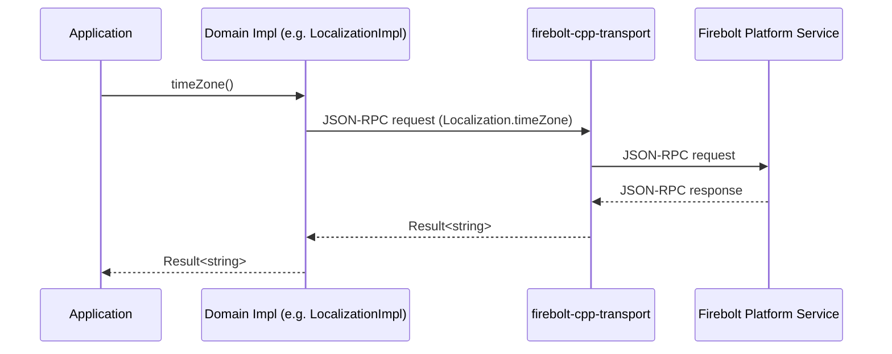
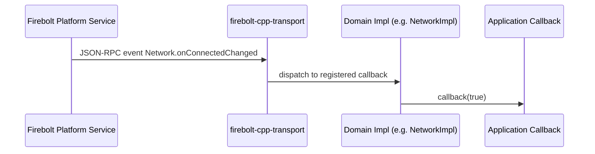

# firebolt-cpp-client

---

`firebolt-cpp-client` is the C++ implementation of the Firebolt client API for RDK-based devices. It exposes a set of strongly-typed, domain-separated C++ interfaces through a unified accessor (`IFireboltAccessor`) that applications obtain at runtime. The library connects to the platform's Firebolt service over a WebSocket connection and exchanges messages using the JSON-RPC protocol, with the underlying transport layer (`firebolt-cpp-transport`) managing the low-level connectivity and protocol handling. At the device level, the library surfaces Firebolt capabilities to native C++ applications by providing ready-to-use interfaces for device information, accessibility settings, app lifecycle, localization, network state, advertising identity, display properties, content discovery, telemetry, text-to-speech, and intent handling. At the module level, each Firebolt domain is encapsulated in its own interface class, with a corresponding concrete implementation that serializes requests to JSON-RPC method calls and deserializes responses back into typed C++ structures.

**Key Features & Responsibilities:**

- **Unified Accessor**: Provides a single entry point (`IFireboltAccessor::Instance()`) through which an application retrieves the connection handle and all domain interfaces, ensuring a single managed WebSocket session per process.
- **Asynchronous Connection Management**: The `Connect()` method initiates a WebSocket connection to the Firebolt service endpoint and delivers the connection result (success or error) asynchronously via a caller-supplied `OnConnectionChanged` callback; applications must wait for this callback before invoking API methods.
- **Domain Interface Segregation**: Each Firebolt capability area (Accessibility, Advertising, Actions, Device, Discovery, Display, Lifecycle, Localization, Metrics, Network, Presentation, Stats, TextToSpeech) is exposed as an independent abstract interface, allowing applications to consume only the domains they require.
- **Event Subscription Model**: Interfaces that expose platform state changes (e.g., HDR format changes, network connectivity, lifecycle state, closed-caption settings) provide typed `subscribe*` methods returning a `SubscriptionId`; subscriptions can be cancelled individually via `unsubscribe()` or collectively via `unsubscribeAll()`.
- **JSON-RPC Method Dispatch**: Each domain implementation translates C++ method calls into JSON-RPC requests and forwards them to the transport; responses are deserialized into typed C++ return structures using dedicated JSON type adapters located in `json_types/`.
- **Protocol Compatibility**: The transport dependency supports both a legacy RPC-v1 wire protocol and a JSON-RPC v2-compliant protocol, allowing the client to operate with both older and newer Firebolt service implementations.

---

## Design

The library is designed around a single abstract interface (`IFireboltAccessor`) that aggregates all Firebolt domain interfaces under one managed connection. The design avoids static coupling between domains: each domain module (e.g., `DeviceImpl`, `LifecycleImpl`) is independently constructed and delegates all platform communication to the `firebolt-cpp-transport` package. JSON serialization and deserialization are handled by thin adapter structs defined in the `json_types/` subdirectory, keeping protocol-level concerns isolated from domain logic.

On the northbound side, the library presents pure abstract C++ interfaces defined in `include/firebolt/`. Applications link against these headers and the shared library, and obtain interface references via the `IFireboltAccessor` — the concrete implementation type remains internal. On the southbound side, all communication flows through the `FireboltTransport` package, which manages the WebSocket lifecycle and multiplexes JSON-RPC requests and event subscriptions.

Each domain that supports events maintains a per-domain subscription registry, mapping a `SubscriptionId` to the caller-supplied `std::function` callback. When the platform fires an event, the transport delivers the payload to the registered handler, which deserializes it and invokes the callback. The `FireboltAccessorImpl` destructor calls `unsubscribeAll()` across every domain that supports subscriptions, releasing all active handlers when the connection is torn down.

All state is session-scoped and tied to the lifetime of the active WebSocket connection. Connection configuration (endpoint URL, log level, protocol selection) is supplied by the caller through the `Firebolt::Config` parameter passed to `Connect()`.

#### Threading Model

- **Threading Architecture**: Multi-threaded; thread management and WebSocket event dispatch are handled by the `firebolt-cpp-transport` layer.
- **Main Thread**: Application code calls `Connect()`, retrieves domain interfaces, and invokes API methods from its own thread context.
- **Async Connection Callback**: The `OnConnectionChanged` callback supplied to `Connect()` is invoked by the transport once the WebSocket handshake completes or fails. The thread on which this callback is delivered is determined by the transport layer.
- **Event Callbacks**: Subscription callbacks are invoked by the transport when an event notification is received, and delivered directly to the registered handler on the transport's dispatch thread.
- **Synchronization**: Per-domain subscription state is managed by the transport layer. The `FireboltAccessorImpl` is non-copyable to prevent shared-state races through duplication.

### Prerequisites and Dependencies

#### Platform and Integration Requirements

- **Build Dependencies**: `firebolt-cpp-transport` (installed separately; major version pinned via `.transport.version`), `nlohmann_json`, CMake ≥ 3.12, C++17-capable compiler.
- **Runtime Dependencies**: `firebolt-cpp-transport` shared library must be present on the target device (`RDEPENDS:${PN}` in the Yocto recipe).
- **Transport Version Pinning**: The major version of the installed `FireboltTransport` package must match the version recorded in `.transport.version`. This check is performed at CMake configure time; a mismatch causes a configuration error unless `BUILD_WITH_INSTALLED_TRANSPORT=ON` is set.
- **Startup Order**: The host application calls `Connect()` and waits for the `OnConnectionChanged` callback before invoking any API methods. All connection parameters are supplied programmatically via the `Firebolt::Config` struct.

---

### Component State Flow

#### Initialization to Active State

The library transitions through the following states during use: **Unconnected** (library loaded, `IFireboltAccessor::Instance()` obtained) → **Connecting** (`Connect()` called, WebSocket handshake in progress) → **Connected** (`OnConnectionChanged(true, …)` received; all domain interfaces are ready for use) → **Disconnected** (`Disconnect()` called or connection dropped, `OnConnectionChanged(false, …)` received; all subscriptions cleared).

#### Runtime State Changes

**State Change Triggers:**

- When the WebSocket connection is interrupted, the transport delivers `OnConnectionChanged(false, error)` to the application. The application can call `Connect()` again to re-establish a new session.
- Calling `Disconnect()` clears all active subscriptions across every domain via `unsubscribeAll()` before closing the WebSocket session.

**Context Switching Scenarios:**

- Applications can subscribe to platform-driven state changes (e.g., `Lifecycle2.onStateChanged`, `Network.onConnectedChanged`) and respond without polling; the callback arrives on the transport's dispatch thread.

---

### Call Flows

#### Initialization Call Flow

#### Request Processing Call Flow

Each domain method call is translated into a JSON-RPC request and dispatched to the Firebolt platform service via the transport. The platform response is deserialized into the typed C++ return value.

---

## Internal Modules

| Module / Class         | Description                                                                                                                                                                                                                                                                                                                                                                         | Key Files                                                |
| ---------------------- | ----------------------------------------------------------------------------------------------------------------------------------------------------------------------------------------------------------------------------------------------------------------------------------------------------------------------------------------------------------------------------------- | -------------------------------------------------------- |
| `IFireboltAccessor`    | Abstract accessor interface that owns the WebSocket connection and provides access to all domain interfaces. `Connect()` and `Disconnect()` manage the session lifecycle.                                                                                                                                                                                                           | `include/firebolt/firebolt.h`                            |
| `FireboltAccessorImpl` | Concrete implementation of `IFireboltAccessor`. Constructs all domain impl objects, holds references to the gateway, and calls `unsubscribeAll()` on every subscribed domain during shutdown.                                                                                                                                                                                       | `src/firebolt.cpp`                                       |
| `AccessibilityImpl`    | Implements `IAccessibility`. Exposes audio description, closed-caption settings, high-contrast UI, and voice-guidance settings, with subscription support for each property.                                                                                                                                                                                                        | `src/accessibility_impl.cpp`, `src/accessibility_impl.h` |
| `ActionsImpl`          | Implements `IActions`. Provides `intent()` to retrieve the current app intent, `subscribeOnIntent()` for live intent change notifications, and `start()` to dispatch a new intent to a handler app. Auto-generated from the OpenRPC spec.                                                                                                                                           | `src/actions_impl.cpp`, `src/actions_impl.h`             |
| `AdvertisingImpl`      | Implements `IAdvertising`. Provides `advertisingId()` returning an `Ifa` struct containing the advertising identifier, type, and limit-ad-tracking flag.                                                                                                                                                                                                                            | `src/advertising_impl.cpp`, `src/advertising_impl.h`     |
| `DeviceImpl`           | Implements `IDevice`. Provides chipset ID, device class (STB/OTT/TV), HDR format capabilities, uptime, UID, active-state time, and Dolby Atmos experience availability, with subscriptions for HDR and Dolby Atmos changes.                                                                                                                                                         | `src/device_impl.cpp`, `src/device_impl.h`               |
| `DiscoveryImpl`        | Implements `IDiscovery`. Reports watched content events to the platform via `watched()` (returns `Result<bool>` for backward compatibility) and `watchedV2()` (returns `Result<void>`).                                                                                                                                                                                             | `src/discovery_impl.cpp`, `src/discovery_impl.h`         |
| `DisplayImpl`          | Implements `IDisplay`. Returns EDID data as a Base64 string, native display resolution (`maxResolution()`), and physical display dimensions (`size()`).                                                                                                                                                                                                                             | `src/display_impl.cpp`, `src/display_impl.h`             |
| `LifecycleImpl`        | Implements `ILifecycle`. Manages app lifecycle state queries (`state()`) and transition subscriptions (`subscribeOnStateChanged()`). Dispatches `Lifecycle2.close` with the requested close type.                                                                                                                                                                                   | `src/lifecycle_impl.cpp`, `src/lifecycle_impl.h`         |
| `LocalizationImpl`     | Implements `ILocalization`. Provides country code, preferred audio language list, presentation language (BCP 47), and timezone (IANA), with subscription support for all four properties.                                                                                                                                                                                           | `src/localization_impl.cpp`, `src/localization_impl.h`   |
| `MetricsImpl`          | Implements `IMetrics`. Reports telemetry events to the platform: `ready()`, `signIn()`, `signOut()`, `startContent()`, `stopContent()`, `page()`, `error()`, `mediaLoadStart()`, `mediaPlay()`, `mediaPlaying()`, `mediaPause()`, `mediaWaiting()`, `mediaSeeking()`, `mediaSeeked()`, `mediaRateChanged()`, `mediaRenditionChanged()`, `mediaEnded()`, `event()`, and `appInfo()`. | `src/metrics_impl.cpp`, `src/metrics_impl.h`             |
| `NetworkImpl`          | Implements `INetwork`. Queries current network connectivity (`connected()`) and subscribes to connectivity change events.                                                                                                                                                                                                                                                           | `src/network_impl.cpp`, `src/network_impl.h`             |
| `PresentationImpl`     | Implements `IPresentation`. Queries whether the application is currently focused (receiving key presses) and subscribes to focus change events.                                                                                                                                                                                                                                     | `src/presentation_impl.cpp`, `src/presentation_impl.h`   |
| `StatsImpl`            | Implements `IStats`. Returns container memory statistics including user memory and GPU memory usage and limits via `memoryUsage()`.                                                                                                                                                                                                                                                 | `src/stats_impl.cpp`, `src/stats_impl.h`                 |
| `TextToSpeechImpl`     | Implements `ITextToSpeech`. Provides TTS control: `listVoices()`, `speak()`, `pause()`, `resume()`, `cancel()`, `getSpeechState()`, and event subscriptions for speech lifecycle (willSpeak, speechStart, speechPause, speechResume, speechComplete, speechInterrupted, networkError, playbackError).                                                                               | `src/texttospeech_impl.cpp`, `src/texttospeech_impl.h`   |
| JSON type adapters     | Per-domain structs under `json_types/` that bridge `nlohmann::json` deserialization to typed C++ domain structs. Each domain has a corresponding header (e.g., `json_types/device.h`, `json_types/lifecycle.h`).                                                                                                                                                                    | `src/json_types/*.h`                                     |

---

## Component Interactions

All interactions are with the Firebolt platform service, routed through the `firebolt-cpp-transport` WebSocket channel.

### Interaction Matrix

| Target Component / Layer      | Interaction Purpose                                                                                | Key APIs / Topics                                                                                                                                  |
| ----------------------------- | -------------------------------------------------------------------------------------------------- | -------------------------------------------------------------------------------------------------------------------------------------------------- |
| **firebolt-cpp-transport**    | WebSocket session management and JSON-RPC request/response dispatch                                | `Connect()` / `Disconnect()` lifecycle; JSON-RPC get and invoke operations routed through the transport                                            |
| **Firebolt Platform Service** | Platform-side Firebolt API endpoint — receives JSON-RPC method calls and emits event notifications | `Device.chipsetId`, `Lifecycle2.state`, `Lifecycle2.close`, `Accessibility.closedCaptionsSettings`, `TextToSpeech.speak`, `Actions.onIntent`, etc. |

### Platform Event Subscriptions

The subscription model delivers platform event notifications to the application via caller-registered `std::function` callbacks. Each subscription returns a `SubscriptionId` used for targeted or bulk cancellation.

| Event                           | JSON-RPC Topic                                  | Trigger Condition                                      | Client Interface |
| ------------------------------- | ----------------------------------------------- | ------------------------------------------------------ | ---------------- |
| HDR format change               | `Device.onHdrChanged`                           | Display HDR capabilities change                        | `IDevice`        |
| Dolby Atmos availability        | `Device.onDolbyAtmosExperienceAvailableChanged` | Platform reports change in Dolby Atmos availability    | `IDevice`        |
| Lifecycle state change          | `Lifecycle2.onStateChanged`                     | Platform transitions the app between lifecycle states  | `ILifecycle`     |
| Audio description change        | `Accessibility.onAudioDescriptionChanged`       | User changes audio description setting                 | `IAccessibility` |
| Closed-caption settings change  | `Accessibility.onClosedCaptionsSettingsChanged` | User changes caption preferences                       | `IAccessibility` |
| High-contrast UI change         | `Accessibility.onHighContrastUIChanged`         | User toggles high-contrast setting                     | `IAccessibility` |
| Voice guidance change           | `Accessibility.onVoiceGuidanceSettingsChanged`  | User changes voice guidance settings                   | `IAccessibility` |
| Network connectivity change     | `Network.onConnectedChanged`                    | Device gains or loses network connectivity             | `INetwork`       |
| Focus change                    | `Presentation.onFocusedChanged`                 | Application gains or loses input focus                 | `IPresentation`  |
| Country change                  | `Localization.onCountryChanged`                 | Platform locale country setting changes                | `ILocalization`  |
| Preferred audio language change | `Localization.onPreferredAudioLanguagesChanged` | Preferred audio language list changes                  | `ILocalization`  |
| Presentation language change    | `Localization.onPresentationLanguageChanged`    | UI presentation language changes                       | `ILocalization`  |
| Timezone change                 | `Localization.onTimeZoneChanged`                | Device timezone setting changes                        | `ILocalization`  |
| Intent received                 | `Actions.onIntent`                              | Platform dispatches a new navigation intent to the app | `IActions`       |
| TTS will speak                  | `TextToSpeech.onWillspeak`                      | TTS engine is about to begin synthesizing speech       | `ITextToSpeech`  |
| TTS speech start                | `TextToSpeech.onSpeechstart`                    | TTS audio playback starts                              | `ITextToSpeech`  |
| TTS speech pause                | `TextToSpeech.onSpeechpause`                    | TTS audio playback is paused                           | `ITextToSpeech`  |
| TTS speech resume               | `TextToSpeech.onSpeechresume`                   | TTS audio playback resumes                             | `ITextToSpeech`  |
| TTS speech complete             | `TextToSpeech.onSpeechcomplete`                 | TTS utterance finishes successfully                    | `ITextToSpeech`  |
| TTS speech interrupted          | `TextToSpeech.onSpeechinterrupted`              | TTS utterance is interrupted                           | `ITextToSpeech`  |
| TTS network error               | `TextToSpeech.onNetworkerror`                   | TTS encounters a network error during synthesis        | `ITextToSpeech`  |
| TTS playback error              | `TextToSpeech.onPlaybackerror`                  | TTS encounters a playback error during output          | `ITextToSpeech`  |

### IPC Flow Patterns

**Primary Request / Response Flow:**

**Event Notification Flow:**

---

## Implementation Details

### Key Implementation Logic

- **State / Lifecycle Management**: The `FireboltAccessorImpl` destructor releases all active subscriptions before delegating disconnect to the transport.
  - Connection management: `src/firebolt.cpp`

- **Event Processing**: Each subscription-capable domain registers event topic handlers with the transport on `subscribe*()` calls. When an event arrives, the payload is deserialized via the domain-specific JSON type adapter and delivered to the registered callback.

- **JSON Serialization Strategy**: Request parameters are serialized per domain in `*_impl.cpp` files. Optional parameters are included only when their `std::optional` value is present. Response deserialization relies on templated JSON adapter structs in `src/json_types/`.

- **Error Handling Strategy**: All API methods return a `Result<T>` type. Callers check the result for success or error before accessing the value.

- **Logging & Diagnostics**: The client library version string is logged at connection time. Verbosity is controlled by the `LogLevel` parameter in `Firebolt::Config`.

---

## Configuration

### Key Configuration Parameters

Configuration is provided programmatically via the `Firebolt::Config` struct passed to `Connect()`.

| Parameter              | Type                 | Description                                                                                                                                 |
| ---------------------- | -------------------- | ------------------------------------------------------------------------------------------------------------------------------------------- |
| WebSocket endpoint URL | `string`             | The URL of the Firebolt platform service (e.g., `ws://127.0.0.1:3474/`).                                                                    |
| Log level              | `Firebolt::LogLevel` | Controls the verbosity of the transport and client logging (e.g., `Notice`, `Debug`).                                                       |
| Protocol selection     | optional bool        | Selects between the legacy RPC-v1 wire format and the JSON-RPC v2-compliant protocol; passed by the calling application at connection time. |

### Configuration Persistence

Configuration is session-scoped and tied to the active WebSocket connection established by `Connect()`. Calling `Connect()` again with a new `Firebolt::Config` starts a fresh session with the updated parameters.

---

## Build-Time Configurations

The following CMake options govern the build behavior of the library. The values listed reflect the defaults defined in `CMakeLists.txt`; the Yocto recipe exposes `DISABLE_SO_VERSION` as a selectable `PACKAGECONFIG` entry.

| CMake Option                     | Default | Description                                                                                                                                                                                                      |
| -------------------------------- | ------- | ---------------------------------------------------------------------------------------------------------------------------------------------------------------------------------------------------------------- |
| `BUILD_SHARED_LIBS`              | `ON`    | Build the library as a shared object (`.so`). Set to `OFF` to produce a static archive.                                                                                                                          |
| `DISABLE_SO_VERSION`             | `OFF`   | When `ON`, suppresses the SONAME and SOVERSION from the shared library. Exposed in the Yocto recipe as `PACKAGECONFIG[disable-so-version]`.                                                                      |
| `BUILD_WITH_INSTALLED_TRANSPORT` | `ON`    | Allow building against the installed `FireboltTransport` even if its version does not match the pinned version in `.transport.version`.                                                                          |
| `ENABLE_TESTS`                   | `OFF`   | Builds unit and component test targets. When `ON`, symbol visibility is set to `default` (rather than `hidden`) and coverage instrumentation flags (`--coverage -g -O0 -fno-inline`) are applied to the library. |
| `ENABLE_DEMO_APP`                | `OFF`   | Builds the `api-test-app` CLI demo utility located in `test/api_test_app/`.                                                                                                                                      |
| `DISCOVER_UT`                    | `ON`    | Enables automatic discovery of all unit test cases at CMake configure time.                                                                                                                                      |
| `DISCOVER_CT`                    | `OFF`   | Enables automatic discovery of all component test cases at CMake configure time.                                                                                                                                 |
