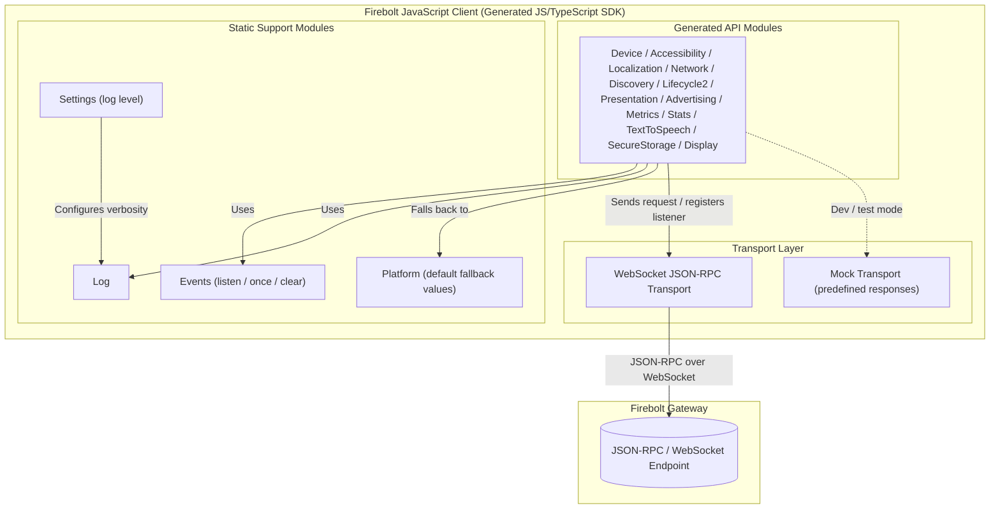
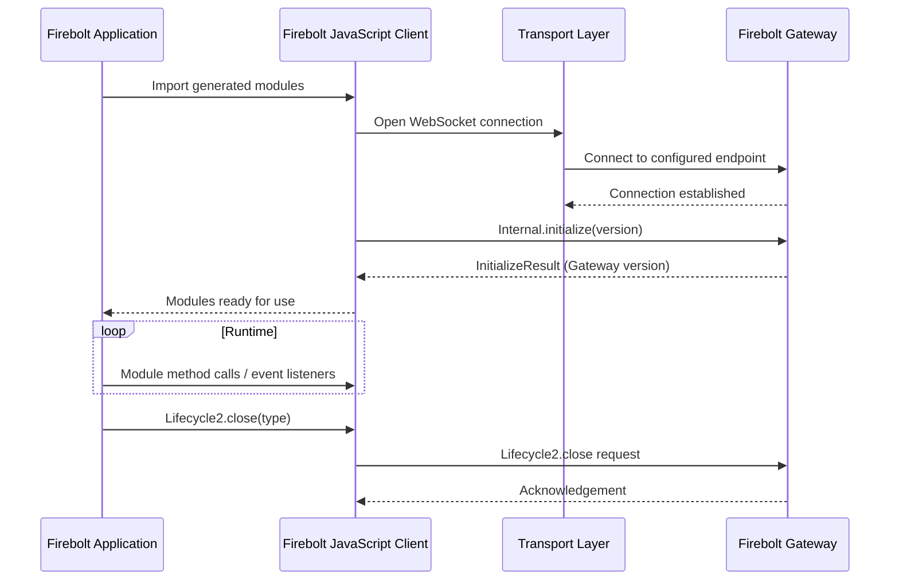
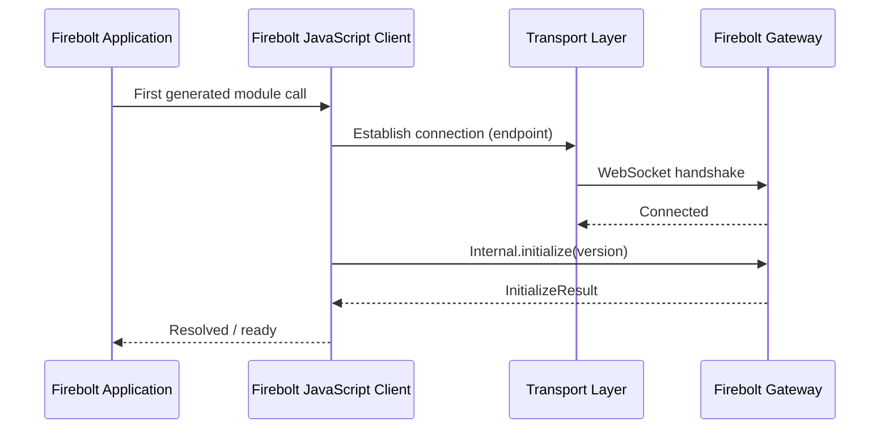
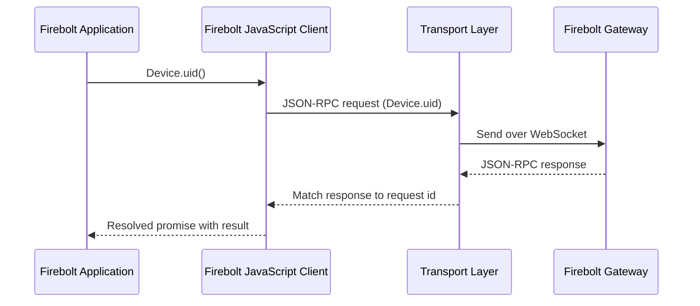
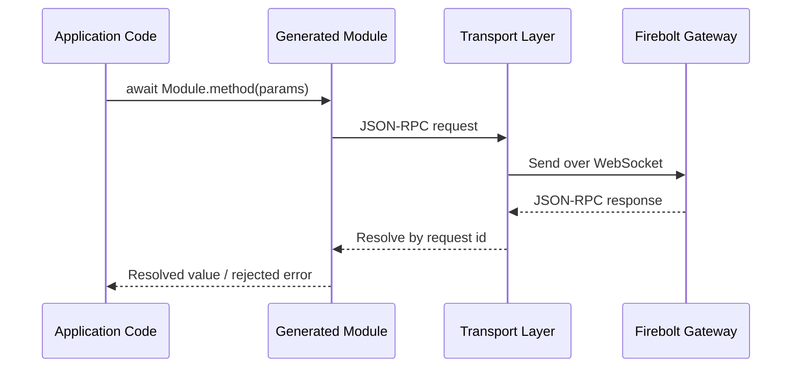
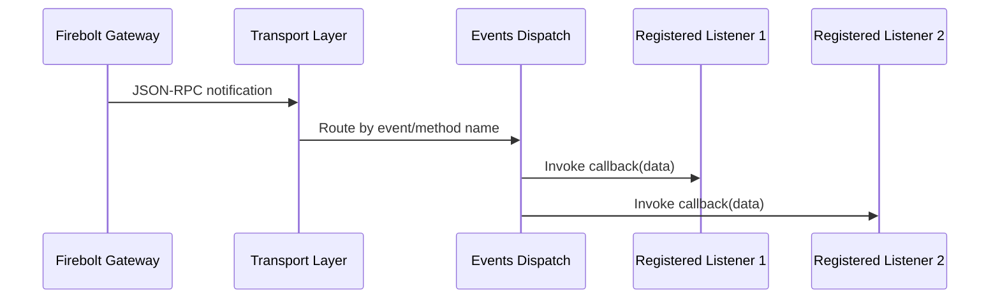

# Firebolt JavaScript Client

Firebolt JavaScript Client is the JavaScript/TypeScript implementation of the Firebolt Core Client SDK. It is a single version of the SDK that is compiled directly into a Firebolt application bundle, giving the application a set of promise-based JavaScript modules for querying device, accessibility, localization, discovery, lifecycle, network, presentation, advertising, metrics, and text-to-speech information without the application needing to know how the underlying platform exposes that information.

At the product/stack level, the client acts as the single point of integration between a Firebolt application and the platform's Firebolt Gateway. Every capability the application uses (reading a setting, listening for a change, reporting a metric, or requesting a lifecycle transition) is funneled through this client as a JSON-RPC call or subscription, so the platform can apply capability negotiation, permissions, and versioning consistently across all applications running on the device.

At the module level, the client is organized as a set of generated, per-domain JavaScript modules (one per Firebolt OpenRPC module such as `Device`, `Accessibility`, `Localization`, `Network`, `Discovery`, `Lifecycle2`, `Presentation`, `Advertising`, `Metrics`, `Stats`, `TextToSpeech`, `SecureStorage`, and `Display`), plus a small set of hand-written support modules (`Log`, `Events`, `Settings`, and a default `Platform` module) that provide logging, generic event subscription, and platform-independent fallback values.

```mermaid
flowchart LR

%% Styles
classDef Apps stroke:#00B9F1,fill:#E6F7FD,stroke-width:2px;
classDef RDKMW stroke:#75D701,fill:#F1FFE6,stroke-width:2px;
classDef VL stroke:#808080,fill:#F2F2F2,stroke-width:2px;

subgraph Apps["Apps and Runtimes"]
    FBApp["Firebolt Application"]
    FBClient["Firebolt JavaScript Client (compiled into app)"]
end

subgraph RDKMW["RDKE/RDKV Core Middleware"]
    Gateway["Firebolt Gateway (JSON-RPC / WebSocket)"]
    OtherPlugins["Other RDKE/RDKV Middleware Plugins"]
end

subgraph VL["Vendor / Platform Layer"]
    HAL["Platform HAL"]
end

FBApp -->|"Calls generated modules"| FBClient
FBClient -->|"Bidirectional JSON-RPC over WebSocket"| Gateway
Gateway -->|"Dispatch"| OtherPlugins
OtherPlugins -->|"Platform APIs"| HAL

class FBApp,FBClient Apps;
class Gateway,OtherPlugins RDKMW;
class HAL VL;
```



**Key Features & Responsibilities:**

- **Generated, OpenRPC-driven API surface**: Each supported Firebolt module (Device, Accessibility, Localization, Network, Discovery, Lifecycle2, Presentation, Advertising, Metrics, Stats, TextToSpeech, SecureStorage, Display) is generated from an OpenRPC document, so method names, parameters, and result shapes stay consistent with the published Firebolt specification.
- **Promise-based getters with built-in change notifications**: Methods tagged as a property (for example `Device.hdr()`, `Accessibility.audioDescription()`, `Network.connected()`) return a promise for the current value and can also be called with a callback to subscribe to an automatically generated `on<Property>Changed` event for the same value.
- **Generic event subscription utilities**: The `Events` module (`listen`, `once`, `clear`) gives every generated module a consistent way to register, register-once, and unregister event listeners without each module reimplementing subscription bookkeeping.
- **Mandatory session initialization**: The `Internal.initialize` method carries the SDK's semantic version to the platform and must be the first JSON-RPC call issued by the client, establishing the session before any other method is used.
- **Capability-aware method tagging**: Every generated method is tagged with the Firebolt capability URN(s) it uses, manages, or provides, which is used to build and validate the capability manifest that the platform enforces at runtime.
- **Configurable, sliced SDK builds**: The Core Client is produced by slicing the full Firebolt OpenRPC specification down to only the modules and capabilities declared in `sdk.config.json`, keeping the shipped SDK scoped to what the platform target actually supports.
- **Fallback/default platform values**: A static `Platform` module supplies default `Accessibility`, `Device`, and `Localization` values, allowing application code to run using locally defined values ahead of an active Firebolt Gateway session.
- **Local response mocking for development**: A mock transport mode allows JSON-RPC responses to be predefined, and a companion Mock-Firebolt WebSocket server is used in automated component testing to validate real bidirectional request/response and event behavior.

---

## Design

The client is built around code generation rather than hand-written API bindings: OpenRPC documents describe every method, its parameters, results, and the capability it depends on, and a build pipeline compiles, validates, and "slices" these documents into the exact API surface each SDK package (such as the Core Client) needs. This keeps the JavaScript API in lockstep with the platform-facing Firebolt specification, lets multiple SDK packages share one source of truth, and reduces the shipped API surface to only the modules a given SDK configuration declares. A small set of static, hand-authored modules (`Log`, `Events`, `Settings`, and the default `Platform` module) supply cross-cutting behavior shared uniformly across every Firebolt module, so generated modules can stay declarative. Method tags in the OpenRPC documents (`rpc-only`, `property:readonly`, `notifier`, `capabilities`) drive how each method is generated: a plain call, a getter with an automatic change-event, or a multi-value lifecycle notification.

Northbound, the client exposes one JavaScript module per Firebolt domain to the hosting application; the application imports only the modules it needs and calls them as promise-returning functions or event subscriptions. Southbound, every generated call is translated into a JSON-RPC request and sent over a transport connection to the platform's Firebolt Gateway; JSON-RPC responses and unsolicited notifications are routed back through the same transport to resolve promises or invoke registered listeners.

The IPC mechanism is JSON-RPC 2.0 carried over a WebSocket connection, configured as bidirectional so that the Gateway can both answer method calls and push event notifications to the client through a single persistent connection. The connection endpoint is supplied at runtime (for example through a global `window.__firebolt.endpoint` value, defaulting to a local WebSocket address in test environments) rather than being hard-coded into the generated modules. A mock transport mode exists in parallel to the real transport so that predefined responses can be served locally, which is used for local development and for the client's own unit tests.

Configuration such as log level is held in memory for the lifetime of the session through the `Settings` module, while durable state (capability grants, user settings, device data) is owned and persisted by the platform behind the Firebolt Gateway.



#### Threading Model

- **Threading Architecture**: Single-threaded, event-driven (standard JavaScript event loop).
- **Main Thread**: Executes application code, invokes generated module methods, and runs the promise/callback resolution for both method results and event notifications; transport I/O is handled asynchronously on this same event loop through the WebSocket connection's own event callbacks.
- **Synchronization**: Concurrent in-flight requests are tracked by JSON-RPC request identifiers so responses are matched to the correct pending promise as they arrive.
- **Async / Event Dispatch**: Method calls return promises that resolve when the matching JSON-RPC response arrives; event notifications received over the transport are dispatched to the listener(s) registered through `Events.listen`/`Events.once` (or a property's own subscribe form) without blocking the caller.

### Prerequisites and Dependencies

#### Platform and Integration Requirements

- **Build Dependencies**: The SDK build pipeline depends on the external `@firebolt-js/openrpc` CLI (referenced as a devDependency) for validating, compiling, slicing, generating, and documenting the SDK from the OpenRPC sources; the root workspace also builds using Node.js `npm` workspaces (`src/sdks/core` is the only declared workspace).
- **Configuration Files**: `sdk.config.json` (declares which OpenRPC modules and capabilities are sliced into this SDK package) and the `config_override/languages/javascript` and `config_override/languages/markdown` overrides (declare code-generation and documentation-generation flags for this package) are required inputs to the SDK generation step.
- **Runtime Dependency**: A reachable Firebolt Gateway endpoint that implements the compiled OpenRPC JSON-RPC API in bidirectional mode; the endpoint address is supplied to the client at runtime rather than being bundled at build time.
- **Startup Order**: `Internal.initialize(version)` must be called by the client before any other JSON-RPC method is sent, so the Gateway can establish the SDK/session context first.

---

### Component State Flow

#### Initialization to Active State

When a Firebolt application starts, the compiled-in client establishes its transport connection to the configured Firebolt Gateway endpoint and immediately issues `Internal.initialize` with its own semantic version. Once the Gateway acknowledges the session with its own version information, the client is considered active and the application is free to call any generated module method or register event listeners. On application shutdown, the client can request platform-driven deactivation through `Lifecycle2.close`.



#### Runtime State Changes

**State Change Triggers:**

- `Lifecycle2.onStateChanged` delivers a history of lifecycle state transitions (for example from `initializing` to `paused` to `active`) so the application can react to foreground/background changes reported by the platform.
- Any property-style method (such as `Network.connected`, `Device.hdr`, `Accessibility.audioDescription`, `Accessibility.closedCaptionsSettings`) has a matching `on<Property>Changed` notification, allowing the application to react to platform-driven value changes instead of polling the getter.

**Context Switching Scenarios:**

- An application can call a property method directly with a callback to subscribe to its changes, or use `Events.listen`/`Events.once` with the corresponding `on<Property>Changed` event name; both forms register through the same underlying event dispatch and are cleared with `Events.clear`.

---

### Call Flows

#### Initialization Call Flow



#### Request Processing Call Flow

The client validates that a generated method is called with the parameters defined by its OpenRPC schema, builds a JSON-RPC request scoped to its module (for example `Device.uid`), and sends it over the transport. The Gateway's JSON-RPC response is matched back to the original call by request identifier and used to resolve the caller's promise with the typed result, or reject it with a Firebolt error object.



---

## Internal Modules

| Module / Class                | Description                                                                                                                                                                                                                                                                                       | Key Files                                                                                       |
| ----------------------------- | ------------------------------------------------------------------------------------------------------------------------------------------------------------------------------------------------------------------------------------------------------------------------------------------------- | ----------------------------------------------------------------------------------------------- |
| Generated domain modules      | One module per Firebolt OpenRPC document (`Device`, `Accessibility`, `Localization`, `Network`, `Discovery`, `Lifecycle2`, `Presentation`, `Advertising`, `Metrics`, `Stats`, `TextToSpeech`, `SecureStorage`, `Display`); generated at build time from the OpenRPC sources into the SDK package. | `src/openrpc/*.json`                                                                            |
| `Internal`                    | Carries SDK-to-Gateway session bootstrap; exposes the `initialize` method that must run before any other call.                                                                                                                                                                                    | `src/openrpc/_internal.json`                                                                    |
| `Log`                         | Static logging module exposing `info`, `debug`, `warn`, and `error`.                                                                                                                                                                                                                              | `src/template/declarations/template.d.ts`                                                       |
| `Events`                      | Static generic event module exposing `listen`, `once`, and `clear`, shared by every generated module's notifications.                                                                                                                                                                             | `src/template/declarations/template.d.ts`                                                       |
| `Settings`                    | Static module exposing `setLogLevel`/`getLogLevel`, controlling `Log` verbosity for the session.                                                                                                                                                                                                  | `src/template/declarations/template.d.ts`                                                       |
| `Platform`                    | Static default/fallback module aggregating `Accessibility`, `Device`, and `Localization` default values, usable ahead of an active Gateway session.                                                                                                                                               | `src/sdks/core/src/js/sdk/Platform/index.mjs`, `src/sdks/core/src/js/sdk/Platform/defaults.mjs` |
| SDK slicing configuration     | Declares which OpenRPC modules and capabilities this SDK package includes; consumed by the `slice` build step to scope the generated API.                                                                                                                                                         | `src/sdks/core/sdk.config.json`                                                                 |
| Version specification tooling | Tracks capability and API version history against the SDK's major version, receiving generated capability data and reconciling it with `firebolt-specification.json`.                                                                                                                             | `src/js/version-specification/apis.mjs`, `src/js/version-specification/capabilities.mjs`        |

---

## Component Interactions

### Interaction Matrix

| Target Component / Layer              | Interaction Purpose                                                                                                                                            | Key APIs / Topics                                                                        |
| ------------------------------------- | -------------------------------------------------------------------------------------------------------------------------------------------------------------- | ---------------------------------------------------------------------------------------- |
| **Firebolt Gateway**                  | Session bootstrap, method invocation, and event subscription over JSON-RPC.                                                                                    | `Internal.initialize`, module getter/setter methods, `on<Property>Changed` notifications |
| **Firebolt Application**              | Consumes generated modules directly as the application's device/platform integration point.                                                                    | Generated module methods, `Events.listen`/`once`/`clear`                                 |
| **`@firebolt-js/openrpc` build tool** | Validates, compiles, slices, generates, and documents the SDK from the OpenRPC sources at build time.                                                          | `validate`, `compile`, `slice`, `sdk`, `docs` CLI tasks                                  |
| **Mock-Firebolt (test only)**         | Acts as a stand-in Firebolt Gateway over a WebSocket endpoint for automated component tests, exercising real request/response and event registration behavior. | Bidirectional JSON-RPC over WebSocket                                                    |

### Events Published

| Event Name                     | IARM / JSON-RPC Topic                                                                                                                                | Trigger Condition                                                  | Subscriber Components |
| ------------------------------ | ---------------------------------------------------------------------------------------------------------------------------------------------------- | ------------------------------------------------------------------ | --------------------- |
| `Lifecycle2.onStateChanged`    | `Lifecycle2.onStateChanged`                                                                                                                          | The platform transitions the app/runtime to a new lifecycle state. | Firebolt Application  |
| `<Module>.on<Property>Changed` | e.g. `Device.onHdrChanged`, `Network.onConnectedChanged`, `Accessibility.onAudioDescriptionChanged`, `Accessibility.onClosedCaptionsSettingsChanged` | The corresponding property's value changes on the platform.        | Firebolt Application  |

### IPC Flow Patterns

**Primary Request / Response Flow:**

A generated module method builds a JSON-RPC request for its module and method name, sends it over the transport, and resolves the caller's promise from the matching JSON-RPC response.



**Event Notification Flow:**

When the Gateway pushes a JSON-RPC notification for a registered event, the transport routes it to the `Events` dispatch mechanism, which invokes every listener registered for that event name (through `listen`, `once`, or a property's own subscribe form).



---

## Implementation Details

### Major HAL APIs Integration

The client integrates with device and platform capabilities exclusively through the JSON-RPC method surface compiled from the OpenRPC specifications below, routed through the transport layer.

| Generated API Group         | Purpose                                                                                                                                  | Defining Specification            |
| --------------------------- | ---------------------------------------------------------------------------------------------------------------------------------------- | --------------------------------- |
| `Internal.initialize`       | Establishes the SDK/session with the Gateway before any other call.                                                                      | `src/openrpc/_internal.json`      |
| `Device.*`                  | Device identity, class, uptime, active-state time, and HDR capability queries.                                                           | `src/openrpc/device.json`         |
| `Accessibility.*`           | Audio description, closed captions, high-contrast UI, and voice guidance settings.                                                       | `src/openrpc/accessibility.json`  |
| `Localization.*`            | Country, preferred audio languages, and presentation language queries.                                                                   | `src/openrpc/localization.json`   |
| `Network.*`                 | Current network connectivity status.                                                                                                     | `src/openrpc/network.json`        |
| `Discovery.watched`         | Reports partial/complete content-watch progress to the platform.                                                                         | `src/openrpc/discovery.json`      |
| `Lifecycle2.*`              | App lifecycle state query, state-change notification, and close requests.                                                                | `src/openrpc/lifecycle2.json`     |
| `Presentation.focused`      | Whether the app currently has input focus.                                                                                               | `src/openrpc/presentation.json`   |
| `Advertising.advertisingId` | Retrieves the platform advertising identifier.                                                                                           | `src/openrpc/advertising.json`    |
| `Metrics.*`                 | Sends first- and third-party metrics/events to the platform.                                                                             | `src/openrpc/metrics.json`        |
| `Stats.memoryUsage`         | Reports container memory usage.                                                                                                          | `src/openrpc/stats.json`          |
| `TextToSpeech.*`            | Speak, pause, resume, and cancel text-to-speech utterances, plus speech-state and voice-list queries and speech lifecycle notifications. | `src/openrpc/text_to_speech.json` |
| `Display.edid`              | Returns the connected display's EDID as a Base64 string.                                                                                 | `src/openrpc/display.json`        |

### Key Implementation Logic

- **State / Lifecycle Management**: The client's own session state is limited to whether `Internal.initialize` has completed; application-visible lifecycle state (`initializing`, `paused`, `active`, and so on) is owned by the platform and surfaced through `Lifecycle2.state` and `Lifecycle2.onStateChanged`.
- **Event Processing**: Property methods and explicit notifier methods (tagged `notifier` in their OpenRPC definition, such as `Lifecycle2.onStateChanged`) are both exposed through the shared `Events` module, so a single `listen`/`once`/`clear` pattern covers property-change and lifecycle notifications alike.
- **Error Handling Strategy**: JSON-RPC errors returned by the Gateway follow the `FireboltError` shape (`code`, `message`, optional `data`), including specific errors such as the `401`/"User is not authenticated." error; these are surfaced to the caller as a rejected promise rather than a special return value.
- **Logging & Diagnostics**: The static `Log` module provides `info`, `debug`, `warn`, and `error` output, with verbosity controlled at runtime through `Settings.setLogLevel`/`getLogLevel` (`WARN`, `INFO`, `DEBUG`, `ERROR`).

---

## Configuration

### Key Configuration Files

| Configuration File                                                        | Purpose                                                                                               | Override Mechanism                                  |
| ------------------------------------------------------------------------- | ----------------------------------------------------------------------------------------------------- | --------------------------------------------------- |
| `src/sdks/core/sdk.config.json`                                           | Declares the OpenRPC modules and capability URNs this SDK package is sliced down to.                  | Edited directly, consumed by the `slice` build step |
| `src/sdks/core/config_override/languages/javascript/language.config.json` | Controls JavaScript code-generation behavior for this SDK package.                                    | Edited directly, consumed by the `sdk` build step   |
| `src/sdks/core/config_override/languages/markdown/language.config.json`   | Controls Markdown documentation-generation behavior for this SDK package.                             | Edited directly, consumed by the `docs` build step  |
| `src/json/firebolt-specification.json`                                    | Source of truth for released API/capability history, reconciled by the version-specification tooling. | Updated by the `specification` build step           |

### Key Configuration Parameters

| Parameter                                               | Type    | Default               | Description                                                                                                                                                                                                                  |
| ------------------------------------------------------- | ------- | --------------------- | ---------------------------------------------------------------------------------------------------------------------------------------------------------------------------------------------------------------------------- |
| `enableListenAndOnceDeclarations`                       | boolean | `false`               | Controls whether the code generator emits explicit `listen`/`once` method declarations per generated module in addition to the shared `Events` module, for both the JavaScript SDK and its generated Markdown documentation. |
| `FIREBOLT_ENDPOINT` (runtime/test environment variable) | string  | `ws://localhost:9998` | WebSocket endpoint the transport connects to, serving as the default connection target unless `window.__firebolt.endpoint` provides a different value.                                                                       |

### Runtime Configuration

Log verbosity is the only value that can be changed at runtime through the SDK's own API:

```javascript
Settings.setLogLevel("DEBUG");
```

### Configuration Persistence

Configuration changes such as the log level are scoped to the current session and held in memory, while durable state is owned and persisted by the platform behind the Firebolt Gateway.
