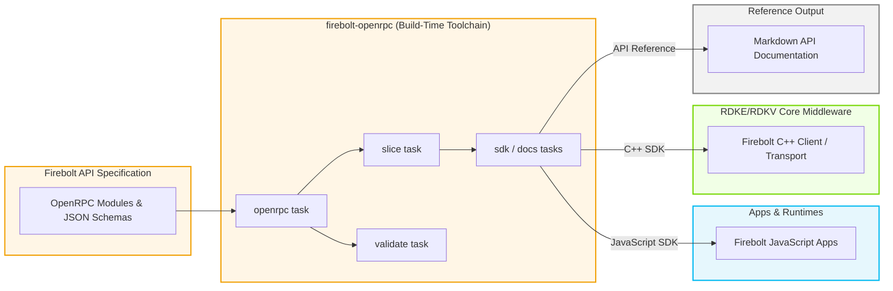
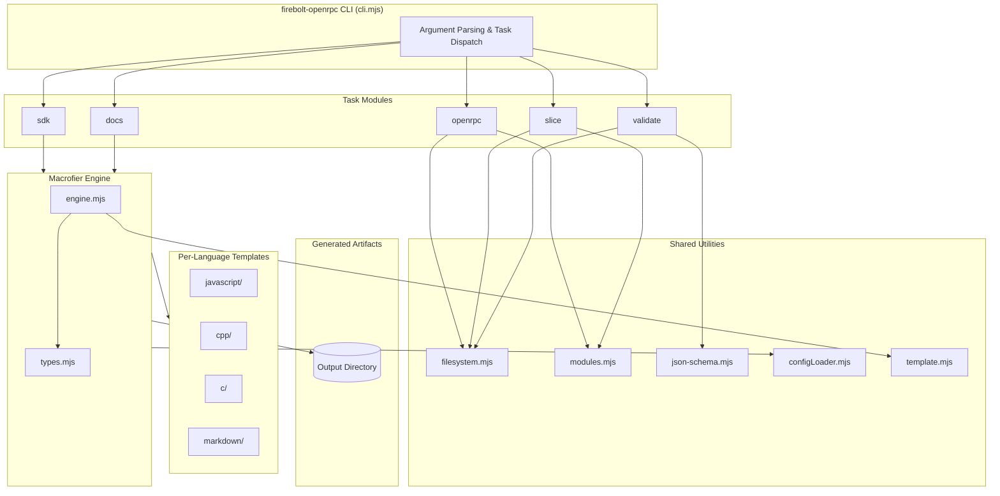
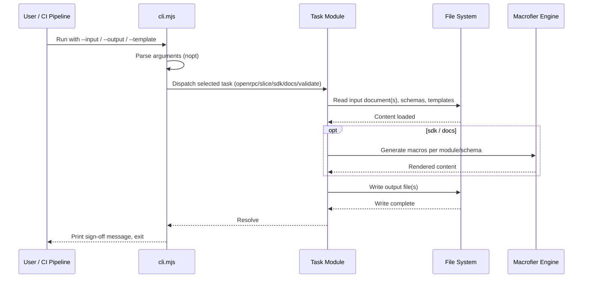
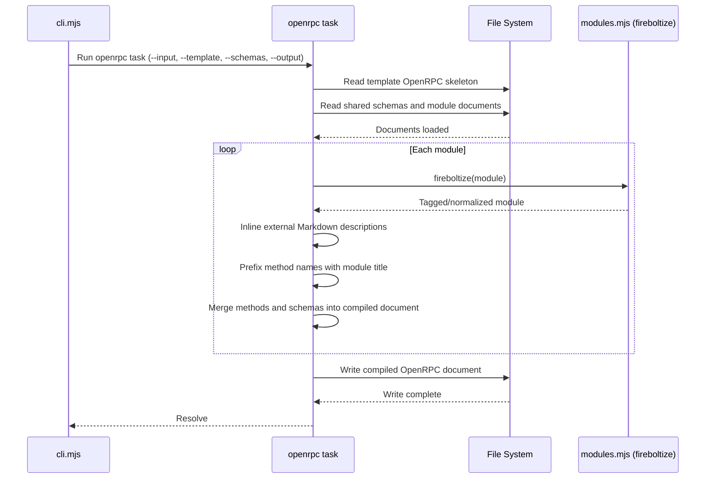
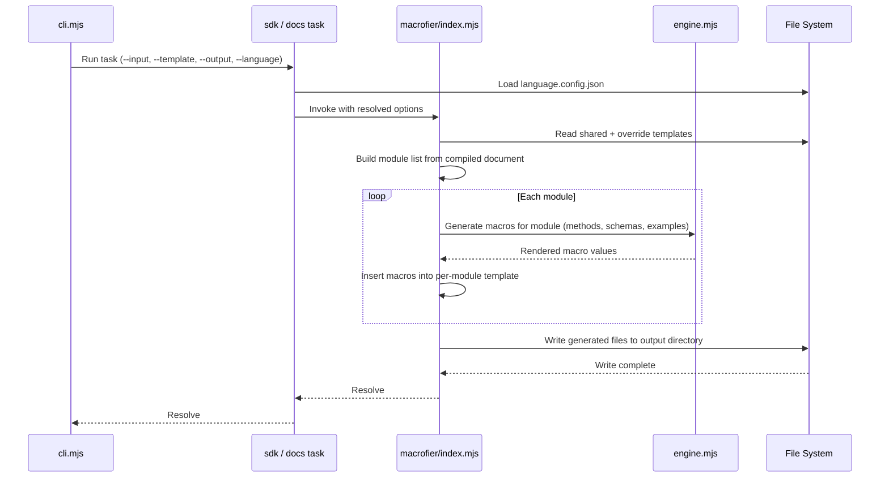
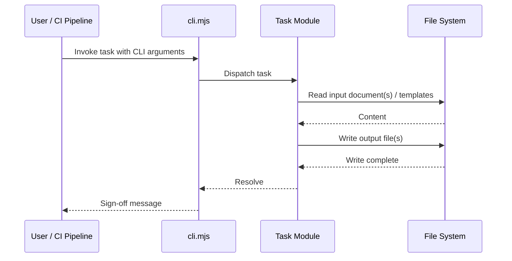
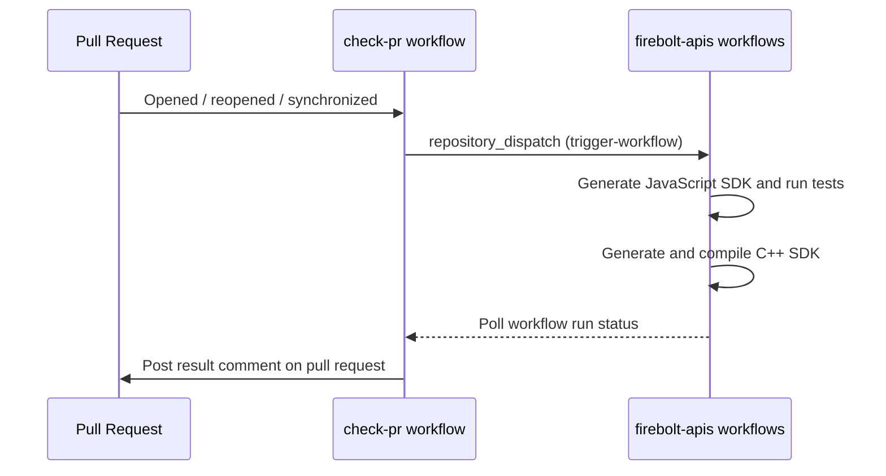

# Firebolt OpenRPC

---

Firebolt OpenRPC is a build-time tooling project that turns a Firebolt API specification, expressed as a set of OpenRPC documents and JSON Schemas, into the artifacts that the rest of the Firebolt stack consumes. It is executed as part of the SDK and documentation build pipeline for the Firebolt API family of repositories, ahead of runtime deployment.

At the product/stack level, the tool is what keeps the JavaScript and native (C++) Firebolt SDKs, and their published API reference documentation, in sync with a single source-of-truth API specification. Any change to the Firebolt API surface is compiled once and then propagated consistently into every generated SDK and every generated documentation page, instead of each SDK maintaining its own hand-written bindings.

At the module level, the tool exposes five independent tasks — `openrpc` (compiles and Fireboltizes modules into one document), `slice` (filters a compiled document down to the methods/capabilities needed by a specific SDK), `sdk` (generates SDK source code and type declarations), `docs` (generates Markdown API reference documentation) and `validate` (validates OpenRPC/JSON-Schema documents against the Firebolt meta-schema). The `sdk` and `docs` tasks share a common template-macro expansion engine so that JavaScript, C++, and documentation output stay behaviorally consistent with one another.



**Key Features & Responsibilities:**

- **OpenRPC Compilation (`openrpc` task)**: Merges a directory of per-module OpenRPC documents and shared JSON Schemas into a single document, applies Firebolt method-tag semantics, and inlines external Markdown description files via JSON-Schema references.
- **Capability-Based Slicing (`slice` task)**: Filters a compiled OpenRPC document down to the methods required by a particular SDK, matching methods by module name and by `use`/`manage`/`provide` capability rules declared in an SDK configuration manifest, then tree-shakes schemas that are no longer referenced.
- **Multi-Language SDK Generation (`sdk` task)**: Uses a shared macro-expansion engine together with per-language templates to generate JavaScript, C++, and C SDK source files and type declarations from the same OpenRPC document.
- **API Documentation Generation (`docs` task)**: Generates Markdown API reference pages per module and schema, with embedded JavaScript and JSON-RPC usage examples pulled from example language templates.
- **Specification Validation (`validate` task)**: Validates OpenRPC documents, shared JSON Schemas, and their examples against the JSON-Schema meta-schema, the OpenRPC meta-schema, and a Firebolt-specific meta-schema using AJV.

---

## Design

The tool is organized as a small CLI (`cli.mjs`) that dispatches to one of five independently invocable tasks. Each task is a stateless, single-purpose async function that reads well-known command-line arguments (`--input`, `--output`, `--template`, `--schemas`, `--language`, and others), performs one transformation, and writes its result to disk. The `sdk` and `docs` tasks delegate their generation logic to a shared "macrofier" engine, so that adding or changing generation behavior only needs to happen once for all output languages. Per-language differences (file layout, type primitives, whether polymorphic methods are generated, whether schemas are inlined into modules, and so on) are expressed declaratively in a `language.config.json` file per language rather than as branching logic in the engine itself. Output for a given language can be customized without touching the tool's source by pointing `--template` at a directory of override templates, which are merged over the shared built-in templates so that user-supplied files win any naming collisions.

North-bound, the tool's input is file-based: OpenRPC module documents, shared JSON Schema files, optional external Markdown description files, an optional SDK configuration manifest (for the `slice` task), and a directory of template files per target language. South-bound, its output is likewise file-based: generated SDK source trees, TypeScript-style declaration files, and Markdown documentation trees written to the directory passed via `--output`. The tool operates as an offline, single-process, file-to-file transformation pipeline, communicating through the file system rather than through inter-process channels; the one exception is the `validate` task, which fetches the public JSON-Schema and OpenRPC meta-schemas over HTTPS to validate against.

Every invocation is stateless: all generation decisions are derived anew from the input document(s), the selected language's `language.config.json`, and any `--template` overrides supplied on that invocation. The tool optionally copies file system permissions (such as an executable bit) from a template file onto the generated output file when a language's `persistPermission` flag is enabled.



#### Threading Model

- **Threading Architecture**: Single-threaded, event-driven Node.js process.
- **Main Thread**: Parses CLI arguments, dispatches to the selected task, drives the async/await pipeline for reading input files, expanding macros, and writing output files.
- **Worker Threads**: Concurrency is achieved through asynchronous I/O; independent file reads (such as reading every file in a schema directory) are parallelized with `Promise.all` within the single main thread.
- **Synchronization**: Each task instance owns an isolated set of document and template objects for the duration of a single CLI invocation, keeping generated state scoped to that run.
- **Async / Event Dispatch**: Each task returns a `Promise` that resolves once its output files have been written; the CLI prints a completion message only after that promise resolves.

### Prerequisites and Dependencies

- **Build Dependencies**: Node.js (an `lts/*` release, as used by the project's GitHub Actions workflows) and npm. Runtime dependencies actually imported by the tool are `ajv` and `ajv-formats` (OpenRPC/JSON-Schema validation), `crocks` (functional helpers used to traverse and transform OpenRPC/JSON-Schema documents), `deepmerge` (merging OpenRPC method/schema fragments), `fs-extra` (directory creation/emptying), `node-fetch` (fetching the public JSON-Schema and OpenRPC meta-schemas during validation), and `nopt` (CLI argument parsing).
- **Configuration Files**: A `language.config.json` file is required for each target language and is read at the start of every `sdk`/`docs` invocation; an SDK configuration manifest (JSON) is required as input to the `slice` task.
- **Task Execution Order**: The `slice`, `sdk`, and `docs` tasks are designed to run against the output of the `openrpc` task (a single, already-compiled OpenRPC document); `slice` is typically run before `sdk`/`docs` when multiple SDK variants are produced from one specification, while `sdk`/`docs` can alternatively run directly against an unsliced document.

#### Platform and Integration Requirements

- **Build Dependencies**: A supported Node.js runtime is sufficient to run the tool itself. The `cpp` language output is compiled separately by a downstream C++ SDK build.
- **Configuration Files**: `language.config.json` (one per language, under `languages/<language>/`) and, for the `slice` task, an SDK configuration manifest supplied via `--sdk`.
- **Task Execution Order**: `openrpc` → `validate` (optional) → `slice` (optional) → `sdk` / `docs`.

---

### Component State Flow

#### Initialization to Active State

Each CLI invocation is a single, short-lived process rather than a long-running service. It transitions through: **Argument Parsing** (`nopt` parses `--input`/`--output`/`--template`/etc. and applies task-specific defaults) → **Task Dispatch** (the requested task module is selected and invoked) → **Input Loading** (OpenRPC document(s), shared schemas, and templates are read from disk) → **Generation** (macro expansion via the shared engine for `sdk`/`docs`, or direct document transformation for `openrpc`/`slice`/`validate`) → **Output Writing** (generated files are written to the output directory) → **Completion** (a sign-off message is printed and the process exits).



#### Runtime State Changes

**State Change Triggers:**

- Supplying a `--template` directory causes the engine to merge those templates over the shared, built-in templates for that language, overriding any file with the same relative path.
- Running the `validate` task with `--transformations` applies the same Firebolt tag processing and Markdown-inlining used by the `openrpc` task before validating, so raw source modules can be validated as if they had already been compiled.
- Passing `--as-path` to the `docs` task changes output layout from flat files to one directory per module.

**Context Switching Scenarios:**

- Running `openrpc` against a directory of modules and shared schemas produces one compiled document; running it again with a different `--template` (the base OpenRPC skeleton) changes only the document's `info` block while reusing the same modules.
- Running `slice` with different SDK configuration manifests against the same compiled document produces different method/schema subsets (for example, a Core SDK versus a Manage SDK) without recompiling the source modules.
- Running `sdk` with `--language` pointed at `javascript` versus `cpp` reuses the same input OpenRPC document and macrofier engine but produces structurally different output because each language supplies its own `language.config.json` and templates.

---

### Call Flows

#### Initialization Call Flow

The `openrpc` task compiles the raw, per-module source into the single document that every downstream task consumes.



#### Request Processing Call Flow

The `sdk` and `docs` tasks share the macrofier engine to turn a compiled OpenRPC document into per-module source or documentation files.



---

## Internal Modules

| Module / Class                    | Description                                                                                                                                                                                                  | Key Files                                                                                                                      |
| --------------------------------- | ------------------------------------------------------------------------------------------------------------------------------------------------------------------------------------------------------------ | ------------------------------------------------------------------------------------------------------------------------------ |
| `cli.mjs`                         | CLI entry point; parses arguments with `nopt` and dispatches to the requested task.                                                                                                                          | `src/cli.mjs`                                                                                                                  |
| `openrpc` task                    | Merges a directory of module documents and shared schemas into one compiled OpenRPC document, applying Firebolt tag semantics and Markdown inlining. Receives external module/schema files as input.         | `src/openrpc/index.mjs`                                                                                                        |
| `slice` task                      | Filters a compiled OpenRPC document to the methods matched by an external SDK configuration manifest's module/capability rules, then tree-shakes unused schemas. Receives an external SDK manifest as input. | `src/slice/index.mjs`                                                                                                          |
| `sdk` task                        | Thin wrapper that loads a language configuration and invokes the macrofier engine to generate SDK source and declarations.                                                                                   | `src/sdk/index.mjs`                                                                                                            |
| `docs` task                       | Thin wrapper that invokes the macrofier engine to generate Markdown API reference documentation.                                                                                                             | `src/docs/index.mjs`                                                                                                           |
| `validate` task                   | Validates OpenRPC documents and shared schemas (and their examples) against JSON-Schema, OpenRPC, and Firebolt meta-schemas using AJV; fetches the public meta-schemas over HTTPS.                           | `src/validate/index.mjs`, `src/validate/validator/`                                                                            |
| Macrofier engine                  | Shared macro-expansion engine that renders per-module and per-schema template macros (method signatures, parameter lists, type declarations, examples) for the `sdk` and `docs` tasks.                       | `src/macrofier/index.mjs`, `src/macrofier/engine.mjs`                                                                          |
| `modules.mjs`                     | Implements Firebolt method-tag semantics: `fireboltize`, provider-interface extraction, and module/schema filtering used by the `openrpc`, `slice`, and macrofier code paths.                                | `src/shared/modules.mjs`                                                                                                       |
| `json-schema.mjs`                 | JSON-Schema `$ref` resolution, dereferencing, `allOf` merging, and sub-schema extraction utilities used across tasks.                                                                                        | `src/shared/json-schema.mjs`                                                                                                   |
| `template.mjs`                    | Resolves which template file applies to a given module, method, or tag.                                                                                                                                      | `src/shared/template.mjs`                                                                                                      |
| `filesystem.mjs`                  | File and directory read/write helpers (JSON, text, recursive directory listing, permission copying).                                                                                                         | `src/shared/filesystem.mjs`                                                                                                    |
| `configLoader.mjs`                | Loads and caches a language's `language.config.json`.                                                                                                                                                        | `src/shared/configLoader.mjs`                                                                                                  |
| `typescript.mjs` / `markdown.mjs` | Helper utilities for rendering TypeScript-style method signatures and for computing per-schema/per-module output filenames.                                                                                  | `src/shared/typescript.mjs`, `src/shared/markdown.mjs`                                                                         |
| Per-language templates            | Language-specific type mappings (`Types.mjs`) and template files (methods, schemas, modules, declarations) for JavaScript, C++, C, C-structs, JSON-RPC, and Markdown output.                                 | `languages/javascript/`, `languages/cpp/`, `languages/c/`, `languages/c-structs/`, `languages/jsonrpc/`, `languages/markdown/` |

---

---

## Component Interactions

### Interaction Matrix

| Target Component / Layer               | Interaction Purpose                                                                                              | Key APIs / Topics                                              |
| -------------------------------------- | ---------------------------------------------------------------------------------------------------------------- | -------------------------------------------------------------- |
| **Firebolt API Specification**         | Source input of OpenRPC module documents and shared JSON Schemas consumed by the `openrpc` and `validate` tasks. | Module/schema directories passed via `--input` / `--schemas`   |
| **SDK Configuration Manifest**         | External input consumed by the `slice` task to select which methods/capabilities belong in a given SDK.          | `sdk.config.json` (`info`, `methods[].use/manage/provide`)     |
| **Firebolt JavaScript SDK / Apps**     | Consumer of the generated JavaScript SDK source produced by the `sdk` task.                                      | Generated `index.mjs` / `defaults.mjs` per module              |
| **Firebolt C++ Client / Transport**    | Consumer of the generated C++ SDK source and declarations produced by the `sdk` task.                            | Generated `firebolt.h` / `firebolt.cpp` and per-module headers |
| **Documentation Output**               | Consumer of Markdown API reference pages produced by the `docs` task.                                            | Generated `index.md` per module/schema                         |
| **JSON-Schema / OpenRPC Meta-Schemas** | External meta-schemas fetched over HTTPS and used by the `validate` task to validate document structure.         | `https://meta.json-schema.tools`, `https://meta.open-rpc.org`  |
| **firebolt-apis CI Pipeline**          | Downstream repository triggered to generate and test SDKs when a pull request is opened against this repository. | GitHub `repository_dispatch` (`trigger-workflow` event)        |

### Events Published

| Event Name         | IARM / JSON-RPC Topic        | Trigger Condition                                                            | Subscriber Components                                                                   |
| ------------------ | ---------------------------- | ---------------------------------------------------------------------------- | --------------------------------------------------------------------------------------- |
| `trigger-workflow` | GitHub `repository_dispatch` | A pull request against this repository is opened, reopened, or synchronized. | `firebolt-apis` repository workflows that generate and test the JavaScript and C++ SDKs |

### IPC Flow Patterns

**Primary Request / Response Flow:**

Every task is invoked as a single CLI request that reads its input from disk and writes its result back to disk, completing synchronously within that one invocation before the process exits.



**Event Notification Flow:**

When a pull request against this repository changes, a workflow dispatches a cross-repository event that drives SDK generation and testing in the `firebolt-apis` repository, and reports the result back on the pull request.



---

## Implementation Details

### Major HAL APIs Integration

The closest equivalent integrations for this tool are the schema-validation and meta-schema retrieval APIs it calls directly.

| External API / Library   | Purpose                                                                                           | Implementation File      |
| ------------------------ | ------------------------------------------------------------------------------------------------- | ------------------------ |
| `Ajv` compile / validate | Compiles JSON-Schema, OpenRPC, and Firebolt meta-schemas and validates documents against them.    | `src/validate/index.mjs` |
| `ajv-formats`            | Adds standard string format validators (date, uri, etc.) to the AJV instance used for validation. | `src/validate/index.mjs` |
| `node-fetch`             | Retrieves the public JSON-Schema and OpenRPC meta-schema documents over HTTPS for validation.     | `src/validate/index.mjs` |

### Key Implementation Logic

- **Task Execution Model**: Each of the five tasks (`openrpc`, `slice`, `sdk`, `docs`, `validate`) is a stateless async function invoked once per CLI run; no state is retained between invocations.
  - Entry point and dispatch: `src/cli.mjs`
  - Task implementations: `src/openrpc/index.mjs`, `src/slice/index.mjs`, `src/sdk/index.mjs`, `src/docs/index.mjs`, `src/validate/index.mjs`

- **Method Tag Processing**: `fireboltize()` interprets Firebolt method tags (`event`, `property`, `property:readonly`, `property:immutable`, `polymorphic-pull`, `polymorphic-reducer`, `rpc-only`, `synchronous`, `exclude-from-sdk`, `calls-metrics`) and normalizes methods accordingly before they reach code/doc generation.
  - Implementation: `src/shared/modules.mjs`

- **Error Handling Strategy**: The `validate` task counts failed documents and prints every AJV error while continuing to validate the remaining documents; the `slice` task raises an explicit error when a method's declared provider is missing from the compiled document.
  - Validation error reporting: `src/validate/index.mjs`, `src/validate/validator/`
  - Provider-resolution check: `src/slice/index.mjs`

- **Logging & Diagnostics**: A small console logging helper provides consistent, color-coded success/info/error/header output used by every task.
  - Implementation: `src/shared/io.mjs` (`logSuccess`, `logInfo`, `logError`, `logHeader`)

---

## Configuration

### Key Configuration Files

| Configuration File                          | Purpose                                                                                                                                                                                    | Override Mechanism                       |
| ------------------------------------------- | ------------------------------------------------------------------------------------------------------------------------------------------------------------------------------------------ | ---------------------------------------- |
| `languages/<language>/language.config.json` | Declares per-language generation behavior (template file layout, primitives, operators, tree-shaking pattern, polymorphic method generation, etc.) consumed by the `sdk` and `docs` tasks. | Selected via `--language <path>`         |
| SDK configuration manifest                  | Declares the SDK's title and the module/capability rules used by the `slice` task to select methods.                                                                                       | Supplied via `--sdk <path>`              |
| `src/firebolt-openrpc.json`                 | Firebolt-specific meta-schema used by the `validate` task to check method tag structure.                                                                                                   | Loaded internally by the `validate` task |
| `package.json`                              | Declares the CLI's own build/test/validate scripts and the version copied into generated OpenRPC `info.version`.                                                                           | Maintained directly in the repository    |

### Key Configuration Parameters

| Parameter                             | Type   | Default                                                               | Description                                                                                                        |
| ------------------------------------- | ------ | --------------------------------------------------------------------- | ------------------------------------------------------------------------------------------------------------------ |
| `createModuleDirectories`             | bool   | Language-specific (`true` for JavaScript/Markdown, `false` for C++/C) | Whether generated files are organized into one directory per module.                                               |
| `copySchemasIntoModules`              | bool   | Language-specific                                                     | Whether shared schemas are duplicated into each module's generated output.                                         |
| `extractSubSchemas`                   | bool   | Language-specific (`true` for C++/C)                                  | Whether nested inline schemas are extracted into separately named schemas.                                         |
| `unwrapResultObjects`                 | bool   | Language-specific                                                     | Whether single-property result objects are unwrapped to their inner value.                                         |
| `createPolymorphicMethods`            | bool   | Language-specific (`true` for C++/C)                                  | Whether `polymorphic-pull`/`polymorphic-reducer` tagged methods generate a single overloaded method.               |
| `persistPermission`                   | bool   | Language-specific (`true` for C++/C)                                  | Whether file system permissions from template files are copied onto generated output files.                        |
| `excludeDeclarations`                 | bool   | Language-specific (`true` for C++/C)                                  | Whether a separate type-declarations file is skipped for this language.                                            |
| `treeshakePattern` / `treeshakeEntry` | string | JavaScript only                                                       | Regular expression and entry file used to prune generated modules that are not reachable from the SDK's main file. |

### Runtime Configuration

Behavior is controlled entirely through CLI arguments passed on each invocation:

```bash
# Compile modules into a single OpenRPC document
node ./src/cli.mjs openrpc --input ./test --template ./src/openrpc-template.json --output ./build/sdk-open-rpc.json --schemas test/schemas

# Generate the JavaScript SDK from the compiled document
node ./src/cli.mjs sdk --input ./build/sdk-open-rpc.json --template ./test/sdk --output ./build/sdk/javascript/src --schemas test/schemas

# Generate Markdown API documentation
node ./src/cli.mjs docs --input ./build/sdk-open-rpc.json --output ./build/docs/markdown --schemas test/schemas --as-path
```

### Configuration Persistence

Each CLI run is stateless, deriving its behavior entirely from the command-line arguments and the referenced `language.config.json` / SDK configuration manifest supplied for that run.
